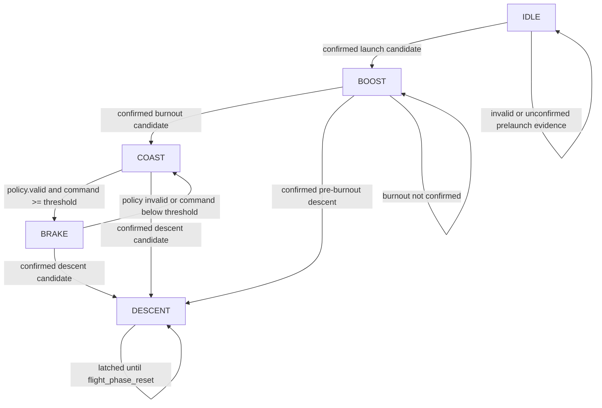

# Flight Phase Detector Notes From the Ground Up

These notes explain the logic, derivation, and operation of the Caelum Sufflamen flight-phase detector. They begin with the basic problem of classifying rocket flight from noisy measurements, then build up to the exact state machine implemented in `src/flight_phase.cpp`.

The goal is not merely to memorize the phases. The goal is to understand why the detector is stateful, why it uses latches and dwell timers, how it handles invalid data, and how its diagnostic fields let a reviewer reconstruct phase transitions after a test or flight.

## 1. What Problem Is the Flight-Phase Detector Solving?

The firmware receives continuous numerical estimates:

```text
altitude h [m]
vertical speed v [m/s]
acceleration norm |a| [m/s^2]
policy command u [0,1]
```

The control system, however, often needs categorical context:

```text
Are we still on the pad?
Are we in boost?
Are we in upward coast?
Are airbrakes active?
Are we descending?
```

The flight-phase detector converts noisy continuous measurements into a small set of discrete labels:

```text
IDLE
BOOST
COAST
BRAKE
DESCENT
```

Those labels are used by policy and safety logic. In this branch, the airbrake policy may compute non-idle deployment intent only in coast-like phases:

```text
COAST or BRAKE
```

The detector therefore protects the policy from being applied in contexts where the policy model is not valid.

## 2. Why Phase Detection Is Hard

A naive detector might use one threshold:

```text
if acceleration is high:
    phase = BOOST
else if vertical speed is positive:
    phase = COAST
else:
    phase = DESCENT
```

That is not robust enough for flight firmware.

Problems:

| Problem | Example |
| --- | --- |
| Sensor noise | One IMU spike could look like launch. |
| Estimator startup | Altitude and velocity may be invalid before seeding. |
| Vibration | Pad handling or rail vibration may create high acceleration. |
| Transient sign changes | Vertical speed may briefly dip near apogee or during estimator correction. |
| Missing samples | A sensor can miss a cycle without the vehicle physically changing phase. |
| Irreversibility | Once launched, the system should not return to `IDLE` merely because one sample is invalid. |

The implemented detector solves these problems with:

```text
state
latches
candidate timers
dwell timers
validity checks
diagnostic publication
```

## 3. Core Idea: A Stateful Finite-State Machine

A finite-state machine has:

```text
current state
inputs
transition rules
memory
outputs
```

In this firmware:

| FSM concept | Implementation |
| --- | --- |
| Current state | `state.phase` |
| Inputs | `state.est.h_m`, `state.est.v_mps`, `state.imu.a_norm`, `state.policy.valid`, `state.policy.command01` |
| Major memory | `g_launch_latched`, `g_burnout_latched`, `g_descent_latched` |
| Timer memory | `g_launch_candidate_ms`, `g_burnout_candidate_ms`, `g_descent_candidate_ms` |
| Outputs | `state.phase`, `state.phase_diag` |

The nominal progression is:

```text
IDLE -> BOOST -> COAST -> BRAKE -> DESCENT
```

Important nuance:

```text
BRAKE is not a permanent flight milestone.
```

`BRAKE` is a coast-phase overlay that means:

```text
burnout has happened
descent has not latched
policy command is active
```

If braking intent disappears before descent, phase returns to `COAST`.

## 4. Implemented Phase Definitions

| Phase | Meaning in this firmware | How it is entered | How it is left |
| --- | --- | --- | --- |
| `IDLE` | No confirmed launch. Fail-safe ground or prelaunch state. | Reset, invalid prelaunch data, or unconfirmed launch candidate. | Confirmed launch. |
| `BOOST` | Launch is confirmed, but burnout is not confirmed. | Launch latch set. | Confirmed burnout/coast or pre-burnout descent. |
| `COAST` | Burnout is confirmed, vehicle is not descending, and brake command is inactive. | Burnout latch set and no active brake command. | Active brake command or confirmed descent. |
| `BRAKE` | Burnout is confirmed and policy command is active. | `policy.valid` and command exceeds brake threshold. | Command inactive or confirmed descent. |
| `DESCENT` | Descent has latched. | Sustained non-positive vertical speed after dwell conditions. | Only `flight_phase_reset(...)`. |

The detector is conservative because it does not let a single measurement immediately advance major phases.

## 5. Measurements Used by the Detector

The detector reads only a small number of values:

```cpp
const float h_m = state.est.h_m;
const float v_mps = state.est.v_mps;
const float a_norm = state.imu.a_norm;
```

These represent:

| Input | Source | Purpose |
| --- | --- | --- |
| `h_m` | Kalman estimator | Avoids classifying launch or coast near the pad from vibration alone. |
| `v_mps` | Kalman estimator | Distinguishes upward motion from descent. |
| `a_norm` | IMU acceleration norm | Detects high acceleration during boost and reduced acceleration after burnout. |
| `policy.valid` | Airbrake policy | Indicates policy intent is meaningful and authorized for consideration. |
| `policy.command01` | Airbrake policy | Distinguishes `BRAKE` from ordinary `COAST`. |

The detector does not directly read the barometer or raw gyro. It consumes already-published estimator and IMU snapshots.

## 6. Validity Comes Before Interpretation

Before interpreting values, the detector checks:

```cpp
if (!state.est.valid || !state.imu.valid) { ... }
```

Then it checks finiteness:

```cpp
if (!is_finite_f(h_m) || !is_finite_f(v_mps) || !is_finite_f(a_norm)) { ... }
```

This is critical. A phase transition based on invalid or non-finite values is not meaningful.

The behavior depends on whether launch has already latched.

Before launch:

```text
invalid data -> clear launch candidate -> IDLE
```

After launch but before burnout:

```text
invalid data -> clear burnout/descent candidates -> preserve current latched phase
```

After burnout but before descent:

```text
invalid data -> clear descent candidate -> preserve current latched phase
```

Reason:

```text
Before launch, invalid evidence should not create launch.
After launch, one invalid sample should not erase flight history.
```

Independent safety and policy freshness checks still prevent actuation from trusting stale estimator data.

## 7. Thresholds and Their Roles

Some thresholds are in `utils/config.h` because they are shared configuration. Others are local to `flight_phase.cpp` because they are detector-specific debounce policy.

### 7.1 Shared Config Thresholds

| Constant | Value | Role |
| --- | --- | --- |
| `FLIGHT_PHASE_BOOST_ACCEL_NORM_MPS2` | `25.0` | Acceleration-norm threshold for launch-by-acceleration. |
| `FLIGHT_PHASE_BOOST_MIN_ALT_M` | `2.0` | Minimum altitude before launch acceleration is believed. |
| `FLIGHT_PHASE_DESCENT_VZ_MPS` | `0.0` | Vertical-speed threshold for descent candidate. |

### 7.2 Local Detector Thresholds

| Constant | Value | Role |
| --- | --- | --- |
| `FLIGHT_PHASE_LAUNCH_MIN_VZ_MPS` | `5.0` | Upward speed threshold for launch-by-motion. |
| `FLIGHT_PHASE_BURNOUT_ACCEL_NORM_MPS2` | `16.0` | Reduced acceleration threshold for burnout candidate. |
| `FLIGHT_PHASE_COAST_MIN_ALT_M` | `5.0` | Minimum altitude for coast/descent candidate logic. |
| `FLIGHT_PHASE_COAST_MIN_VZ_MPS` | `1.0` | Minimum upward velocity for burnout/coast confirmation. |
| `FLIGHT_PHASE_BRAKE_MIN_COMMAND01` | `0.01` | Command threshold for `BRAKE`. |

### 7.3 Dwell and Confirmation Times

| Constant | Value | Role |
| --- | --- | --- |
| `FLIGHT_PHASE_LAUNCH_CONFIRM_MS` | `60` | Launch candidate must persist this long. |
| `FLIGHT_PHASE_BURNOUT_CONFIRM_MS` | `120` | Burnout candidate must persist this long. |
| `FLIGHT_PHASE_DESCENT_CONFIRM_MS` | `300` | Descent candidate must persist this long. |
| `FLIGHT_PHASE_MIN_BOOST_DWELL_MS` | `250` | Minimum time in boost before burnout/descent logic can advance. |
| `FLIGHT_PHASE_MIN_COAST_DWELL_MS` | `250` | Minimum time after burnout before descent can latch. |

The detector intentionally requires time continuity, not only threshold crossing.

## 8. The Candidate-Timer Concept

The helper function is:

```cpp
condition_confirmed(condition, now_ms, dwell_ms, candidate_ms)
```

It implements this logic:

```text
if condition is false:
    candidate_ms = 0
    return false

if condition just became true:
    candidate_ms = now_ms

return now_ms - candidate_ms >= dwell_ms
```

This is debounce in time.

Example:

```text
Launch threshold true for 20 ms, then false -> no launch.
Launch threshold true continuously for 60 ms -> launch confirmed.
```

Why this matters:

```text
The detector responds to sustained physical evidence, not instantaneous noise.
```

## 9. The Latch Concept

A latch records that a major event has occurred:

```text
launch_latched
burnout_latched
descent_latched
```

Once a latch is set, ordinary sensor noise does not unset it.

This reflects the physical sequence:

```text
after launch, the flight has launched
after burnout, boost is over
after descent, the vehicle has passed apogee or is falling
```

Only:

```cpp
flight_phase_reset(...)
```

returns the detector to a clean `IDLE` state.

## 10. Rollover-Safe Time Arithmetic

The detector computes elapsed time as:

```cpp
return now_ms - then_ms;
```

With unsigned integers, this is rollover-safe for elapsed intervals shorter than half the integer range. This is a common embedded timing pattern.

The detector uses it for:

```text
candidate confirmation ages
time since launch
time since burnout
minimum boost dwell
minimum coast dwell
```

## 11. Reset Operation

The reset function:

```cpp
flight_phase_reset(SystemState &state)
```

does four things:

1. Sets `state.phase = IDLE`.
2. Clears launch, burnout, and descent latches.
3. Clears launch, burnout, and descent candidate timers.
4. Resets `state.phase_diag`.

Use reset before:

```text
new bench test
new simulation scenario
new flight attempt
post-abort reinitialization
```

Do not try to manually assign `state.phase` alone. That would not clear private latch/timer memory.

## 12. Launch Detection

Launch can be detected in two ways:

```cpp
launch_by_accel =
  (a_norm >= FLIGHT_PHASE_BOOST_ACCEL_NORM_MPS2) &&
  (h_m >= FLIGHT_PHASE_BOOST_MIN_ALT_M);

launch_by_motion =
  (h_m >= FLIGHT_PHASE_BOOST_MIN_ALT_M) &&
  (v_mps >= FLIGHT_PHASE_LAUNCH_MIN_VZ_MPS);
```

The launch candidate is:

```text
launch_by_accel OR launch_by_motion
```

Then:

```text
candidate must stay true for 60 ms
```

Why two launch paths?

| Path | What it catches |
| --- | --- |
| Acceleration path | High-acceleration boost evidence. |
| Motion path | Clear upward motion even if acceleration norm threshold is not sustained or is filtered differently. |

Why altitude gate?

```text
Pad vibration or handling should not classify as launch.
```

If launch confirms:

```text
g_launch_latched = true
g_launch_latch_ms = now_ms
phase = BOOST
```

If not:

```text
phase = IDLE
```

## 13. Boost Dwell

After launch, the detector does not immediately check burnout. It first requires:

```cpp
boost_dwell_met =
  elapsed_ms(now_ms, g_launch_latch_ms) >= FLIGHT_PHASE_MIN_BOOST_DWELL_MS;
```

Configured value:

```text
250 ms
```

Reason:

```text
Very early post-launch transients should not immediately produce burnout or descent.
```

This is not a physics claim that motor boost lasts 250 ms. It is a detector debounce guard.

## 14. Burnout and Coast Detection

Burnout candidate:

```cpp
burnout_candidate =
  boost_dwell_met &&
  (a_norm <= FLIGHT_PHASE_BURNOUT_ACCEL_NORM_MPS2) &&
  (h_m >= FLIGHT_PHASE_COAST_MIN_ALT_M) &&
  (v_mps >= FLIGHT_PHASE_COAST_MIN_VZ_MPS);
```

Interpretation:

| Condition | Meaning |
| --- | --- |
| `boost_dwell_met` | Launch has been held long enough. |
| `a_norm <= 16.0` | Acceleration has dropped below boost-like levels. |
| `h_m >= 5.0` | Vehicle is away from pad/near-ground ambiguity. |
| `v_mps >= 1.0` | Vehicle is still moving upward. |

Then the candidate must persist for:

```text
120 ms
```

If confirmed:

```text
g_burnout_latched = true
g_burnout_latch_ms = now_ms
phase = COAST
```

If not confirmed:

```text
phase = BOOST
```

## 15. Pre-Burnout Descent Escape

The detector includes a special path:

```cpp
pre_burnout_descent_candidate =
  boost_dwell_met &&
  (h_m >= FLIGHT_PHASE_COAST_MIN_ALT_M) &&
  (v_mps <= FLIGHT_PHASE_DESCENT_VZ_MPS);
```

If this condition persists for the descent confirmation dwell:

```text
300 ms
```

then:

```text
burnout_latched = true
descent_latched = true
phase = DESCENT
```

Why this path exists:

```text
If a flight never satisfies the normal burnout/coast condition but later clearly descends, the detector should not remain stuck in BOOST forever.
```

This is a recovery path for abnormal or poorly observed flights.

## 16. Coast Dwell and Descent Detection

After burnout latches, descent detection is not immediate. First:

```cpp
coast_dwell_met =
  elapsed_ms(now_ms, g_burnout_latch_ms) >= FLIGHT_PHASE_MIN_COAST_DWELL_MS;
```

Configured value:

```text
250 ms
```

Then descent candidate:

```cpp
descent_candidate =
  coast_dwell_met &&
  (h_m >= FLIGHT_PHASE_COAST_MIN_ALT_M) &&
  (v_mps <= FLIGHT_PHASE_DESCENT_VZ_MPS);
```

The candidate must persist for:

```text
300 ms
```

If confirmed:

```text
g_descent_latched = true
phase = DESCENT
```

Why sustained non-positive velocity?

```text
Near apogee, velocity estimates can be noisy. A single zero or negative sample should not permanently classify descent.
```

## 17. Brake Phase Detection

After burnout and before descent, the detector checks:

```cpp
brake_active =
  state.policy.valid &&
  (state.policy.command01 >= FLIGHT_PHASE_BRAKE_MIN_COMMAND01);
```

If true:

```text
phase = BRAKE
```

Otherwise:

```text
phase = COAST
```

This means `BRAKE` is not detected from servo position or aerodynamics. It is detected from policy intent:

```text
policy says a meaningful brake command is active
```

In the current scheduler, phase detection observes policy state from the available `SystemState` at the time `flight_phase_update(...)` is called. This is why the source comments describe BRAKE as reflecting active airbrake command intent from the previous policy pass.

## 18. Complete Transition Logic

The implemented transition logic can be summarized as:

```text
Start: IDLE

If required snapshots invalid:
    before launch -> IDLE and clear launch candidate
    after launch -> preserve latched history and clear active candidates

If launch not latched:
    if sustained launch_by_accel or launch_by_motion:
        latch launch -> BOOST
    else:
        IDLE

Else if burnout not latched:
    if sustained pre-burnout descent:
        latch burnout and descent -> DESCENT
    else if sustained burnout candidate:
        latch burnout -> COAST
    else:
        BOOST

Else if descent not latched:
    if sustained descent candidate:
        latch descent -> DESCENT
    else if policy command active:
        BRAKE
    else:
        COAST

Else:
    DESCENT
```

## 19. State Diagram



## 20. Why `IDLE` Is Not Reentered After Launch

Once launch is latched, invalid data no longer returns the phase to `IDLE`.

Reason:

```text
The physical fact that launch occurred should not be erased by one bad sample.
```

However, this does not mean actuation remains allowed. The safety and policy layers still check estimator validity and freshness.

This separation is important:

```text
phase memory records flight history
safety gates decide hardware authority
```

## 21. Diagnostics: Why `FlightPhaseDiag` Exists

Without diagnostics, a reviewer might see only:

```text
phase = BOOST
```

That is not enough. The reviewer also needs to know:

```text
Was launch latched?
Was burnout candidate active?
How long has descent candidate been true?
Did boost dwell pass?
Did brake intent become active?
```

`FlightPhaseDiag` exposes that internal reasoning:

| Field | Meaning |
| --- | --- |
| `valid` | Diagnostic payload is usable. |
| `updated` | Diagnostic payload was freshly published. |
| `seq` | Diagnostic publication count. |
| `t_ms` | Diagnostic timestamp. |
| `launch_latched` | Launch has been confirmed. |
| `burnout_latched` | Burnout/coast has been confirmed. |
| `descent_latched` | Descent has been confirmed. |
| `launch_candidate` | Launch condition is currently timing toward confirmation. |
| `burnout_candidate` | Burnout condition is currently timing toward confirmation. |
| `descent_candidate` | Descent condition is currently timing toward confirmation. |
| `boost_dwell_met` | Minimum post-launch dwell has passed. |
| `coast_dwell_met` | Minimum post-burnout dwell has passed. |
| `brake_active` | Policy command meets brake-active threshold. |
| `launch_confirm_ms` | Current launch candidate age. |
| `burnout_confirm_ms` | Current burnout candidate age. |
| `descent_confirm_ms` | Current descent candidate age. |
| `since_launch_ms` | Time since launch latch. |
| `since_burnout_ms` | Time since burnout latch. |

These fields make the detector reviewable during flight testing.

## 22. Telemetry and SD Logging

Phase state appears in:

```text
Serial telemetry
Serial diagnostics/status
SD logs
```

Important fields include:

```text
phase
phase_diag_valid
phase_diag_updated
phase_diag_seq
phase_diag_t_ms
phase_diag_age_ms
phase_launch_latched
phase_burnout_latched
phase_descent_latched
phase_launch_candidate
phase_burnout_candidate
phase_descent_candidate
phase_boost_dwell_met
phase_coast_dwell_met
phase_brake_active
phase_launch_confirm_ms
phase_burnout_confirm_ms
phase_descent_confirm_ms
phase_since_launch_ms
phase_since_burnout_ms
```

The rule for interpreting logs:

```text
Never interpret phase alone if phase diagnostics are available.
```

Use the diagnostic fields to explain why the detector did or did not transition.

## 23. Interaction With Policy and Safety

The phase detector is advisory. It classifies flight context.

It does not:

```text
arm the system
enable the policy
authorize servo motion
prove estimator freshness
prove aerodynamic validity
```

Those responsibilities are elsewhere:

| Layer | Responsibility |
| --- | --- |
| Commands | Runtime arming and policy enable. |
| Phase detector | Classify flight context. |
| Airbrake policy | Compute deployment intent when phase and gates permit. |
| Safety | Final runtime predicate for actuation. |
| Actuator | Apply pulse or force idle. |

This separation prevents a phase classification alone from commanding hardware.

## 24. Worked Timeline Example

Assume a 50 Hz scheduler, so one main pass occurs about every:

```text
20 ms
```

### Prelaunch

```text
t = 0 ms
h = 0.0
v = 0.0
a_norm = 9.8
phase = IDLE
```

No launch candidate because altitude and speed gates are not met.

### Launch Candidate Starts

```text
t = 100 ms
h = 2.5
v = 6.0
a_norm = 30.0
```

Launch condition is true. Candidate timer starts.

```text
launch_candidate = true
launch_confirm_ms = 0
phase = IDLE
```

### Launch Confirms

After 60 ms of continuous true launch condition:

```text
t = 160 ms
launch_latched = true
phase = BOOST
since_launch_ms = 0
```

### Boost Dwell

For the next 250 ms, burnout cannot latch even if acceleration drops. This prevents immediate transition from launch transients.

### Burnout Candidate

After boost dwell:

```text
a_norm <= 16.0
h >= 5.0
v >= 1.0
```

Burnout candidate timer starts.

After 120 ms continuous candidate:

```text
burnout_latched = true
phase = COAST
```

### Brake Active

If policy output becomes:

```text
policy.valid = true
policy.command01 = 0.25
```

then:

```text
phase = BRAKE
```

If command falls below `0.01`, phase returns to:

```text
COAST
```

### Descent

After coast dwell, if:

```text
v <= 0
```

for 300 ms:

```text
descent_latched = true
phase = DESCENT
```

## 25. Common Misconceptions

| Misconception | Correct interpretation |
| --- | --- |
| `BOOST` means motor thrust is directly measured. | It means launch is latched and burnout is not yet confirmed from estimator/IMU conditions. |
| `COAST` means perfect thrust-free physics is proven. | It is a conservative classification from available measurements. |
| `BRAKE` means the actuator physically deployed. | It means active policy command intent exceeded threshold. |
| `DESCENT` means a single negative velocity sample occurred. | It means descent candidate persisted through confirmation dwell. |
| Invalid data should reset to `IDLE` at all times. | Only before launch; after launch the detector preserves flight history. |
| Phase alone allows actuation. | Safety, arming, policy enable, estimator freshness, and actuator gates still apply. |

## 26. Edge Cases

### 26.1 Pad Vibration

If acceleration spikes but altitude remains below `2 m`:

```text
launch_by_accel = false
launch_by_motion = false
phase remains IDLE
```

### 26.2 Short Launch Spike

If launch condition is true for less than `60 ms`:

```text
launch candidate clears
launch does not latch
```

### 26.3 Invalid Estimator Before Launch

If estimator is invalid before launch:

```text
phase = IDLE
launch candidate clears
```

### 26.4 Invalid IMU After Launch

If IMU becomes invalid after launch but before burnout:

```text
phase history is preserved
burnout/descent candidates clear
```

### 26.5 Never Satisfies Burnout But Starts Falling

If boost dwell passed and vertical speed becomes non-positive for `300 ms`:

```text
burnout and descent both latch
phase = DESCENT
```

### 26.6 Braking Command Flickers

If policy command crosses the brake threshold:

```text
COAST <-> BRAKE
```

This is acceptable because `BRAKE` is not a major irreversible milestone. Major milestones are still latched.

## 27. How to Review a Phase Log

Use this order:

1. Check `warn_mask` and source validity fields.
2. Check `est_valid`, `imu_valid`, and estimator age if available.
3. Locate when `phase_launch_latched` first becomes `1`.
4. Check `phase_launch_confirm_ms` before launch latch.
5. Locate when `phase_burnout_latched` first becomes `1`.
6. Check `phase_burnout_confirm_ms` before burnout latch.
7. Compare `phase` with `phase_brake_active`.
8. Locate when `phase_descent_latched` first becomes `1`.
9. Check `phase_descent_confirm_ms` before descent latch.
10. Confirm transitions make physical sense with `est_h`, `est_v`, and `a_norm`.

Do not use a single row to justify a transition. Use the candidate and latch histories.

## 28. Mapping Code to Theory

| Concept | Code |
| --- | --- |
| Phase enum | `enum class FlightPhase` in `include/data_types.h` |
| Public interface | `include/flight_phase.h` |
| Detector implementation | `src/flight_phase.cpp` |
| Launch latch | `g_launch_latched` |
| Burnout latch | `g_burnout_latched` |
| Descent latch | `g_descent_latched` |
| Candidate timer helper | `condition_confirmed(...)` |
| Rollover-safe elapsed time | `elapsed_ms(...)` |
| Diagnostics publisher | `publish_phase_diag(...)` |
| Reset path | `flight_phase_reset(...)` |
| Runtime update path | `flight_phase_update(...)` |
| Serial observability | `utils/telemetry.cpp` |
| SD observability | `utils/sd_logger.cpp` |
| Host reference model | `PhaseDetectorModel` in `tests/host/run_host_tests.py` |

## 29. Design Strengths

| Strength | Why it matters |
| --- | --- |
| Stateful latches | Preserve major flight history. |
| Confirmation dwell | Suppresses noisy one-sample transitions. |
| Minimum boost/coast dwell | Prevents immediate transition chains. |
| Invalid-data handling by flight stage | Avoids false launch while preserving post-launch history. |
| Diagnostic publication | Makes internal reasoning observable. |
| No hardware I/O | Keeps detector deterministic and testable. |
| Constant-time logic | Bounded runtime in the flight loop. |

## 30. Design Limitations

| Limitation | Consequence |
| --- | --- |
| Thresholds are not yet tuned from representative current-flight logs. | False positives or delayed transitions are possible. |
| `BRAKE` reflects policy intent, not measured brake deployment. | It does not prove physical airbrake motion. |
| No explicit motor-thrust or burnout sensor. | Burnout is inferred from acceleration and motion. |
| Phase classification depends on estimator quality. | Bad altitude/velocity estimates can affect transitions. |
| Latches require explicit reset. | Test harnesses and ground operations must call reset before a new scenario. |

## 31. Practice Exercises

### Exercise 1: Draw the State Machine

Draw:

```text
IDLE -> BOOST -> COAST <-> BRAKE -> DESCENT
```

Then annotate:

1. Which transitions are latched.
2. Which transitions require candidate confirmation.
3. Which transition is reversible.
4. Which transition depends on policy command.

### Exercise 2: Explain Launch Detection

Explain why launch requires:

```text
altitude gate AND sustained acceleration or upward motion
```

Your answer should mention pad vibration, noise, and confirmation dwell.

### Exercise 3: Explain Burnout Detection

Explain why burnout requires:

```text
minimum boost dwell
reduced acceleration norm
minimum altitude
positive upward speed
confirmation dwell
```

### Exercise 4: Interpret a Diagnostic Row

Given:

```text
phase = BOOST
launch_latched = 1
burnout_latched = 0
burnout_candidate = 1
burnout_confirm_ms = 80
boost_dwell_met = 1
```

Interpretation:

```text
Launch has confirmed. Burnout conditions are currently true but have not yet persisted for the 120 ms burnout confirmation dwell.
```

### Exercise 5: Identify Unsupported Claims

Explain why this statement is too strong:

```text
The detector proves the rocket is physically in coast.
```

Better:

```text
The detector classifies COAST after sustained estimator/IMU evidence consistent with post-burnout upward coast.
```

## 32. Verification Questions

Use these to check mastery:

| Question | Expected answer should include |
| --- | --- |
| Why is phase detection stateful? | Major flight events should not chatter from noisy samples. |
| Why are candidate timers needed? | Thresholds must persist before transition. |
| What does `launch_latched` mean? | Launch has been confirmed and IDLE is no longer reentered without reset. |
| Why is invalid prelaunch data handled differently from invalid post-launch data? | Prelaunch invalid data should not cause launch; post-launch invalid data should not erase history. |
| Why does burnout require low acceleration and positive vertical speed? | It identifies post-boost upward coast, not descent. |
| Why does descent require 300 ms confirmation? | Avoids latching descent from one noisy near-apogee sample. |
| What does `BRAKE` mean? | Active policy command intent, not physical deployment proof. |
| What fields explain transition timing? | Candidate flags, confirm ages, dwell flags, since-event ages. |

## 33. Recommended Next Development Steps

1. Collect current-schema SD logs with phase diagnostics, estimator state, IMU acceleration norm, policy command, actuator pulse, and observed coast-through-apogee behavior.
2. Tune launch, burnout, and descent thresholds from representative logs instead of relying on initial conservative constants.
3. Add replay tests for false-launch rejection, invalid-data candidate clearing, early burnout prevention, and near-apogee descent debounce.
4. Extend firmware-in-the-loop tests so recorded sensor/estimator sequences can drive the detector deterministically.
5. If actuator position feedback is added, distinguish policy-intent `BRAKE` from measured physical deployment in logs.

## 34. Final Summary

The Caelum Sufflamen flight-phase detector is a conservative stateful classifier:

```text
estimator altitude
estimator vertical speed
IMU acceleration norm
policy command intent
-> validity checks
-> candidate timers
-> latches
-> phase
-> phase diagnostics
```

Its core engineering idea is:

```text
Do not turn one noisy sample into a flight milestone.
```

Instead, the detector requires sustained evidence, records irreversible milestones with latches, preserves phase history after launch, and exposes its internal reasoning through telemetry and SD logs.
