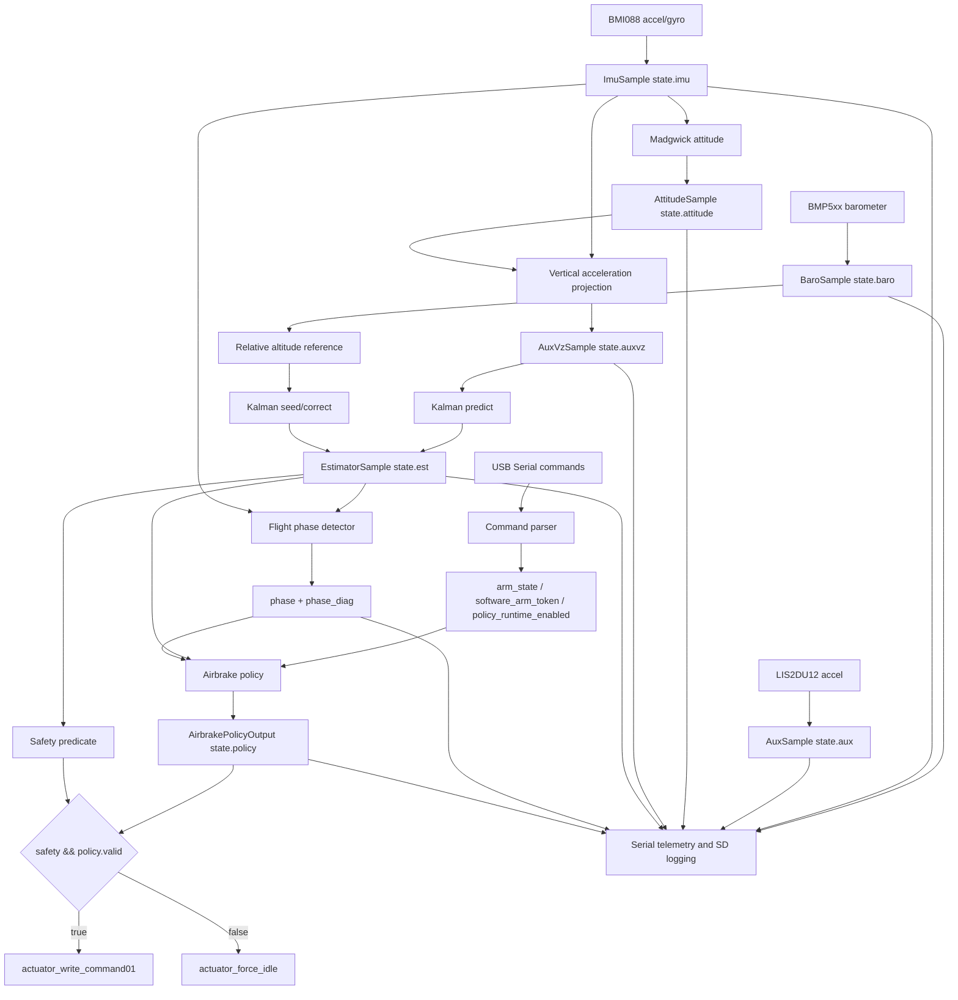
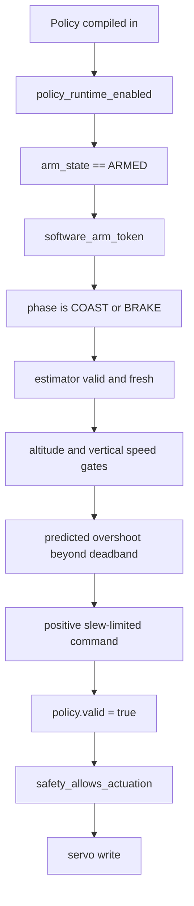

# Repository Study Notes

These notes prepare an engineer to present the Caelum Sufflamen repository in a technical review. They are based on the current source tree, documentation, host scripts, configuration files, and committed validation artifacts. Statements marked as "confirmed" are directly supported by repository contents. Statements marked as "inferred" are reasonable engineering interpretations from names, comments, structure, and control flow, but are not independently proven by committed test evidence.

## 1. Executive Summary

Caelum Sufflamen is a Teensy 4.1 embedded firmware project for a rocket airbrake module. The firmware observes barometer and inertial sensor data, estimates vertical state, classifies flight phase, computes apogee-targeting airbrake deployment intent, gates that intent through explicit runtime and safety conditions, and exports evidence through Serial telemetry and SD-card logs.

The core contribution is not merely a sketch that drives a servo. The repository is structured as a deterministic, reviewable flight-software pipeline with explicit ownership boundaries:

| Layer | Responsibility |
| --- | --- |
| Sensing | Publish validity-qualified snapshots from BMP5xx, BMI088, and LIS2DU12 hardware. |
| Estimation | Produce altitude, vertical velocity, acceleration, covariance, and attitude state. |
| Phase classification | Convert noisy motion data into conservative `IDLE`, `BOOST`, `COAST`, `BRAKE`, and `DESCENT` states. |
| Policy | Compute normalized airbrake command intent using a quadratic-drag apogee model. |
| Safety and actuation | Decide whether intent may reach hardware, then write microsecond servo pulses or force idle. |
| Observability | Emit live Serial telemetry, diagnostics, status lines, SD CSV logs, and warning masks. |
| Validation | Provide host-side policy, phase, parser, simulation, replay, fit, and data-audit scripts. |

Confirmed facts:

| Fact | Evidence |
| --- | --- |
| The target board is Teensy 4.1. | `BUILDING.md:5`, `BUILDING.md:8`, `tools/teensy41_arduino_cli.ps1:4`. |
| The intended Arduino CLI FQBN is `teensy:avr:teensy41`. | `BUILDING.md:8`, `tools/teensy41_arduino_cli.ps1:4`. |
| The main loop is time-gated at 50 Hz. | `utils/config.h:70`, `CaelumSufflamen.ino:266`. |
| Policy and actuation are compiled in by default in this branch. | `utils/config.h:53`, `utils/config.h:57`. |
| Non-idle policy intent still requires explicit runtime arming and policy-enable gates. | `src/airbrake_policy.cpp:493`, `src/airbrake_policy.cpp:498`, `src/airbrake_policy.cpp:503`. |
| The actuator writes microsecond pulse requests. | `src/actuator.cpp:185`, `src/actuator.cpp:220`. |
| Serial and SD warning masks share one generator. | `utils/telemetry.cpp:49`, `utils/sd_logger.cpp:385`. |
| The current previous-year data cannot identify current airbrake coefficients. | `validation/results/previous_year_flight_data_audit.json:3`, `validation/results/previous_year_flight_data_audit.json:8`. |

High-level inferred intent:

| Inference | Reasoning |
| --- | --- |
| The firmware is intended for a rocket or sounding-rocket airbrake module. | The repository, policy equations, phase names, apogee target, and airbrake documentation all converge on that use case. |
| The project is designed for reviewability and presentation. | Most modules have long role, input, output, failure, and determinism comments. |
| The control path is intentionally conservative. | Policy intent is separated from safety and actuation; invalid or stale conditions force idle. |

Most important caveat for a presenter:

The repository implements a plausible, model-based airbrake control architecture, but it does not yet contain committed vehicle-specific aerodynamic coefficient identification, full simulation, firmware-in-the-loop tests, hardware-in-the-loop tests, pinned library versions, or target-board pulse-width measurement evidence.

## 2. Repository Map

Current repository structure:

```text
CaelumSufflamen/
|- .gitignore
|- Airbrake_Policy_Documentation.md
|- BUILDING.md
|- CaelumSufflamen.ino
|- README.md
|- Repository_Study_Notes.md
|- include/
|  |- actuator.h
|  |- airbrake_policy.h
|  |- attitude.h
|  |- data_types.h
|  |- estimation.h
|  |- flight_phase.h
|  |- kalman_alt2.h
|  |- safety.h
|  `- sensors.h
|- simulation/
|  `- README.md
|- src/
|  |- actuator.cpp
|  |- airbrake_policy.cpp
|  |- attitude.cpp
|  |- estimation.cpp
|  |- flight_phase.cpp
|  |- kalman_alt2.cpp
|  |- safety.cpp
|  `- sensors.cpp
|- tests/
|  `- host/
|     |- audit_previous_year_flight_data.py
|     |- policy_aero_empirical_fit.py
|     |- policy_coast_sim.py
|     |- replay_policy_validation.py
|     `- run_host_tests.py
|- tools/
|  `- teensy41_arduino_cli.ps1
|- utils/
|  |- commands.cpp
|  |- commands.h
|  |- config.h
|  |- math_utils.h
|  |- sd_logger.cpp
|  |- sd_logger.h
|  |- telemetry.cpp
|  `- telemetry.h
`- validation/
   |- README.md
   |- data/
   |- flight data/
   |  |- Drop1.csv ... Drop6.csv
   |  |- Stationary.csv
   |  `- mc_logs/MC_LOG_001.csv ... MC_LOG_030.csv
   `- results/
      `- previous_year_flight_data_audit.json
```

Directory and file roles:

| Path | Role |
| --- | --- |
| `CaelumSufflamen.ino` | Top-level Arduino sketch, boot sequence, scheduler, control-loop ordering, and final actuator gating. |
| `include/` | Public interfaces and shared data contracts for core firmware modules. |
| `src/` | Core implementations for sensing, attitude, estimation, phase, policy, safety, and actuator output. |
| `utils/` | Configuration, command parser, math helpers, telemetry, and SD logging. These headers and sources are staged into the Arduino sketch build. |
| `tools/teensy41_arduino_cli.ps1` | Canonical build/upload wrapper for Teensy 4.1. It stages the split source tree into `.build/teensy41/staged_sketch/`. |
| `tests/host/` | Python host-side reference tests, policy simulation, replay validation, empirical fitting, and historical-data audit. |
| `validation/` | Workflow and artifacts for real-log replay validation and aerodynamic coefficient identification. |
| `validation/flight data/` | Previous-year CSV data used for audit and schema review. |
| `validation/results/` | Generated result artifacts, currently including the previous-year data audit JSON. |
| `simulation/README.md` | Current simulation status and planned firmware-in-the-loop/hardware-in-the-loop path. |
| `BUILDING.md` | Board, FQBN, required libraries, canonical build command, upload command, and build limitations. |
| `README.md` | Primary technical entry point. It documents architecture, build, configuration, verification, results, limitations, and future work. |
| `Airbrake_Policy_Documentation.md` | Narrative expected behavior for phase and policy integration. |
| `.gitignore` | Ignores `.build/`, macOS resource-fork files, Python bytecode, and `__pycache__/`. |

Generated or non-source artifacts:

| Artifact | Interpretation |
| --- | --- |
| `.build/` | Generated build staging/output path; ignored. |
| `tests/host/__pycache__/` | Python bytecode cache; ignored. |
| `._*` files | macOS resource-fork metadata; ignored. |

## 3. System Architecture

The system is a single-threaded, fixed-order embedded runtime. The architecture is easiest to explain as a pipeline from sensors to state snapshots to estimates to policy intent to safety-gated actuator output.



Architectural boundaries:

| Boundary | Owner | Why it matters |
| --- | --- | --- |
| Hardware acquisition | `src/sensors.cpp` | Keeps device objects and I2C operations localized. |
| Attitude quaternion | `src/attitude.cpp` | Private quaternion prevents partial external writes. |
| Kalman state | `src/estimation.cpp` and `src/kalman_alt2.cpp` | Estimator controls predict/correct sequencing and publication. |
| Phase latches | `src/flight_phase.cpp` | Detector owns stateful transition memory. |
| Policy command memory | `src/airbrake_policy.cpp` | Slew limiting depends on previous command and time. |
| Servo backend | `src/actuator.cpp` | One authoritative physical actuator writer. |
| SD file handle | `utils/sd_logger.cpp` | Logger owns file lifetime, naming, flushing, and failures. |

The system is not event-driven. It is time-triggered, with commands and heartbeat serviced opportunistically each Arduino `loop()` call and the main flight-control pass admitted only when the configured period has elapsed.

## 4. Theory of Operation

### 4.1 Startup

Startup behavior is implemented in `setup()` at `CaelumSufflamen.ino:174`.

Boot sequence:

1. Initialize `SystemState` defaults with `initialize_state()` at `CaelumSufflamen.ino:82`.
2. Configure the status LED and start USB Serial.
3. Print `BOOT,BEGIN`.
4. Initialize sensors through `sensors_begin()` at `src/sensors.cpp:68`.
5. Print sensor health through `sensors_print_status()` at `src/sensors.cpp:134`.
6. If BMP5xx is available, run bounded baseline pressure calibration.
7. Reset estimator after baseline capture.
8. Initialize SD logging through `sd_logger_init()` at `utils/sd_logger.cpp:245`.
9. Attach the actuator and force idle through `actuator_begin()` and `actuator_force_idle()`.
10. Print command help and the telemetry header.
11. Establish scheduler deadlines and print `BOOT,READY`.

Presentation point:

The boot order is deliberate. The pressure baseline is captured before estimator and logger runtime begins, so altitude reference, telemetry, and SD data use the same basis. The actuator is attached late and immediately forced idle.

### 4.2 Main Scheduler

The runtime entry point is `loop()` at `CaelumSufflamen.ino:266`.

The scheduler:

| Step | Operation | Evidence |
| --- | --- | --- |
| 1 | Service heartbeat and commands every Arduino loop. | `CaelumSufflamen.ino:270`. |
| 2 | Return early if the 50 Hz main period is not due. | `CaelumSufflamen.ino:276`. |
| 3 | Poll barometer, IMU, and auxiliary accelerometer once. | `CaelumSufflamen.ino:293`. |
| 4 | Run estimator update. | `CaelumSufflamen.ino:299`. |
| 5 | Update flight phase. | `CaelumSufflamen.ino:303`. |
| 6 | Compute airbrake policy intent. | `CaelumSufflamen.ino:306`. |
| 7 | Apply actuator only if safety and policy both approve. | `CaelumSufflamen.ino:308`. |
| 8 | Emit telemetry and diagnostics by cadence. | `CaelumSufflamen.ino:322`, `CaelumSufflamen.ino:334`. |
| 9 | Service SD logger last. | `CaelumSufflamen.ino:343`. |

The order means each SD row records the same state that was already used for policy and actuation in that scheduler pass.

### 4.3 Sensor Path

Sensor polling is intentionally bounded:

| Function | Source | Behavior |
| --- | --- | --- |
| `sensors_poll_baro()` | `src/sensors.cpp:216` | Attempts one BMP5xx reading, converts pressure from Pa to hPa, computes altitude, publishes valid snapshot if finite. |
| `sensors_poll_imu()` | `src/sensors.cpp:287` | Attempts one BMI088 accelerometer read and one gyro read when available, publishes finite values and acceleration norm. |
| `sensors_poll_aux()` | `src/sensors.cpp:378` | Reads LIS2DU12 raw axes and sensitivity once, converts to m/s^2, publishes finite values. |
| `sensors_calibrate_baro_base()` | `src/sensors.cpp:455` | Bounded blocking ground/boot calibration loop. Not a flight-loop operation. |

Sensor failures do not halt firmware. Missing or invalid hardware sets snapshots invalid and warning bits are reflected in telemetry.

### 4.4 Estimation Path

The estimator is mixed-rate and snapshot-driven. It consumes `state.imu.updated` and `state.baro.updated`; it does not read hardware directly. The active update function is `estimation_update()` at `src/estimation.cpp:234`.

Pipeline:

1. Clear `updated` observability flags for attitude, vertical acceleration, estimator, and legacy flight state.
2. If IMU updated, compute measured `dt` from IMU timestamps.
3. Reject first IMU sample as timing initialization.
4. Reject unreasonable `dt` outside configured bounds.
5. Update attitude with gyro and accelerometer.
6. Project acceleration into world vertical axis.
7. Seed Kalman filter if needed from barometric relative altitude.
8. Predict Kalman state with measured vertical acceleration and measured `dt`.
9. If barometer updated, seed or correct with relative altitude.
10. Publish estimator only if prediction or correction changed state.

Kalman state:

```text
x = [h, v]^T
h = relative altitude [m]
v = vertical velocity [m/s], positive upward
```

Prediction:

```text
h(k+1) = h(k) + v(k) * dt + 0.5 * a * dt^2
v(k+1) = v(k) + a * dt
```

Measurement:

```text
z = h + noise
```

The filter implementation is in `src/kalman_alt2.cpp`. Key functions:

| Function | Evidence | Role |
| --- | --- | --- |
| `kf_alt2_reset()` | `src/kalman_alt2.cpp:56` | Reset to unseeded state. |
| `kf_alt2_seed()` | `src/kalman_alt2.cpp:94` | Initialize altitude and velocity from first trusted altitude. |
| `kf_alt2_predict()` | `src/kalman_alt2.cpp:143` | Propagate state and covariance under acceleration input. |
| `kf_alt2_update()` | `src/kalman_alt2.cpp:214` | Correct with scalar altitude measurement using Joseph-form covariance update. |
| `kf_alt2_is_valid()` | `src/kalman_alt2.cpp:296` | Confirm seeded finite state and covariance before publication. |

### 4.5 Phase Path

The phase detector is implemented by `flight_phase_update()` at `src/flight_phase.cpp:243`.

Inputs:

| Input | Meaning |
| --- | --- |
| `state.est.h_m` | Relative altitude. |
| `state.est.v_mps` | Vertical speed. |
| `state.imu.a_norm` | Acceleration magnitude. |
| previous latches | Launch, burnout, descent, and candidate timers. |
| previous policy output | Determines `BRAKE` state after active policy intent. |

Phase meaning:

| Phase | Interpretation |
| --- | --- |
| `IDLE` | No confirmed launch; fail-safe preflight state. |
| `BOOST` | Launch latched, burnout not latched. |
| `COAST` | Burnout latched, not descending, no active previous brake command. |
| `BRAKE` | Prior-cycle policy intent is valid and above minimum command threshold. |
| `DESCENT` | Descent latched from sustained non-positive vertical speed. |

Important nuance:

The scheduler updates phase before computing the current policy. Therefore, `BRAKE` reflects previous-cycle policy intent. This creates deterministic one-cycle latency rather than uncontrolled feedback inside one scheduler pass.

### 4.6 Policy Path

The airbrake policy is implemented by `airbrake_policy_compute()` at `src/airbrake_policy.cpp:472`.

The model:

```text
dv/dt = -g - k(u) * v^2
k(u) = rho * (CDA_body + u * CDA_brake) / (2 * m)
```

Predicted coast apogee:

```text
h_apogee(u) = h + ln(1 + k(u) * v^2 / g) / (2 * k(u))
```

Ballistic fallback:

```text
h_apogee = h + v^2 / (2 * g)
```

Command solution:

1. Enforce runtime gates.
2. Predict no-brake apogee.
3. Predict full-brake apogee.
4. If no-brake is within target plus deadband, command zero.
5. If full-brake is still too high, command maximum allowed deployment.
6. Otherwise solve with fixed-count bisection.
7. Apply slew limiting.
8. Mark policy valid only when the resulting command is positive.

Runtime gates:

| Gate | Evidence |
| --- | --- |
| Policy runtime enable | `src/airbrake_policy.cpp:493`. |
| `arm_state == ARMED` | `src/airbrake_policy.cpp:498`. |
| `software_arm_token == true` | `src/airbrake_policy.cpp:503`. |
| Phase is `COAST` or `BRAKE` | `src/airbrake_policy.cpp:508`. |
| Estimator freshness | `src/airbrake_policy.cpp:520`. |
| Minimum altitude | `src/airbrake_policy.cpp:531`. |
| Minimum vertical speed | `src/airbrake_policy.cpp:536`. |
| Positive command before `valid=true` | `src/airbrake_policy.cpp:594`. |

### 4.7 Actuation Path

The actuator module is in `src/actuator.cpp`. It abstracts servo attachment, idle forcing, command mapping, and last pulse reporting.

Actuator mapping:

```text
command01 in [0, 1]
servo_us = servo_us_min + command01 * (servo_us_max - servo_us_min)
```

Key functions:

| Function | Evidence | Role |
| --- | --- | --- |
| `actuator_begin()` | `src/actuator.cpp:114` | Store config, attach servo, force idle. |
| `actuator_force_idle()` | `src/actuator.cpp:150` | Write configured idle pulse. |
| `actuator_write_command01()` | `src/actuator.cpp:185` | Enforce compile-time actuation, map normalized command, write microseconds. |
| `actuator_last_us()` | `src/actuator.cpp:220` | Return last requested pulse for telemetry. |

Final actuation decision occurs in `CaelumSufflamen.ino:308`: non-idle command is applied only when `safety_allows_actuation(state)` and `state.policy.valid` are both true. Otherwise `actuator_force_idle()` is called at `CaelumSufflamen.ino:318`.

### 4.8 Observability Path

Telemetry and SD logging are not decorative. They are the repository's primary evidence mechanisms.

Serial telemetry:

| Function | Evidence | Role |
| --- | --- | --- |
| `telemetry_print_header()` | `utils/telemetry.cpp:97` | Emits stable CSV schema. |
| `telemetry_emit_tlm()` | `utils/telemetry.cpp:148` | Emits one high-rate telemetry row. |
| `telemetry_print_status()` | `utils/telemetry.cpp:344` | Emits compact command-response status. |
| `telemetry_emit_diag()` | `utils/telemetry.cpp:463` | Emits age and warning diagnostics. |
| `telemetry_warn_mask()` | `utils/telemetry.cpp:49` | Builds shared health and validity mask. |

SD logging:

| Function | Evidence | Role |
| --- | --- | --- |
| `make_next_log_filename()` | `utils/sd_logger.cpp:55` | Finds first unused `LOG###.CSV`. |
| `sd_write_header()` | `utils/sd_logger.cpp:95` | Emits fixed SD schema. |
| `sd_logger_init()` | `utils/sd_logger.cpp:245` | Initializes card, file, header, boot marker. |
| `sd_logger_service()` | `utils/sd_logger.cpp:340` | Appends rows at configured cadence and handles flush/fault logic. |
| `sd_logger_ok()` | `utils/sd_logger.cpp:556` | Reports active logger state. |

The SD logger uses `telemetry_warn_mask(state)` at `utils/sd_logger.cpp:385`, which keeps Serial and SD health semantics aligned.

## 5. Key Components

### 5.1 `CaelumSufflamen.ino`

| Aspect | Notes |
| --- | --- |
| Purpose | Top-level Arduino sketch and system orchestrator. |
| Inputs | Arduino time, Serial bytes, sensor hardware through subsystem calls, shared state. |
| Outputs | Calls sensor, estimator, phase, policy, actuator, telemetry, and SD modules. |
| Internal behavior | Runs boot sequence, heartbeat, 50 Hz time-gated main pass, telemetry cadence, diagnostic cadence, SD service. |
| Dependencies | All subsystem headers plus Arduino runtime. |
| Side effects | Serial output, LED writes, sensor polling, SD writes, servo writes. |
| Assumptions | Subsystem calls are bounded and safe to invoke in fixed order. |
| Failure modes | Any invalid safety/policy state forces actuator idle. |
| Talking point | This file defines the real runtime contract and ordering guarantees. |

### 5.2 `utils/config.h`

| Aspect | Notes |
| --- | --- |
| Purpose | Central compile-time and tuning configuration. |
| Inputs | Optional preprocessor overrides. |
| Outputs | Constants consumed by all firmware modules and host scripts. |
| Internal behavior | Defines feature switches, rates, estimator tuning, policy constants, servo limits, warning bits. |
| Dependencies | Arduino headers. |
| Side effects | None at runtime. |
| Assumptions | Constants are physically reasonable and kept synchronized with validation. |
| Failure modes | Placeholder aerodynamic constants may mislead if presented as identified. |
| Talking point | `config.h` is both a technical contract and a provenance surface. |

Important constants:

| Constant | Evidence | Meaning |
| --- | --- | --- |
| `LOOP_HZ = 50` | `utils/config.h:70` | Main scheduler rate. |
| `CMD_BUF_N = 96` | `utils/config.h:76` | Serial parser line buffer size. |
| `SD_LOG_HZ = 50` | `utils/config.h:89` | SD logging rate. |
| `MADGWICK_BETA = 0.1` | `utils/config.h:114` | Attitude correction gain. |
| `EST_MAX_AGE_MS = 200` | `utils/config.h:136` | Safety freshness threshold. |
| `PIN_AIRBRAKE_SERVO = 9` | `utils/config.h:142` | Servo output pin. |
| `POLICY_TARGET_APOGEE_M = 300` | `utils/config.h:163` | Nominal apogee target. |
| `POLICY_CDA_BODY_M2` and `POLICY_CDA_BRAKE_M2` | `utils/config.h:219`, `utils/config.h:220` | Placeholder drag-area constants. |

### 5.3 `include/data_types.h`

| Aspect | Notes |
| --- | --- |
| Purpose | Shared schema and subsystem interface contracts. |
| Inputs | None. |
| Outputs | Runtime structs, enums, and compatibility aliases. |
| Internal behavior | Defines snapshot metadata, `SystemState`, policy output, phase diagnostics, SD logger state, config, and actuator config. |
| Dependencies | Arduino, SD, math, stdint. |
| Side effects | None. |
| Assumptions | Each module writes only its owned fields. |
| Failure modes | Contract drift can break telemetry, logging, policy, or tests. |
| Talking point | The `valid`/`updated`/timestamp/`seq` model is the backbone of observability. |

Critical contract:

`updated` is defined as fresh publication observability, not a consume latch (`include/data_types.h:18`). `SystemState` begins at `include/data_types.h:440`.

Key data structures:

| Structure | Evidence | Role |
| --- | --- | --- |
| `RuntimeConfig` | `include/data_types.h:28` | Runtime config and pressure references. |
| `BaroSample` | `include/data_types.h:58` | BMP5xx snapshot. |
| `ImuSample` | `include/data_types.h:72` | BMI088 snapshot. |
| `AttitudeSample` | `include/data_types.h:124` | Quaternion attitude publication. |
| `AuxVzSample` | `include/data_types.h:146` | Derived vertical acceleration. |
| `EstimatorSample` | `include/data_types.h:169` | Fused altitude, velocity, acceleration, covariance. |
| `FlightPhaseDiag` | `include/data_types.h:287` | Phase latches and dwell observability. |
| `AirbrakePolicyOutput` | `include/data_types.h:320` | Policy validity, command, predictions, target, uncertainty. |
| `SdLoggerState` | `include/data_types.h:413` | SD logger state and active file. |

### 5.4 `src/sensors.cpp`

| Aspect | Notes |
| --- | --- |
| Purpose | Own sensor objects and publish hardware snapshots. |
| Inputs | I2C bus, sensor hardware, runtime pressure reference. |
| Outputs | `state.health`, `state.baro`, `state.imu`, `state.aux`. |
| Internal behavior | Initializes sensors, attempts one read per poll, validates finite values, updates timestamps and sequence counters. |
| Dependencies | `Wire`, `Adafruit_BMP5xx`, `Adafruit_Sensor`, `BMI088`, `LIS2DU12Sensor`. |
| Side effects | I2C transactions, Serial boot status, bounded calibration delays. |
| Assumptions | Sensor addresses and bus wiring match code. |
| Failure modes | Missing sensor sets health/snapshot invalid; runtime continues. |
| Talking point | Partial hardware availability is treated as observable degradation, not immediate fatal failure. |

### 5.5 `src/attitude.cpp`

| Aspect | Notes |
| --- | --- |
| Purpose | Madgwick IMU attitude update and vertical acceleration projection. |
| Inputs | Gyro, accelerometer, measured `dt`, current quaternion state. |
| Outputs | `state.attitude`, derived vertical acceleration. |
| Internal behavior | Normalizes accelerometer, computes correction gradient, integrates quaternion, normalizes quaternion, rotates acceleration into world vertical. |
| Dependencies | `MADGWICK_BETA`, `kG`, finite checks. |
| Side effects | Updates private quaternion variables `g_q0..g_q3`. |
| Assumptions | IMU axis/sign convention matches estimator call site. |
| Failure modes | Invalid `dt`, non-finite values, zero norms, or degenerate quaternion cause no-op or reset. |
| Talking point | The estimator does not integrate raw accelerometer Z directly; it first estimates orientation. |

Key functions:

| Function | Evidence | Role |
| --- | --- | --- |
| `attitude_update_imu()` | `src/attitude.cpp:169` | Main Madgwick update. |
| `attitude_compute_vertical_accel()` | `src/attitude.cpp:343` | Projects body acceleration into world vertical and removes gravity. |

### 5.6 `src/estimation.cpp` and `src/kalman_alt2.cpp`

| Aspect | Notes |
| --- | --- |
| Purpose | Fuse barometer and IMU-derived acceleration into altitude and vertical velocity. |
| Inputs | `state.imu`, `state.baro`, config pressure references, timestamps. |
| Outputs | `state.est`, `state.auxvz`, `state.flight`, `state.kf`. |
| Internal behavior | Selects relative altitude reference, seeds filter, predicts with measured acceleration, corrects with barometer. |
| Dependencies | Attitude module, Kalman module, pressure conversion, estimator tuning constants. |
| Side effects | Updates private reference altitude and private Kalman state. |
| Assumptions | Barometric altitude and IMU vertical acceleration share a coherent reference/sign convention. |
| Failure modes | Unseeded filter remains invalid; unreasonable IMU `dt` prevents prediction; invalid barometer prevents update. |
| Talking point | The estimator uses measured IMU `dt`, not a hard-coded fixed step, which is more robust for real sensor timing. |

### 5.7 `src/flight_phase.cpp`

| Aspect | Notes |
| --- | --- |
| Purpose | Conservative flight-phase detector. |
| Inputs | Estimator altitude, estimator vertical speed, acceleration norm, previous policy command. |
| Outputs | `state.phase` and `state.phase_diag`. |
| Internal behavior | Uses latches, confirmation timers, and dwell timers to avoid phase chatter. |
| Dependencies | Phase thresholds from `utils/config.h` plus local dwell constants. |
| Side effects | Private latch and candidate timer state. |
| Assumptions | Acceleration norm and vertical velocity are adequate for broad phase classification. |
| Failure modes | Invalid pre-launch data stays `IDLE`; invalid post-launch data preserves latched history but safety still gates actuation. |
| Talking point | Phase is advisory; safety and actuator modules still have final authority. |

### 5.8 `src/airbrake_policy.cpp`

| Aspect | Notes |
| --- | --- |
| Purpose | Compute normalized airbrake deployment intent from apogee prediction. |
| Inputs | Estimator state, phase, arming state, policy enable, covariance, policy constants. |
| Outputs | `AirbrakePolicyOutput`. |
| Internal behavior | Enforces gates, predicts apogee under candidate command, solves by bisection, applies uncertainty margin and slew limit. |
| Dependencies | Policy constants, `millis()`, finite checks. |
| Side effects | Updates private previous-command and previous-time memory. |
| Assumptions | Constant density over the modeled coast segment, fixed mass, monotonic drag authority, identified drag coefficients. |
| Failure modes | Any invalid gate returns invalid zero command and resets command memory. |
| Talking point | This is a bounded model-based solver, not a PID loop. |

Risk note:

The aerodynamic coefficients are placeholders. A presenter should not imply that `POLICY_CDA_BODY_M2` or `POLICY_CDA_BRAKE_M2` are validated vehicle coefficients.

### 5.9 `src/safety.cpp` and `src/actuator.cpp`

| Aspect | Notes |
| --- | --- |
| Purpose | Decide whether actuator output is allowed and map command to servo pulse. |
| Inputs | Runtime config, estimator validity/freshness, normalized command, actuator config. |
| Outputs | Servo pulse write or idle pulse, last pulse telemetry. |
| Internal behavior | Safety checks config and estimator age; actuator maps normalized command to microseconds. |
| Dependencies | Arduino servo backend, compile-time `ACTUATION_ENABLED`. |
| Side effects | Physical servo output. |
| Assumptions | Servo pulse range matches actual mechanism and Teensy backend. |
| Failure modes | Disabled actuation or unsafe runtime state forces idle. |
| Talking point | Safety and actuator checks intentionally duplicate policy gating philosophy for defense in depth. |

### 5.10 `utils/commands.cpp`

| Aspect | Notes |
| --- | --- |
| Purpose | Non-blocking Serial command surface. |
| Inputs | Serial bytes. |
| Outputs | Runtime state changes and Serial command responses. |
| Internal behavior | Buffers CR/LF-terminated lines, handles overflow by discarding until newline, dispatches commands. |
| Dependencies | Telemetry, estimation, SD logger, sensors, policy, actuator, math helpers. |
| Side effects | Can change arming, policy enable, pressure references, estimator state, SD reference timing, and actuator idle state. |
| Assumptions | Operators use blocking calibration only on ground. |
| Failure modes | Invalid commands emit `ERR,*`; overlong commands emit `ERR,CMD_TOO_LONG`. |
| Talking point | The explicit `ARM` plus `POLICY` command path is central to safe demonstrations. |

Command list is printed at `utils/commands.cpp:55`. Command dispatch begins at `utils/commands.cpp:199`. Overflow handling is at `utils/commands.cpp:434` and emits `ERR,CMD_TOO_LONG` at `utils/commands.cpp:475`.

### 5.11 `utils/telemetry.cpp` and `utils/sd_logger.cpp`

| Aspect | Notes |
| --- | --- |
| Purpose | Live and persistent observability. |
| Inputs | Published `SystemState`. |
| Outputs | Serial CSV/status/diagnostics and SD CSV files. |
| Internal behavior | Emit schemas, rows, warning masks, age diagnostics, file creation, flush, failure latching. |
| Dependencies | Arduino Serial, SD card, actuator last pulse, shared warning mask. |
| Side effects | Serial bandwidth, SD card writes and flushes. |
| Assumptions | CSV consumers honor validity fields and schema order. |
| Failure modes | SD failures disable logger but do not halt runtime. |
| Talking point | Observability records truth plus validity, not just numbers. |

### 5.12 Host Scripts

| Script | Purpose | Presentation use |
| --- | --- | --- |
| `run_host_tests.py` | Runs regression checks and source-integration assertions. | Show the host-verifiable behavior boundary. |
| `policy_coast_sim.py` | Minimal 1D coast simulation with firmware policy constants. | Demonstrate apogee model behavior without hardware. |
| `policy_aero_empirical_fit.py` | Fits body/brake drag coefficients from compatible SD logs. | Explain how placeholders should be replaced. |
| `replay_policy_validation.py` | Replays compatible logs through the apogee model. | Explain future validation metrics. |
| `audit_previous_year_flight_data.py` | Audits historical CSV schemas for fit suitability. | Explain why current data cannot identify coefficients. |

## 6. Data Flow and Control Flow

### 6.1 Snapshot Data Flow

```mermaid
sequenceDiagram
  participant Loop as loop()
  participant Sensors as sensors.cpp
  participant Est as estimation.cpp
  participant Phase as flight_phase.cpp
  participant Policy as airbrake_policy.cpp
  participant Safety as safety.cpp
  participant Act as actuator.cpp
  participant Log as telemetry/sd_logger

  Loop->>Sensors: poll baro, IMU, aux
  Sensors-->>Loop: state.baro, state.imu, state.aux
  Loop->>Est: estimation_update(state)
  Est-->>Loop: state.attitude, state.auxvz, state.est
  Loop->>Phase: flight_phase_update(state)
  Phase-->>Loop: state.phase, state.phase_diag
  Loop->>Policy: airbrake_policy_compute(state)
  Policy-->>Loop: policy intent
  Loop->>Safety: safety_allows_actuation(state)
  Loop->>Act: command or force idle
  Loop->>Log: emit telemetry, diagnostics, SD row
```

### 6.2 State Ownership

| State region | Writer | Readers |
| --- | --- | --- |
| `state.cfg` | initialization, commands, baro calibration | estimation, safety, telemetry, SD logger. |
| `state.health` | sensors initialization | sensors, telemetry, warning mask. |
| `state.baro` | `sensors_poll_baro()` | estimation, telemetry, SD logger. |
| `state.imu` | `sensors_poll_imu()` | attitude/estimation, phase, telemetry, SD logger. |
| `state.aux` | `sensors_poll_aux()` | telemetry, SD logger. |
| `state.attitude` | attitude/estimation path | telemetry, SD logger. |
| `state.auxvz` | estimation path | estimator publication, telemetry, SD logger. |
| `state.est` | estimation path | phase, policy, safety, telemetry, SD logger. |
| `state.phase` | phase detector | policy, commands, telemetry, SD logger. |
| `state.policy` | top-level scheduler assignment from policy compute | phase detector next cycle, actuator gate, telemetry, SD logger. |
| `state.sdlog` | SD logger | telemetry/status. |

### 6.3 Control Flow

Primary control path:

```text
Serial operator gates
  -> command parser updates arm/policy state
  -> estimator publishes fresh state
  -> phase detector confirms allowed phase
  -> policy computes intent
  -> safety validates runtime state
  -> actuator writes pulse or idle
```

Failure control path:

```text
missing sensor / invalid estimator / stale estimator / disarmed state / disabled policy / wrong phase
  -> policy invalid or safety false
  -> actuator_force_idle()
  -> telemetry and SD record state and warning mask
```

## 7. Interfaces and Contracts

### 7.1 Serial Command Interface

| Command | Contract |
| --- | --- |
| `HELP` | Print supported commands. |
| `STATUS` | Print compact system status. |
| `HDR 0` or `HDR 1` | Disable/enable periodic telemetry rows. |
| `ARM DISARMED` or `ARM 0` | Disarm, clear token, disable policy, reset policy, force idle. |
| `ARM SAFE` or `ARM 1` | Safe state, clear token, disable policy, reset policy, force idle. |
| `ARM ARMED` or `ARM 2` | Arm only when phase is `IDLE`; sets `software_arm_token`. |
| `POLICY 0/1` | Disable/enable runtime policy gate. |
| `SET_SLP <hpa>` | Set sea-level pressure reference and reset estimator/log reference timing. |
| `CAP_BASELINE` | Capture current valid barometer pressure as baseline. |
| `CAL_BASELINE` | Bounded averaged baseline calibration. |
| `SIM_APOGEE <h_m> <v_mps>` | Policy math diagnostic when test API is enabled. |

### 7.2 Telemetry Format

Serial telemetry starts with `HDR` and rows start with `TLM`. The header includes validity, update, and sequence fields for each major payload (`utils/telemetry.cpp:99` through `utils/telemetry.cpp:118`).

Important design contract:

Telemetry emits invalid payload values in fixed positions rather than shifting columns or hiding data. Consumers must use validity fields to interpret payloads.

### 7.3 SD Log Format

SD logs are named `LOG###.CSV` and receive a fixed schema from `sd_write_header()` at `utils/sd_logger.cpp:95`.

SD log notable fields:

| Field group | Purpose |
| --- | --- |
| `t_us` | Microsecond timestamp. |
| BMP/IMU/LIS fields | Raw sensor evidence. |
| Quaternion and vertical acceleration | Estimator intermediate evidence. |
| `est_h`, `est_v`, `est_a`, covariance | Fused state evidence. |
| arming/policy/phase fields | Control-state evidence. |
| prediction fields | Policy reasoning evidence. |
| `warn_mask` | Compact health and validity evidence. |

### 7.4 Build Interface

The build wrapper accepts:

| Parameter | Meaning |
| --- | --- |
| `-ArduinoCli` | Executable name or path for `arduino-cli`; default is `arduino-cli`. |
| `-Fqbn` | Board FQBN; default is `teensy:avr:teensy41`. |
| `-Upload` | Adds upload flags to Arduino CLI invocation. |
| `-Port` | Required when uploading. |
| `-BuildRoot` | Optional output/staging root. |

The wrapper validates required source directories, stages files, invokes compile, and optionally uploads (`tools/teensy41_arduino_cli.ps1:38` through `tools/teensy41_arduino_cli.ps1:75`).

### 7.5 Validation Data Contract

The empirical fit script expects current SD-style columns:

```text
t_us, phase, est_h, est_v, policy_cmd, policy_valid
```

This is documented in `validation/README.md:29` and enforced by `policy_aero_empirical_fit.py:96`.

## 8. Build, Run, Simulation, and Deployment Flow

### 8.1 Build

Canonical build command:

```powershell
powershell -ExecutionPolicy Bypass -File .\tools\teensy41_arduino_cli.ps1 -ArduinoCli arduino-cli
```

The wrapper stages:

| Source | Destination |
| --- | --- |
| `CaelumSufflamen.ino` | staged sketch root. |
| `include/*.h` | staged sketch root. |
| `utils/*.h` | staged sketch root. |
| `src/*.cpp` | `staged_sketch/src/`. |
| `utils/*.cpp` | `staged_sketch/src/`. |

Confirmed build limitations:

| Limitation | Evidence |
| --- | --- |
| Exact Teensy core version unpinned. | `BUILDING.md:48`. |
| Exact library versions unpinned. | `BUILDING.md:49`. |
| Wrapper assumes Arduino CLI can resolve platform and libraries. | `BUILDING.md:52`. |

### 8.2 Upload

Canonical upload command:

```powershell
powershell -ExecutionPolicy Bypass -File .\tools\teensy41_arduino_cli.ps1 -ArduinoCli arduino-cli -Upload -Port COM7
```

Replace `COM7` with the port reported by `arduino-cli board list`.

### 8.3 Bench Run

Recommended bench sequence:

1. Connect Teensy 4.1 and required sensors.
2. Build and upload.
3. Open Serial at `115200`.
4. Confirm `BOOT,BEGIN` and `BOOT,READY`.
5. Run `STATUS`.
6. Verify sensor health flags.
7. Run `CAL_BASELINE` or `CAP_BASELINE` while stationary.
8. Keep actuator restrained or disconnected during early testing.
9. Use `SIM_APOGEE` to demonstrate policy math without entering flight state.
10. Only use `ARM ARMED` and `POLICY 1` in a controlled test.

### 8.4 Simulation and Replay

Current simulation level:

| Level | Status | Tool |
| --- | --- | --- |
| On-target model probe | Committed | `SIM_APOGEE`. |
| 1D analytical host simulation | Committed | `tests/host/policy_coast_sim.py`. |
| Replay validation on compatible SD logs | Committed | `tests/host/replay_policy_validation.py`. |
| Firmware-in-the-loop | Planned | Not implemented. |
| Hardware-in-the-loop | Planned | Not implemented. |

Example simulation:

```powershell
python .\tests\host\policy_coast_sim.py --mode policy --h0-m 120 --v0-mps 90 --target-apogee-m 300
```

Example audit:

```powershell
python .\tests\host\audit_previous_year_flight_data.py --data-dir "validation/flight data" --json-out .\validation\results\previous_year_flight_data_audit.json
```

## 9. Verification and Testing

### 9.1 Existing Tests

Run:

```powershell
python .\tests\host\run_host_tests.py
```

Current host harness tests:

| Test | Evidence | What it proves |
| --- | --- | --- |
| `policy_valid_command_in_coast` | `tests/host/run_host_tests.py:454` | Policy can become valid in armed, enabled `COAST` overshoot conditions. |
| `policy_invalid_when_disarmed` | `tests/host/run_host_tests.py:473` | Disarmed or un-tokened state prevents command validity. |
| `phase_detector_reaches_coast_and_descent` | `tests/host/run_host_tests.py:492` | Reference phase logic reaches `COAST` and `DESCENT`. |
| `command_overflow_discard_until_newline` | `tests/host/run_host_tests.py:503` | Overlong commands discard suffix until newline. |
| `source_integrations_present` | `tests/host/run_host_tests.py:512` | Source contains key integration features documented by tests. |
| `policy_coast_sim_reduces_apogee_with_more_brake` | `tests/host/run_host_tests.py:522` | Analytical full-brake and policy modes reduce apogee relative to closed brake. |
| `previous_year_flight_data_audit_blocks_aero_fit` | `tests/host/run_host_tests.py:556` | Historical data cannot update current policy coefficients. |
| `empirical_aero_fit_on_analytic_fixture` | `tests/host/run_host_tests.py:565` | Fitter can recover known coefficients from a constructed analytic fixture. |

### 9.2 Committed Data Audit

The audit result records:

| Field | Value | Evidence |
| --- | --- | --- |
| `data_dir` | `validation\flight data` | `validation/results/previous_year_flight_data_audit.json:2`. |
| `file_count` | `37` | `validation/results/previous_year_flight_data_audit.json:3`. |
| `legacy_mc_log_count` | `30` | `validation/results/previous_year_flight_data_audit.json:4`. |
| `raw_sensor_log_count` | `7` | `validation/results/previous_year_flight_data_audit.json:5`. |
| `body_identifiable_log_count` | `0` | `validation/results/previous_year_flight_data_audit.json:6`. |
| `brake_identifiable_log_count` | `0` | `validation/results/previous_year_flight_data_audit.json:7`. |
| `can_update_policy_cda_body_m2` | `false` | `validation/results/previous_year_flight_data_audit.json:8`. |
| `can_update_policy_cda_brake_m2` | `false` | `validation/results/previous_year_flight_data_audit.json:9`. |

### 9.3 What Testing Proves

The current tests prove selected behavioral contracts:

- Policy reference logic can generate valid commands only under the intended gates.
- Phase reference logic handles representative progression.
- Parser overflow handling avoids suffix execution.
- Host scripts remain source-integrated with current constants.
- The historical data audit blocks unsupported aerodynamic updates.
- The empirical fitter works on an analytic fixture.

### 9.4 What Testing Does Not Prove

The current tests do not prove:

- The Arduino/Teensy C++ build succeeds on this machine.
- The target-board scheduler meets timing under real SD and sensor behavior.
- Sensor axes and sign conventions match the physical installation.
- Servo pulse widths match commanded microseconds on Teensy 4.1.
- Airbrake coefficients are vehicle-identified.
- The closed-loop controller reaches target apogee in real flight.
- SD writes remain reliable under vibration or power-loss conditions.
- The host Python reference model exactly matches compiled firmware behavior under all edge cases.

### 9.5 High-Value Additional Tests

Recommended tests:

| Test | Why it matters |
| --- | --- |
| Arduino CLI build in CI or scripted local environment | Confirms firmware compiles after each change. |
| Firmware-in-the-loop C++ tests | Tests actual C++ logic against Arduino shims. |
| Parser fuzzing | Hardens command boundary behavior. |
| Servo pulse capture | Validates physical actuator output on Teensy 4.1. |
| Barometer/IMU replay | Tests estimator and phase behavior against real sensor traces. |
| HIL SD and Serial capture | Verifies timing and observability on real hardware. |
| Real flight replay validation | Quantifies apogee prediction bias and RMSE. |

## 10. Design Strengths

| Strength | Why it is valuable |
| --- | --- |
| Explicit scheduler order | Reviewers can trace exactly which state each subsystem consumes. |
| Snapshot metadata | Validity, freshness, timestamps, and sequence counters make data quality observable. |
| Separation of policy and actuation | The control law cannot directly move hardware; safety still arbitrates. |
| Runtime arming and policy gates | Compile-time-enabled code still requires explicit operator authorization. |
| Conservative phase detector | Latches and dwell timers reduce noisy phase chatter. |
| Measured `dt` estimation | Better matches real sensor timing than fixed-step assumptions. |
| Shared warning mask | Serial and SD logs report health with consistent semantics. |
| Host-side tests | Important logic can be exercised without hardware. |
| Validation workflow | The repository has a defined path for replacing placeholders with evidence. |
| Rich inline comments | Many modules document purpose, input contract, output contract, failure behavior, and determinism. |

## 11. Risks, Weaknesses, and Open Questions

### 11.1 Technical Risks

| Risk | Impact | Evidence or rationale |
| --- | --- | --- |
| Placeholder aerodynamic constants | Policy command may not match real vehicle drag authority. | `utils/config.h:219`, `utils/config.h:220`. |
| Unpinned Arduino/library versions | Build behavior may differ across machines. | `BUILDING.md:48`, `BUILDING.md:49`. |
| No committed target-board pulse validation | Servo command may not produce assumed microsecond pulse under all backend conditions. | Code writes microseconds, but no measurement artifact exists. |
| No full simulation | Analytical 1D model cannot verify complete flight dynamics. | `simulation/README.md:5`. |
| No firmware-in-the-loop | Python references may diverge from C++ edge cases. | FIL is planned, not committed. |
| Sensor mounting convention | Estimator negates accelerometer into attitude update; this must match physical mounting. | `src/estimation.cpp:234` through attitude call path. |
| SD card write timing | Runtime SD I/O can affect loop timing; no target timing log is committed. | `utils/sd_logger.cpp:340`. |

### 11.2 Documentation and Presentation Risks

| Risk | Recommended handling |
| --- | --- |
| Calling the controller "flight-ready" | Avoid. Say it is a structured firmware architecture with partial verification. |
| Calling aerodynamic constants "identified" | Avoid. Say the data audit explicitly blocks replacement. |
| Overclaiming simulation | Avoid. Say simulation is analytical host-side plus planned HIL/FIL. |
| Treating previous-year data as validation of current airbrakes | Avoid. It is useful for schema review, not current coefficient identification. |
| Ignoring safety caveats | Lead with fail-idle behavior and gated actuation. |

### 11.3 Open Questions

| Question | Evidence needed |
| --- | --- |
| What exact Teensy core and library versions should be used? | Version-pinned setup or lock artifact. |
| What are actual vehicle mass and airbrake geometry? | Mechanical/vehicle configuration document. |
| What are identified `CDA_body` and `CDA_brake` values? | Current-branch flight logs, fit results, replay validation. |
| Does servo output match requested microseconds? | Oscilloscope or logic-analyzer capture on Teensy 4.1. |
| Does estimator remain stable during actual powered ascent? | Real flight logs with raw and estimated state. |
| Does phase classification hold under vibration and motor burn? | Flight or HIL replay with labeled phase events. |

## 12. Presentation Preparation Notes

### 12.1 Suggested Narrative Arc

1. Start with the problem: passive rockets overshoot or undershoot target apogee, and active airbrakes require safe, observable control.
2. Introduce the design principle: separate observation, estimation, policy intent, safety, and physical actuation.
3. Show the pipeline diagram from sensors to SD logs.
4. Explain `SystemState` and snapshot metadata as the central architectural contract.
5. Walk through the scheduler order and why logging happens last.
6. Explain the estimator at a high level: attitude, vertical acceleration, Kalman altitude/velocity.
7. Explain phase classification and why phase is conservative.
8. Explain the apogee policy equation and command solver.
9. Explain runtime gates and fail-idle behavior.
10. Show tests and validation artifacts.
11. Close with limitations and the exact data needed to replace placeholder coefficients.

### 12.2 Key Concepts to Explain First

| Concept | Why first |
| --- | --- |
| `SystemState` | It connects every subsystem. |
| `valid` vs `updated` | It prevents misreading stale or invalid values. |
| Policy intent vs actuator authority | It explains the safety architecture. |
| Phase gating | It explains why brakes cannot deploy in boost or descent. |
| Placeholder coefficients | It prevents overclaiming performance. |

### 12.3 Most Important Diagrams to Show

Recommended diagrams:

| Diagram | Purpose |
| --- | --- |
| Sensor-to-actuator pipeline | Shows whole architecture at once. |
| Scheduler sequence diagram | Shows deterministic ordering and logging last. |
| Policy gate stack | Shows why command validity is hard to reach accidentally. |
| Validation workflow | Shows how future real data becomes committed coefficients. |

Policy gate stack:



### 12.4 Most Impressive Technical Details

| Detail | Why it is impressive |
| --- | --- |
| Explicit `updated` observability semantics | Shows disciplined real-time data contracts. |
| Measured-dt Kalman prediction | Shows attention to real sensor timing. |
| Joseph-form covariance update | Shows numerical care in the estimator. |
| Fixed-count bisection policy solver | Shows deterministic model-based control. |
| Runtime arming and policy enable path | Shows safety awareness beyond compile flags. |
| Shared warning-mask generation | Shows semantic consistency across telemetry channels. |
| Historical data audit | Shows integrity: the project refuses to claim unsupported coefficient identification. |

### 12.5 Likely Audience Questions and Recommended Answers

| Question | Recommended answer |
| --- | --- |
| Is this flight-ready? | No. It is a structured firmware/control architecture with host-side tests and documentation, but it still needs target build validation, HIL/FIL, pulse capture, and real coefficient identification. |
| Why not use PID? | The policy is model-based because the objective is apogee targeting during coast, where a quadratic-drag prediction can directly estimate remaining altitude. |
| What keeps the servo from moving accidentally? | Compile-time actuation, runtime arming, software arm token, policy runtime gate, phase gate, estimator freshness, policy validity, and safety predicate must all align; otherwise idle is forced. |
| Are the drag constants real? | Not yet. They are placeholders. The committed audit shows the previous-year data cannot identify current body or brake drag coefficients. |
| What does `updated` mean? | It means the owning module published fresh data in the most recent service call. It is not a consume latch. |
| Why does SD logging happen last? | So the SD row records the exact state already used for policy and actuation in that scheduler pass. |
| What is the strongest verification artifact? | The host harness plus committed data audit. The strongest future artifact would be replay/HIL evidence from compatible current-branch logs. |
| What is missing before coefficient replacement? | Current logs with phase, estimator altitude/velocity, policy command/deployment state, observed apogee, mass, and density assumptions. |

### 12.6 Potential Demo Flow

Safe demo sequence:

1. Show repository map and README.
2. Run `python .\tests\host\run_host_tests.py`.
3. Show `validation/results/previous_year_flight_data_audit.json`.
4. Run `policy_coast_sim.py` with a high-velocity overshoot scenario.
5. On hardware, show boot lines and `STATUS`.
6. Use `SIM_APOGEE` to show policy math without flight state.
7. Demonstrate that disarmed or policy-disabled state keeps `policy_valid=0`.
8. Avoid any unrestrained actuator movement.

### 12.7 Topics to Avoid Overemphasizing

| Topic | Why |
| --- | --- |
| Exact apogee performance | Not validated with current airbrake flight data. |
| Aerodynamic coefficient accuracy | Constants are placeholders. |
| Full simulation | Not implemented. |
| Certification or safety compliance | Not supported by repository evidence. |
| Previous-year data as proof of current controller performance | Audit says it is insufficient for coefficient identification. |

## 13. Glossary

| Term | Definition |
| --- | --- |
| Airbrake | Deployable aerodynamic surface intended to increase drag and reduce apogee. |
| Apogee | Maximum altitude reached during flight. |
| `CDA` | Drag coefficient times reference area, represented as effective drag area in m^2. |
| `command01` | Normalized actuator deployment command, where 0 is retracted and 1 is maximum allowed deployment. |
| `SystemState` | Shared runtime data aggregate that carries configuration, sensor snapshots, estimator output, policy output, phase, and logger state. |
| Snapshot | A validity-qualified data publication with timestamps and sequence counter. |
| `valid` | Indicates payload is semantically usable. |
| `updated` | Indicates fresh publication in the owning module's most recent service call. |
| `seq` | Publication counter. |
| Madgwick filter | Quaternion-based IMU attitude estimation method. |
| Kalman filter | State estimator that predicts altitude/velocity and corrects with barometric altitude. |
| Joseph form | Numerically robust covariance update form used by the Kalman correction. |
| `IDLE` | Pre-launch or fail-safe phase. |
| `BOOST` | Powered ascent phase after launch confirmation. |
| `COAST` | Upward unpowered flight after burnout confirmation. |
| `BRAKE` | Active braking supervisory phase based on prior policy intent. |
| `DESCENT` | Post-apogee descending phase. |
| `policy_runtime_enabled` | Runtime software permission for policy to compute non-idle intent. |
| `software_arm_token` | Records that an explicit `ARM ARMED` command was accepted. |
| `warn_mask` | Compact bitmask summarizing health, validity, config, and SD faults. |
| FQBN | Fully Qualified Board Name used by Arduino CLI. |
| HIL | Hardware-in-the-loop, using real board hardware with repeatable injected inputs and captured outputs. |
| FIL | Firmware-in-the-loop, compiling firmware logic against host shims. |
| SD log | Persistent CSV evidence file written on the Teensy built-in SD card. |

## 14. Final Study Checklist

Before presenting, the engineer should be able to explain:

| Checklist item | Ready? |
| --- | --- |
| What problem the repository solves and what it does not yet prove. |  |
| Why the firmware is organized as a deterministic scheduler. |  |
| How `SystemState` and snapshot metadata work. |  |
| Which module owns each part of state. |  |
| How sensor data becomes altitude, velocity, and vertical acceleration. |  |
| How the phase detector transitions through `IDLE`, `BOOST`, `COAST`, `BRAKE`, and `DESCENT`. |  |
| How the airbrake apogee prediction equation works. |  |
| Why the policy uses fixed-count bisection and slew limiting. |  |
| What runtime gates are required before policy can become valid. |  |
| What safety checks are applied before actuator output. |  |
| How normalized command maps to servo pulse width. |  |
| What Serial commands exist and when they should be used. |  |
| What telemetry and SD logs contain. |  |
| What the warning mask means. |  |
| How to build and upload for Teensy 4.1. |  |
| What the host tests verify. |  |
| What the previous-year data audit proves and does not prove. |  |
| Why aerodynamic constants remain placeholders. |  |
| What evidence is required before replacing coefficients. |  |
| What future work would most improve confidence. |  |

Recommended closing statement for a presentation:

Caelum Sufflamen is best presented as a disciplined embedded control architecture with clear state contracts, safety-gated actuation, and a defined validation pathway. Its current strength is structure and observability. Its next major development milestone is evidence: pinned builds, target-board measurements, HIL/FIL coverage, and compatible flight logs that support aerodynamic coefficient identification.
