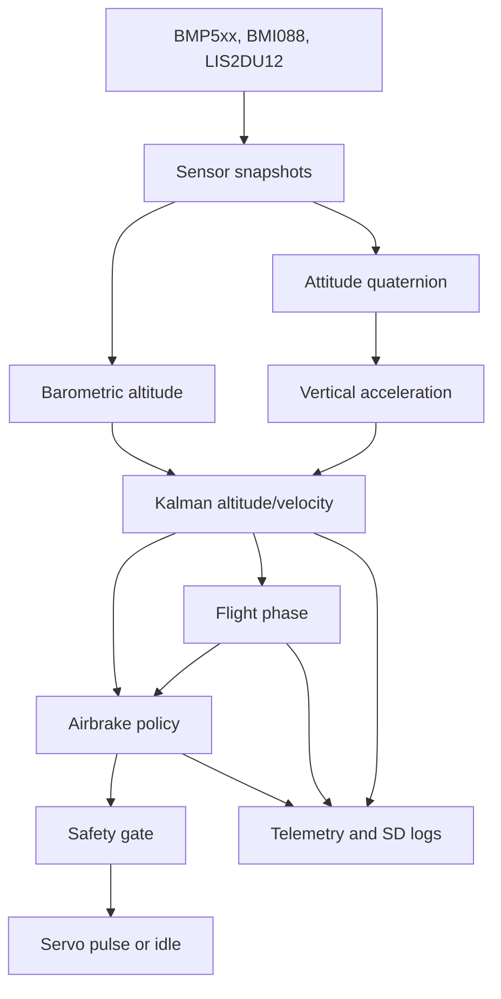
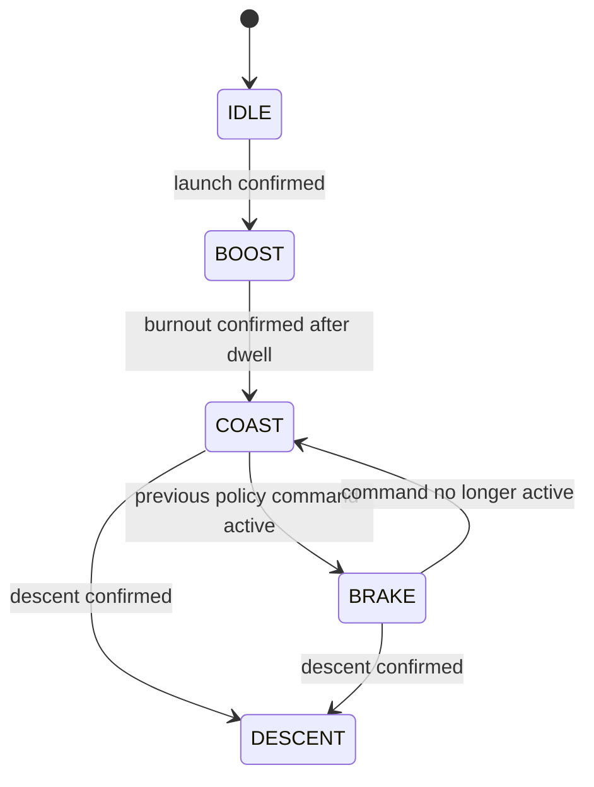

# Caelum Sufflamen Comprehensive Studying Guide

This guide is a self-study roadmap for understanding the Caelum Sufflamen firmware deeply enough to review it, modify it responsibly, explain it in a technical interview or presentation, and identify what evidence is still missing before stronger flight-performance claims can be made.

It is intentionally learner-focused. The teaching guide is written for someone instructing others; this studying guide is written for the engineer doing the studying.

## 1. What You Are Studying

Caelum Sufflamen is a Teensy 4.1 embedded firmware project for a rocket airbrake module. It reads sensors, estimates vertical state, classifies flight phase, predicts apogee, computes airbrake command intent, gates that intent through safety checks, and records evidence through Serial telemetry and SD-card logs.

The most compact system description is:

```text
sensors -> snapshots -> attitude/altitude estimation -> phase detection
        -> apogee policy -> safety gate -> servo pulse or idle
        -> telemetry and SD evidence
```

The project is best studied as an embedded control architecture with explicit data contracts. Do not study it only as Arduino code. The important ideas are state ownership, validity, timing, safety gating, model assumptions, evidence generation, and validation limits.

## 2. Safety and Claims Boundary

Before studying details, memorize this boundary:

| Claim type | Current status |
| --- | --- |
| The repository implements a deterministic Teensy 4.1 firmware architecture. | Supported. |
| The repository implements sensor polling, estimation, phase detection, policy, safety, actuator, telemetry, SD logging, and host tests. | Supported. |
| The repository has a canonical Arduino CLI build wrapper. | Supported. |
| The repository contains previous-year flight/sensor CSV data and an audit artifact. | Supported. |
| The current aerodynamic constants are vehicle-identified. | Not supported. |
| The current controller is flight-ready. | Not supported. |
| The repository contains full simulation, firmware-in-the-loop, or hardware-in-the-loop validation. | Not supported. |
| The target-board servo pulse mapping is empirically validated in committed evidence. | Not supported. |

Study with this mindset:

> Treat implementation as real, tests as partial evidence, and flight-performance claims as unproven unless the repository contains traceable data.

## 3. Prerequisites

You do not need to master every prerequisite before starting, but you should know what each one contributes.

| Topic | What you need to understand |
| --- | --- |
| Arduino/Teensy firmware | `setup()`, `loop()`, `millis()`, `micros()`, Serial, SD, GPIO, servo output. |
| C/C++ basics | Headers, source files, structs, enums, static module state, pass-by-reference. |
| Embedded timing | Fixed-rate loops, non-blocking design, bounded work, freshness checks. |
| Sensor units | Pressure, altitude, acceleration, angular rate, timestamps. |
| Basic kinematics | `h_next = h + v*dt + 0.5*a*dt^2`, `v_next = v + a*dt`. |
| Orientation | Why body-frame acceleration must be rotated into world-frame vertical acceleration. |
| Kalman filtering | Prediction, correction, state covariance, measurement noise at a high level. |
| Aerodynamic drag | Quadratic drag and why airbrakes reduce upward coast apogee. |
| Python test scripts | Running scripts, reading arguments, understanding fixtures and assertions. |

If any topic is weak, continue studying the repository anyway, but keep a notes section for follow-up theory.

## 4. Study Materials in the Repository

Use these files in this order.

| Order | File | Why it matters |
| --- | --- | --- |
| 1 | `README.md` | Gives the current project-wide technical overview. |
| 2 | `Studying_Guide.md` | This learner roadmap. |
| 3 | `Studying_Guide_Theoretical_Mechanisms.md` | Extended theory guide explaining the physical, mathematical, estimation, control, safety, and validation mechanisms. |
| 4 | `Kalman_Filter_and_Estimator_Notes.md` | Ground-up derivation of scalar and two-state Kalman filtering mapped to this firmware's estimator. |
| 5 | `Flight_Phase_Detector_Notes.md` | Ground-up derivation of the stateful flight-phase detector, latches, dwell timers, and diagnostics. |
| 6 | `Teaching_Guide.md` | Instructor-oriented lesson plan; useful after you understand the basics. |
| 7 | `Repository_Study_Notes.md` | Presentation-grade deep notes and Q&A. |
| 8 | `CaelumSufflamen.ino` | Defines actual runtime order. |
| 9 | `include/data_types.h` | Defines the shared state model. |
| 10 | `utils/config.h` | Defines compile-time switches, timing, tuning, policy constants, and placeholders. |
| 11 | `src/sensors.cpp` | Explains sensor acquisition and validity. |
| 12 | `src/attitude.cpp` | Explains quaternion attitude and vertical acceleration projection. |
| 13 | `src/estimation.cpp` and `src/kalman_alt2.cpp` | Explain altitude/velocity estimation. |
| 14 | `src/flight_phase.cpp` | Explains flight phase latches and dwell logic. |
| 15 | `src/airbrake_policy.cpp` | Explains the apogee predictor and command solver. |
| 16 | `src/safety.cpp` and `src/actuator.cpp` | Explain final actuation gating and pulse output. |
| 17 | `utils/commands.cpp` | Explains runtime operator interface and arming. |
| 18 | `utils/telemetry.cpp` and `utils/sd_logger.cpp` | Explain observability and persistent evidence. |
| 19 | `tests/host/run_host_tests.py` | Shows what behavior is host-tested. |
| 20 | `validation/README.md` and `validation/results/previous_year_flight_data_audit.json` | Explain empirical data status and limitations. |
| 21 | `BUILDING.md` and `tools/teensy41_arduino_cli.ps1` | Explain build and flash workflow. |

## 5. High-Level Mental Model

Use this diagram as your main mental map:



The architecture is controlled by three questions:

1. What do we currently know about the vehicle state?
2. Is that knowledge valid and fresh enough to use?
3. Even if the policy wants to act, is hardware motion allowed?

## 6. Core Vocabulary

Master these terms first.

| Term | Meaning |
| --- | --- |
| Snapshot | A published data structure with payload plus validity, timestamp, update, and sequence metadata. |
| `SystemState` | The shared runtime object that carries configuration, sensor data, estimator output, phase, policy, logger state, and arming gates. |
| `valid` | Payload is semantically usable. |
| `updated` | Owning module produced a fresh publication during its most recent service call. |
| `seq` | Publication counter. |
| Freshness | Whether a snapshot is recent enough for a consumer to trust it. |
| Policy intent | A computed command request that still needs safety approval. |
| Fail-idle | The safe behavior where actuator output is forced to retracted/idle when conditions are not valid. |
| Apogee | Maximum altitude reached during flight. |
| `CDA` | Effective drag area, drag coefficient times reference area. |
| `command01` | Normalized airbrake command in `[0,1]`. |
| HIL | Hardware-in-the-loop, real board and repeatable injected/captured signals. |
| FIL | Firmware-in-the-loop, firmware logic compiled against host shims. |

## 7. Week-Long Study Plan

### Day 1: Orientation and Claims

Read:

- `README.md`
- `BUILDING.md`
- `validation/README.md`

Focus questions:

| Question | What your answer should include |
| --- | --- |
| What does this repository do? | Teensy firmware for airbrake control architecture. |
| What does it not yet prove? | Flight readiness, identified coefficients, full simulation, HIL/FIL. |
| What is the board? | Teensy 4.1. |
| What is the build tool path? | Arduino CLI wrapper in `tools/`. |

Deliverable:

Write a 150-word summary of the repository and a 5-item list of limitations.

### Day 2: Runtime Order

Read:

- `CaelumSufflamen.ino`
- `utils/config.h`

Trace:

```text
setup()
loop()
heartbeat()
commands_service()
sensors_poll_*
estimation_update()
flight_phase_update()
airbrake_policy_compute()
safety_allows_actuation()
actuator_write_command01() or actuator_force_idle()
telemetry_emit_tlm()
sd_logger_service()
```

Deliverable:

Draw the scheduler as a flowchart and annotate which steps can affect hardware.

### Day 3: State Contracts

Read:

- `include/data_types.h`
- `utils/math_utils.h`

Focus questions:

| Question | Expected concept |
| --- | --- |
| What makes a payload usable? | `valid == true`, finite values, acceptable age. |
| What does `updated` mean? | Fresh publication observability. |
| Why are `t_ms` and `t_us` both present? | Freshness and measured intervals. |
| Which fields are legacy or compatibility fields? | `FlightState`, aliases, optional magnetometer/plot fields. |

Deliverable:

Make a table listing every major `SystemState` field, its writer, and its readers.

### Day 4: Estimation

Read:

- `src/sensors.cpp`
- `src/attitude.cpp`
- `src/estimation.cpp`
- `src/kalman_alt2.cpp`

Focus questions:

| Question | Expected concept |
| --- | --- |
| Why is pressure converted to altitude? | Barometer supplies altitude measurement. |
| Why is attitude needed? | Rotate body acceleration into world vertical. |
| What is the Kalman state? | Altitude and vertical velocity. |
| What seeds the filter? | First trusted relative altitude. |
| What rejects bad IMU timing? | `EST_MIN_IMU_DT_S` and `EST_MAX_IMU_DT_S`. |

Deliverable:

Explain the estimator in three paragraphs: sensor input, prediction, correction.

### Day 5: Phase and Policy

Read:

- `src/flight_phase.cpp`
- `src/airbrake_policy.cpp`
- `Airbrake_Policy_Documentation.md`

Focus questions:

| Question | Expected concept |
| --- | --- |
| Why use dwell timers? | Avoid phase chatter from noisy samples. |
| When can policy be valid? | Armed, tokened, enabled, COAST/BRAKE, fresh estimator, altitude/speed gates, overshoot. |
| What does the policy solve? | Normalized command that reduces predicted apogee toward target. |
| Why bisection? | Deterministic fixed-cost solve for monotonic model. |

Deliverable:

Write the complete policy gate list from memory.

### Day 6: Safety, Commands, Observability

Read:

- `src/safety.cpp`
- `src/actuator.cpp`
- `utils/commands.cpp`
- `utils/telemetry.cpp`
- `utils/sd_logger.cpp`

Focus questions:

| Question | Expected concept |
| --- | --- |
| Who finally decides servo motion? | Top-level scheduler plus safety and actuator modules. |
| What does `ARM ARMED` do? | Sets `arm_state` and software token only if phase is `IDLE`. |
| What does `POLICY 1` do? | Enables runtime policy gate. |
| Why is SD logging last? | Logs state already used for control. |
| Why share warning mask generation? | Serial and SD health semantics stay consistent. |

Deliverable:

Explain what happens after `ARM DISARMED`, `ARM SAFE`, `ARM ARMED`, `POLICY 0`, and `POLICY 1`.

### Day 7: Verification and Review

Run:

```powershell
python .\tests\host\run_host_tests.py
```

Read:

- `tests/host/run_host_tests.py`
- `tests/host/policy_coast_sim.py`
- `tests/host/policy_aero_empirical_fit.py`
- `tests/host/replay_policy_validation.py`
- `tests/host/audit_previous_year_flight_data.py`
- `validation/results/previous_year_flight_data_audit.json`

Deliverable:

Write a review memo with:

1. what is verified,
2. what is not verified,
3. the highest-risk assumption,
4. the next best validation step.

## 8. Deep Dive: Scheduler and Timing

The top-level scheduler is the first code path to master.

Important facts:

| Topic | Current behavior |
| --- | --- |
| Main loop frequency | `LOOP_HZ = 50`. |
| Heartbeat | Runs independently at low cadence. |
| Commands | Serviced every Arduino loop pass, not only every 50 Hz pass. |
| Main pass | Admitted when `micros()` reaches `next_loop_us`. |
| Diagnostics | Can emit even when main pass is not due. |
| SD logger | Serviced last. |

Why timing matters:

If the estimator output is stale, policy and safety should not act. If the loop blocks unexpectedly, freshness logic becomes a safety boundary.

Study task:

Read `loop()` and mark each line as one of:

- timing,
- input,
- estimation,
- decision,
- output,
- observability.

## 9. Deep Dive: `SystemState`

`SystemState` is not just a bag of variables. It is the integration contract.

### Snapshot Pattern

Most runtime publications follow:

```text
valid
updated
t_ms
t_us
seq
payload fields
```

Study the pattern in:

- `BaroSample`
- `ImuSample`
- `AttitudeSample`
- `AuxVzSample`
- `EstimatorSample`
- `FlightPhaseDiag`

### Rules for Reading State

Use these rules when reviewing code:

1. Do not trust payloads without checking `valid`.
2. Do not treat stale data as safe just because it was once valid.
3. Do not clear another module's `updated` flag unless the ownership contract says so.
4. Do not write fields owned by another subsystem.
5. Preserve units.
6. Preserve sequence counter meaning.

### Study Drill

For each of these fields, identify writer and purpose:

| Field | Writer to identify | Purpose to explain |
| --- | --- | --- |
| `state.baro` |  |  |
| `state.imu` |  |  |
| `state.attitude` |  |  |
| `state.auxvz` |  |  |
| `state.est` |  |  |
| `state.phase_diag` |  |  |
| `state.policy` |  |  |
| `state.sdlog` |  |  |

Answer key:

| Field | Writer | Purpose |
| --- | --- | --- |
| `state.baro` | `sensors_poll_baro()` | Barometric temperature, pressure, altitude. |
| `state.imu` | `sensors_poll_imu()` | BMI088 acceleration, gyro, acceleration norm. |
| `state.attitude` | `attitude_update_imu()` | Quaternion attitude. |
| `state.auxvz` | estimator/attitude path | World-vertical acceleration. |
| `state.est` | `estimation_update()` | Fused altitude, velocity, acceleration, covariance. |
| `state.phase_diag` | `flight_phase_update()` | Phase latch and dwell observability. |
| `state.policy` | top-level assignment from `airbrake_policy_compute()` | Policy intent and apogee predictions. |
| `state.sdlog` | SD logger | SD card/file state. |

## 10. Deep Dive: Sensors

### Barometer Path

The BMP5xx path:

```text
performReading()
pressure Pa -> hPa
pressure + sea-level reference -> altitude
finite check
publish BaroSample
```

What to watch:

- If BMP hardware is not initialized, barometer snapshot is invalid.
- If pressure, temperature, or altitude is not finite, snapshot is invalid.
- Altitude depends on `state.cfg.sea_level_hpa`.
- Baseline pressure can define relative altitude for estimation.

### IMU Path

The BMI088 path:

```text
read accelerometer
read gyroscope
validate finite accel and gyro streams independently
publish if at least one stream is valid
compute acceleration norm if accel valid
```

Potential review question:

If gyro is valid but accelerometer is invalid, should attitude update proceed?

Study answer:

Check implementation behavior. The IMU snapshot may be valid if either stream is valid, but the attitude update requires finite gyro and accelerometer values. This distinction is why downstream modules must validate payload fields, not only source-level health.

### Auxiliary Accelerometer Path

The LIS2DU12 path:

```text
read raw axes
read sensitivity
raw * sensitivity -> mg
mg -> g
g -> m/s^2
publish AuxSample
```

Study task:

Explain why auxiliary acceleration is logged even if not control-critical in the current branch.

Expected answer:

It provides diagnostics, future redundancy potential, and evidence for comparing sensor streams.

## 11. Deep Dive: Attitude

The attitude module has private quaternion state:

```text
g_q0, g_q1, g_q2, g_q3
```

Study objectives:

| Objective | Why it matters |
| --- | --- |
| Understand private quaternion ownership | Prevents uncontrolled external state changes. |
| Understand accelerometer normalization | Madgwick correction uses gravity direction, not magnitude. |
| Understand quaternion normalization | Rotation must remain unit length. |
| Understand vertical projection | Kalman filter needs world-vertical acceleration. |

Plain-language explanation:

The gyroscope tells how orientation changes. The accelerometer gives a gravity-direction reference. The Madgwick update combines them to maintain an orientation estimate. That orientation lets the firmware rotate measured acceleration into the world vertical direction.

Study drill:

Explain why a tilted vehicle cannot use raw body-frame `az` as vertical acceleration.

## 12. Deep Dive: Kalman Filter

### What the Filter Estimates

```text
h_m = altitude relative to selected reference
v_mps = vertical speed
```

### Prediction

The IMU-derived vertical acceleration predicts short-term motion:

```text
h = h + v*dt + 0.5*a*dt^2
v = v + a*dt
```

### Correction

The barometer corrects altitude drift.

### Why Both Are Needed

| Source | Strength | Weakness |
| --- | --- | --- |
| IMU acceleration | High-rate motion response. | Drifts when integrated. |
| Barometer altitude | Absolute altitude reference. | Noisy and slower. |

The Kalman filter combines them.

### Study Exercise

Given:

```text
h = 50 m
v = 40 m/s
a = -9 m/s^2
dt = 0.02 s
```

Compute:

```text
h_next = 50 + 40*0.02 + 0.5*(-9)*(0.02^2)
v_next = 40 + (-9)*0.02
```

Expected:

```text
h_next = 50.7982 m
v_next = 39.82 m/s
```

### Key Review Questions

| Question | Good answer |
| --- | --- |
| Why does the first IMU sample not predict? | No previous timestamp exists for measured `dt`. |
| Why reject extreme `dt`? | Prevents numerical jumps from corrupt timing. |
| Why seed from barometer? | The filter needs an altitude reference frame. |
| What is `P00`? | Altitude variance. |
| Why expose covariance to policy? | Policy can subtract uncertainty margin from target. |

## 13. Deep Dive: Flight Phase Detector

The phase detector protects the policy from acting in the wrong part of flight.

### Phase Transitions

Study the detector as a latched state machine:



### Why It Is Conservative

The detector requires conditions to remain true for dwell intervals before accepting major transitions. This makes it less sensitive to one-sample spikes.

### Study Drill

Explain these design choices:

| Design choice | Explanation to produce |
| --- | --- |
| Launch latch | Once launch is confirmed, do not casually return to preflight. |
| Burnout latch | Coast should start only after boost behavior ends. |
| Descent latch | Once descent is confirmed, control window is closed. |
| `BRAKE` from prior policy | Avoid same-cycle circular dependency between phase and policy. |

## 14. Deep Dive: Airbrake Policy

### Gate Before Math

The policy first asks:

```text
Am I allowed to compute non-idle deployment intent?
```

Only then does the model matter.

Complete gate list:

1. `AIRBRAKE_POLICY_ENABLED`.
2. `policy_runtime_enabled`.
3. `arm_state == ARMED`.
4. `software_arm_token`.
5. phase is `COAST` or `BRAKE`.
6. estimator valid.
7. altitude and velocity finite.
8. estimator fresh.
9. altitude above `POLICY_MIN_ALT_M`.
10. velocity above `POLICY_MIN_VZ_MPS`.
11. effective target finite and nonnegative.
12. predicted overshoot beyond deadband.
13. positive slew-limited command.

### Model

The policy uses:

```text
dv/dt = -g - k(u)*v^2
k(u) = rho*(CDA_body + u*CDA_brake)/(2m)
```

Predicted apogee:

```text
h_apogee = h + ln(1 + k*v^2/g)/(2k)
```

Ballistic fallback:

```text
h_apogee = h + v^2/(2g)
```

### Command Solve

The solver:

| Step | Meaning |
| --- | --- |
| No-brake prediction | Estimate where vehicle goes with airbrakes retracted. |
| Full-brake prediction | Estimate maximum braking authority. |
| Deadband check | Avoid chatter near target. |
| Saturation check | If full brake still overshoots, command maximum. |
| Bisection | Find deployment value that brings predicted apogee toward target. |
| Slew limit | Prevent abrupt command jumps. |

### Study Exercise

Answer without code:

If no-brake apogee is below target plus deadband, what should command be?

Expected:

```text
0.0
```

If full-brake apogee is still above target, what should command be?

Expected:

```text
POLICY_MAX_COMMAND01
```

### Critical Limitation

The policy's quality depends on aerodynamic constants:

```text
POLICY_CDA_BODY_M2
POLICY_CDA_BRAKE_M2
POLICY_VEHICLE_MASS_KG
POLICY_RHO_KGPM3
```

The repository explicitly treats the key aerodynamic constants as placeholders pending current vehicle identification.

## 15. Deep Dive: Safety and Actuator

### Safety Runtime Check

The safety module checks:

- runtime config valid,
- estimator valid,
- estimator not stale,
- compile-time actuation gate.

### Actuator Behavior

The actuator module:

1. stores servo configuration,
2. attaches servo backend,
3. forces idle at startup,
4. maps normalized command to microseconds,
5. writes pulse using `writeMicroseconds`,
6. stores last pulse for telemetry.

### Study Exercise

Map command to pulse:

| Command | Pulse with 1000-2000 us range |
| --- | --- |
| `0.0` | 1000 us |
| `0.25` | 1250 us |
| `0.5` | 1500 us |
| `0.75` | 1750 us |
| `1.0` | 2000 us |

### Review Warning

Do not confuse software mapping with measured hardware output. Accurate target-board pulse-width behavior still requires oscilloscope or logic-analyzer evidence.

## 16. Deep Dive: Commands

Commands are the operator interface.

### Parser Behavior

The parser:

- reads only available Serial bytes,
- waits for CR/LF to dispatch a line,
- uses a fixed buffer,
- trims spaces,
- uppercases command token,
- rejects invalid arguments,
- discards overlong lines until newline.

### Command Semantics

| Command | Study meaning |
| --- | --- |
| `HELP` | Discover interface. |
| `STATUS` | Inspect live state. |
| `HDR 0/1` | Disable/enable telemetry rows. |
| `ARM DISARMED` | Return to hard-safe supervisory state. |
| `ARM SAFE` | Safe armed-adjacent state without token/policy. |
| `ARM ARMED` | Explicit arming, only while phase is `IDLE`. |
| `POLICY 0/1` | Runtime policy permission. |
| `SET_SLP` | Change pressure reference. |
| `CAP_BASELINE` | Capture current pressure as baseline. |
| `CAL_BASELINE` | Bounded calibration routine. |
| `SIM_APOGEE` | Policy math probe. |

### Study Drill

Explain why arming and policy enable are separate commands.

Good answer:

Separating them makes accidental policy activation less likely and gives operators two independent runtime controls: supervisory arming and policy computation permission.

## 17. Deep Dive: Telemetry and SD Logs

### Telemetry Study Method

When reading telemetry, always ask:

1. What is the row type?
2. What timestamp is used?
3. Which validity flags are true?
4. Which update flags are true?
5. What phase is reported?
6. What are the arming gates?
7. Is policy valid?
8. What command was requested?
9. What actuator pulse was last written?
10. What warning mask bits are set?

### Warning Mask

The warning mask compactly reports sensor health, snapshot validity, config validity, and SD faults. It is generated once and used by both Serial telemetry and SD logs.

### SD Logger Study Points

| Point | Why it matters |
| --- | --- |
| Log files are named `LOG###.CSV` | Avoids overwriting earlier logs. |
| Header is fixed | Enables post-processing. |
| Boot marker is written | Records log start context. |
| Logger disables itself on runtime fault | SD failure is non-fatal. |
| Flush cadence is bounded | Balances data safety and runtime cost. |
| Logger runs last | Records the state used for the control decision. |

## 18. Deep Dive: Build Workflow

### Canonical Build

```powershell
powershell -ExecutionPolicy Bypass -File .\tools\teensy41_arduino_cli.ps1 -ArduinoCli arduino-cli
```

### Canonical Upload

```powershell
powershell -ExecutionPolicy Bypass -File .\tools\teensy41_arduino_cli.ps1 -ArduinoCli arduino-cli -Upload -Port COM7
```

### What the Wrapper Does

The wrapper stages a normalized Arduino sketch:

| Source | Staged location |
| --- | --- |
| `CaelumSufflamen.ino` | staged root. |
| `include/*.h` | staged root. |
| `utils/*.h` | staged root. |
| `src/*.cpp` | `staged_sketch/src/`. |
| `utils/*.cpp` | `staged_sketch/src/`. |

### Build Study Questions

| Question | Answer |
| --- | --- |
| Why stage files? | Arduino CLI expects sketch-compatible layout. |
| What FQBN is used? | `teensy:avr:teensy41`. |
| What is unpinned? | Exact Teensy core and library versions. |
| Is this bit-for-bit reproducible? | No. It is canonical, not fully locked. |

## 19. Deep Dive: Host Tests

### What To Run

```powershell
python .\tests\host\run_host_tests.py
```

### How To Study the Test Harness

Do not only run it. Read it in this order:

1. Constant extraction helpers.
2. Python reference policy functions.
3. `PolicyRuntime`.
4. `FlightPhaseDetector`.
5. `CommandParserModel`.
6. Individual test functions.
7. `main()` test list.

### What Each Test Teaches

| Test | Learning value |
| --- | --- |
| `policy_valid_command_in_coast` | Shows valid command can occur under correct gates. |
| `policy_invalid_when_disarmed` | Shows arming gates matter. |
| `phase_detector_reaches_coast_and_descent` | Shows expected phase progression. |
| `command_overflow_discard_until_newline` | Shows parser safety behavior. |
| `source_integrations_present` | Protects expected integration features from regression. |
| `policy_coast_sim_reduces_apogee_with_more_brake` | Confirms model response to brake authority. |
| `previous_year_flight_data_audit_blocks_aero_fit` | Confirms data audit blocks unsupported coefficient update. |
| `empirical_aero_fit_on_analytic_fixture` | Confirms fitter can recover known analytic constants. |

## 20. Deep Dive: Validation Data

### Current Data Status

The repository contains previous-year CSV logs under:

```text
validation/flight data/
```

The audit result says:

```text
file_count = 37
legacy_mc_log_count = 30
raw_sensor_log_count = 7
body_identifiable_log_count = 0
brake_identifiable_log_count = 0
can_update_policy_cda_body_m2 = false
can_update_policy_cda_brake_m2 = false
```

### Why the Data Is Insufficient

The current airbrake coefficient fit needs:

- current SD-style fields,
- phase,
- estimator altitude,
- estimator vertical velocity,
- policy command,
- policy validity,
- observed apogee or coast-through-descent altitude history,
- vehicle mass,
- atmospheric-density assumption,
- deployment state or actuator command.

The previous-year logs do not contain enough of this evidence.

### Study Exercise

Explain why many CSV files can still be insufficient.

Good answer:

Quantity of data is not enough. The fields must support the model identification question. Without deployment command and observed apogee, the brake drag coefficient cannot be identified.

## 21. Review Checklists

### Architecture Checklist

You understand the architecture if you can explain:

| Item | Can explain? |
| --- | --- |
| Why the scheduler is fixed-order. |  |
| Why `SystemState` exists. |  |
| Why policy and actuator are separate. |  |
| Why telemetry includes validity flags. |  |
| Why SD logging happens after actuation decision. |  |
| Why arming and policy enable are separate. |  |

### Estimator Checklist

You understand estimation if you can explain:

| Item | Can explain? |
| --- | --- |
| What the barometer contributes. |  |
| What the IMU contributes. |  |
| Why attitude is needed. |  |
| What the Kalman state is. |  |
| What prediction does. |  |
| What correction does. |  |
| Why invalid or stale data is rejected. |  |

### Policy Checklist

You understand policy if you can explain:

| Item | Can explain? |
| --- | --- |
| What the apogee predictor estimates. |  |
| What `k(u)` represents. |  |
| Why bisection is used. |  |
| Why a deadband exists. |  |
| Why slew limiting exists. |  |
| Why coefficients are placeholders. |  |

### Verification Checklist

You understand verification if you can explain:

| Item | Can explain? |
| --- | --- |
| What host tests prove. |  |
| What host tests do not prove. |  |
| What the audit JSON proves. |  |
| What data is needed for coefficient identification. |  |
| Why target-board pulse validation matters. |  |
| Why HIL/FIL would improve confidence. |  |

## 22. Active Recall Questions

Answer these without looking, then check source files.

| Question | Answer |
| --- | --- |
| What is the board target? | Teensy 4.1. |
| What is the FQBN? | `teensy:avr:teensy41`. |
| What file owns the scheduler? | `CaelumSufflamen.ino`. |
| What file defines `SystemState`? | `include/data_types.h`. |
| What file defines policy constants? | `utils/config.h`. |
| What is the main loop frequency? | 50 Hz. |
| What does `valid` mean? | Payload is semantically usable. |
| What does `updated` mean? | Fresh publication by owner in most recent service call. |
| What are the Kalman states? | Altitude and vertical velocity. |
| What phases permit policy? | `COAST` and `BRAKE`. |
| What command arms the system? | `ARM ARMED`. |
| What command enables runtime policy? | `POLICY 1`. |
| Does `policy.valid` guarantee servo motion? | No. Safety still gates actuation. |
| What happens on unsafe output conditions? | Actuator is forced idle. |
| What validates previous-year data suitability? | `audit_previous_year_flight_data.py` and audit JSON. |

## 23. Concept Maps To Draw

Draw these by hand or in notes.

### Map 1: Runtime Pipeline

```text
commands
sensors
estimation
phase
policy
safety
actuator
telemetry
SD
```

### Map 2: Estimator

```text
IMU -> attitude -> vertical acceleration -> Kalman predict
BMP -> pressure altitude -> relative altitude -> Kalman update
```

### Map 3: Policy Gates

```text
compiled policy
runtime policy enabled
armed
software token
COAST/BRAKE
fresh valid estimator
altitude/speed gates
overshoot
positive command
safety
actuator
```

### Map 4: Validation Path

```text
current SD logs -> fitter -> candidate CDA values -> replay validation
                -> config change only if physically credible and repeatable
```

## 24. Practice Problems

### Problem 1: Snapshot Interpretation

Given:

```text
state.est.valid = true
state.est.t_ms = 1000
now_ms = 1300
EST_MAX_AGE_MS = 200
```

Should safety accept estimator freshness?

Answer:

No. Age is 300 ms, which exceeds 200 ms.

### Problem 2: Policy Phase

Given:

```text
phase = BOOST
estimator valid and fresh
predicted apogee above target
armed and policy enabled
```

Can policy become valid?

Answer:

No. Policy is permitted only in `COAST` or `BRAKE`.

### Problem 3: Command Mapping

Given:

```text
servo_us_min = 1000
servo_us_max = 2000
command01 = 0.35
```

Pulse:

```text
1000 + 0.35*(2000-1000) = 1350 us
```

### Problem 4: Aerodynamic Evidence

A teammate provides logs with altitude and velocity but no airbrake command. Can you identify `POLICY_CDA_BRAKE_M2`?

Answer:

No. Brake coefficient identification requires deployment command or actuator state, because the model must know how much brake was applied.

### Problem 5: Parser Overflow

Why discard all bytes until newline after command buffer overflow?

Answer:

So the suffix of an overlong malformed command cannot become an accidental valid command.

## 25. Code Review Guide

When reviewing changes to this repository, ask:

| Area | Questions |
| --- | --- |
| Scheduler | Does the change preserve fixed ordering and bounded runtime? |
| State ownership | Does the module write only fields it owns? |
| Validity | Are invalid and stale data rejected before use? |
| Units | Are units preserved and documented? |
| Safety | Does any path bypass final actuation gates? |
| Commands | Are arguments bounded, parsed fully, and fail-safe on error? |
| Telemetry | Does schema remain aligned with emitted rows? |
| SD logging | Does logging failure remain non-fatal? |
| Policy | Are aerodynamic assumptions documented and traceable? |
| Tests | Are host tests updated for behavior changes? |

## 26. Study Milestones

### Beginner Milestone

You can:

- describe what the project does,
- list major directories,
- explain the main scheduler order,
- run host tests,
- state major limitations.

### Intermediate Milestone

You can:

- explain `SystemState`,
- trace a sensor value into telemetry,
- explain estimator predict/correct,
- list policy gates,
- interpret warning masks at a high level,
- explain why previous-year data is insufficient.

### Advanced Milestone

You can:

- review a policy change for safety and validation impact,
- propose a HIL/FIL test plan,
- design a current-flight logging schema for coefficient identification,
- reason about timing/freshness failures,
- explain the apogee model equations,
- identify unsupported claims in a presentation.

## 27. Final Mastery Checklist

You are ready to present or modify this repository if you can answer all of these:

| Question | Can answer? |
| --- | --- |
| What problem is Caelum Sufflamen solving? |  |
| What exact board and FQBN are documented? |  |
| What is the boot sequence? |  |
| What is the 50 Hz loop order? |  |
| What does each major `SystemState` field represent? |  |
| What are `valid`, `updated`, `t_ms`, `t_us`, and `seq` for? |  |
| How does pressure become relative altitude? |  |
| How does body acceleration become vertical acceleration? |  |
| What does the Kalman filter estimate? |  |
| How does phase detection avoid chatter? |  |
| What phases permit airbrake policy? |  |
| What equations does the policy use? |  |
| How does bisection choose command? |  |
| What gates must pass before policy validity? |  |
| What gates must pass before actuator motion? |  |
| How does normalized command map to pulse width? |  |
| What commands does the operator have? |  |
| What does telemetry record? |  |
| What does SD logging record? |  |
| What does the warning mask mean? |  |
| What do host tests prove? |  |
| What do host tests not prove? |  |
| Why are aerodynamic constants placeholders? |  |
| What data is required to replace them? |  |
| What is the next best engineering step? |  |

## 28. Recommended Study Outputs

As you study, produce these artifacts for yourself:

1. A one-page architecture diagram.
2. A table of `SystemState` writers and readers.
3. A one-page estimator explanation.
4. A one-page airbrake policy explanation.
5. A list of all safety gates.
6. A host-test summary table.
7. A limitations and future-work memo.
8. A demo script that avoids unsupported claims.

## 29. Final Summary

To study Caelum Sufflamen well, focus on the chain of evidence:

```text
physical measurement
-> validity-qualified snapshot
-> estimator state
-> phase context
-> policy intent
-> safety approval
-> actuator command
-> telemetry and SD evidence
```

The repository's strongest engineering quality is that it makes this chain explicit. Its most important remaining gap is empirical validation: replacing placeholder aerodynamic constants requires current, traceable flight or test data with deployment state and observed coast-through-apogee behavior.
