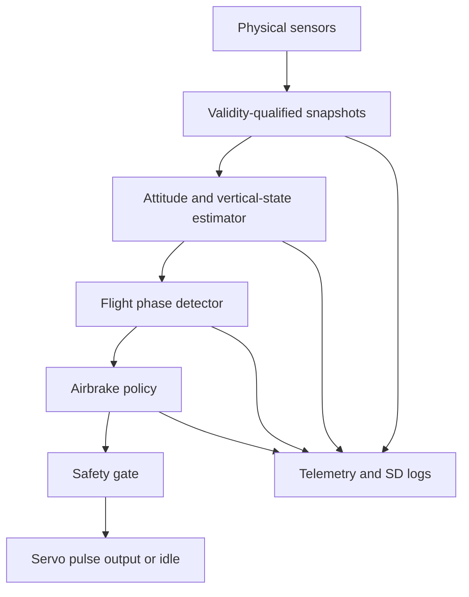
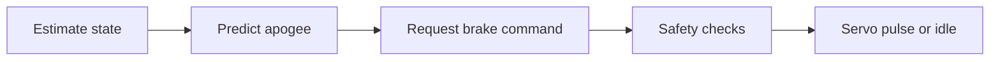
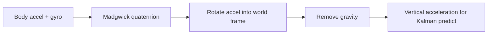

# Caelum Sufflamen Teaching Guide

This guide teaches the Caelum Sufflamen firmware from the ground up. It is written for an instructor, project lead, or self-studying engineer who wants to understand and explain the program as an embedded control system, not just as a collection of files.

The guide assumes the learner may be new to this repository, but has basic familiarity with C/C++, Arduino-style firmware, physics, and Python scripts. It does not assume prior experience with rocket airbrakes, Kalman filters, or flight-software review.

## 1. Teaching Goals

By the end of this guide, a learner should be able to:

| Goal | Expected learner capability |
| --- | --- |
| Explain the mission | Describe what the firmware is trying to do and why active airbrake control needs careful gating. |
| Trace the runtime | Walk through boot, scheduler timing, sensor polling, estimation, phase detection, policy, safety, actuator, telemetry, and SD logging. |
| Interpret the architecture | Explain why the code is split into `include/`, `src/`, `utils/`, `tests/host/`, `simulation/`, and `validation/`. |
| Explain state contracts | Describe `SystemState`, snapshots, `valid`, `updated`, timestamps, and sequence counters. |
| Teach the control law | Explain the quadratic-drag apogee predictor and how it turns overshoot into a normalized airbrake command. |
| Explain safety gates | List all gates required before a non-idle command can reach the servo. |
| Use host validation | Run and interpret the host-side tests, simulation, previous-year data audit, and fitting/replay tools. |
| Present limitations honestly | Distinguish implemented architecture from unvalidated flight performance claims. |

## 2. How To Use This Guide

Recommended teaching sequence:

1. Teach the mission and safety problem before opening code.
2. Teach the high-level pipeline before individual functions.
3. Teach `SystemState` before teaching any specific subsystem.
4. Teach the scheduler order before teaching the policy.
5. Teach validity/freshness before interpreting telemetry.
6. Teach the estimator as a data transformation pipeline, not as abstract math first.
7. Teach the policy after learners understand altitude, velocity, and phase.
8. Teach validation last, so learners can evaluate what is proven and what remains open.

Recommended repository files to keep open:

| File | Why keep it open |
| --- | --- |
| `README.md` | Primary project overview and current evidence model. |
| `Repository_Study_Notes.md` | Detailed presentation-oriented technical notes. |
| `CaelumSufflamen.ino` | Runtime order and top-level behavior. |
| `include/data_types.h` | Shared state contracts. |
| `utils/config.h` | Constants, switches, and placeholder aerodynamic parameters. |
| `src/estimation.cpp` | Sensor-to-estimator path. |
| `src/airbrake_policy.cpp` | Model-based airbrake command logic. |
| `utils/commands.cpp` | Runtime arming and command surface. |
| `tests/host/run_host_tests.py` | Executable host-side confidence checks. |

## 3. Safety and Evidence Framing

Start every teaching session with this framing:

> This repository is an experimental embedded control architecture. It is not a certified flight controller and should not be presented as flight-ready. The code implements a safety-gated control path and validation workflow, but the aerodynamic constants remain placeholders until supported by suitable current-branch flight data.

The most important teaching distinction is between:

| Concept | Meaning |
| --- | --- |
| Implemented behavior | Code paths that exist in the repository. |
| Tested behavior | Behavior covered by host tests or committed artifacts. |
| Validated flight behavior | Behavior supported by current vehicle flight evidence. |
| Inferred intent | Reasonable engineering interpretation from code and comments. |

For this repository:

- Implemented behavior includes sensing, estimation, phase detection, policy, safety gating, telemetry, SD logging, build wrapper, host scripts, and runtime commands.
- Tested behavior includes host-side policy, phase, command-parser overflow, simulation, previous-year data audit, and analytic fitting fixture.
- Validated flight behavior is limited by the available data. The committed previous-year logs cannot identify current airbrake policy coefficients.
- Inferred intent is that the firmware supports a rocket airbrake module on Teensy 4.1 hardware.

## 4. The Problem From First Principles

### 4.1 What Is the System Trying To Control?

The vehicle is assumed to be a rocket-like system with deployable airbrakes. During upward coast after motor burnout, the vehicle may be predicted to exceed a target apogee. Deploying airbrakes increases drag and can reduce the eventual apogee.

The program's control question is:

```text
Given current altitude and upward velocity, how much airbrake deployment is needed to reduce predicted apogee toward the target?
```

The program's safety question is:

```text
Even if the policy wants deployment, is the system currently allowed to move the actuator?
```

Those two questions are intentionally separate.

### 4.2 Why Not Just Move the Servo When Apogee Is High?

Because an airbrake actuator is safety-relevant. A premature or stale command could deploy during boost, on the pad, during descent, or while the estimator is invalid. The repository therefore requires several independent gates before command intent reaches hardware.

The major gates are:

| Gate | Purpose |
| --- | --- |
| Compile-time actuation enabled | Prevents builds from moving hardware unless intended. |
| Runtime `ARM ARMED` command | Requires explicit operator action. |
| `software_arm_token` | Records that arming was accepted by command logic. |
| `POLICY 1` command | Separately enables policy runtime behavior. |
| Correct flight phase | Permits policy only in `COAST` or `BRAKE`. |
| Fresh valid estimator | Prevents stale or invalid state from driving control. |
| Altitude/speed gates | Prevents pad, low-altitude, low-speed, or descent actuation. |
| Safety predicate | Final runtime gate before servo output. |

## 5. Big-Picture Architecture

Teach the architecture as a pipeline:



The key teaching point:

The firmware is not a monolithic loop full of unrelated operations. It is a fixed-order pipeline where each subsystem owns a well-defined state publication.

## 6. Repository Layout Lesson

Teach the repository layout before teaching algorithms.

| Area | What to teach |
| --- | --- |
| `CaelumSufflamen.ino` | The top-level schedule and system call order. |
| `include/` | Public contracts and type definitions. |
| `src/` | Core implementations for sensors, estimation, phase, policy, safety, actuator. |
| `utils/` | Cross-cutting utilities: config, commands, telemetry, SD logger, math helpers. |
| `tests/host/` | Python host-side tests and validation tools. |
| `validation/` | Empirical data workflow and result artifacts. |
| `simulation/` | Current simulation scope and planned HIL/FIL path. |
| `tools/` | Build and upload wrapper for Teensy 4.1. |

Suggested learner exercise:

Ask learners to answer:

1. Which file decides the order of runtime operations?
2. Which file defines `SystemState`?
3. Which file contains policy constants?
4. Which script runs host tests?
5. Which document explains the canonical build?

Expected answers:

1. `CaelumSufflamen.ino`
2. `include/data_types.h`
3. `utils/config.h`
4. `tests/host/run_host_tests.py`
5. `BUILDING.md`

## 7. Lesson Plan Overview

This curriculum can be taught as eight sessions.

| Session | Topic | Primary files | Outcome |
| --- | --- | --- | --- |
| 1 | Mission, safety, and repository map | `README.md`, `Repository_Study_Notes.md` | Learner understands what the project is and what it is not. |
| 2 | Runtime scheduler | `CaelumSufflamen.ino` | Learner can trace boot and loop order. |
| 3 | State contracts | `include/data_types.h`, `utils/math_utils.h` | Learner understands snapshots, validity, freshness, and sequence counters. |
| 4 | Sensors and estimation | `src/sensors.cpp`, `src/attitude.cpp`, `src/estimation.cpp`, `src/kalman_alt2.cpp` | Learner can explain raw data to altitude/velocity. |
| 5 | Flight phase | `src/flight_phase.cpp` | Learner can explain latches, dwell timers, and phase semantics. |
| 6 | Policy and actuation | `src/airbrake_policy.cpp`, `src/safety.cpp`, `src/actuator.cpp` | Learner can explain apogee prediction, command solve, and fail-idle behavior. |
| 7 | Commands, telemetry, logging | `utils/commands.cpp`, `utils/telemetry.cpp`, `utils/sd_logger.cpp` | Learner can use and interpret operator and evidence interfaces. |
| 8 | Build, tests, validation, limitations | `BUILDING.md`, `tests/host/*.py`, `validation/README.md` | Learner can evaluate confidence and identify next evidence needed. |

## 8. Session 1: Mission and Safety

### Teaching Objective

Learners should understand the mission before they see implementation details.

### Core Explanation

The firmware exists to support an active airbrake system. It observes the vehicle, estimates vertical state, predicts apogee, and requests airbrake deployment only when the current state is safe and meaningful.

The phrase "requests deployment" matters. The policy does not directly move the servo. It produces intent. The safety and actuator layers decide whether intent reaches hardware.

### Key Diagram



### Discussion Questions

| Question | Teaching answer |
| --- | --- |
| Why is active airbrake control useful? | It can reduce apogee overshoot by increasing drag during coast. |
| Why does it need strong gating? | Actuation at the wrong time can be mechanically dangerous or aerodynamically wrong. |
| Is the project flight-ready? | No. It is an architecture with partial host-side verification and known validation gaps. |
| What is the strongest current claim? | The repository implements a reviewable, safety-gated firmware pipeline and host-side validation tools. |

## 9. Session 2: Runtime Scheduler

### Teaching Objective

Learners should be able to walk through `setup()` and `loop()` without losing the big picture.

### Boot Flow

Teach `setup()` as a deliberate sequence:

1. Set conservative defaults.
2. Configure LED and Serial.
3. Initialize sensors.
4. Calibrate barometer baseline if possible.
5. Reset estimator.
6. Initialize SD logger.
7. Attach actuator and force idle.
8. Print help and telemetry header.
9. Establish timing baselines.

### Loop Flow

Teach `loop()` as two layers:

| Layer | Meaning |
| --- | --- |
| Always-service layer | Heartbeat and command parser run each Arduino loop call. |
| Time-gated layer | Main sensor/estimator/policy/logging pass runs at 50 Hz. |

Main pass order:

```text
sensors -> estimation -> phase -> policy -> safety/actuator -> telemetry -> diagnostics -> SD
```

### Why This Order Matters

| Ordering decision | Reason |
| --- | --- |
| Sensors before estimator | Estimator consumes freshest snapshots. |
| Estimator before phase | Phase needs altitude and vertical velocity. |
| Phase before policy | Policy must know whether `COAST` or `BRAKE` is permitted. |
| Policy before actuator | Actuator needs computed intent. |
| Safety at final output | Final stale/invalid checks happen as late as possible. |
| SD logging last | Log records exactly what the controller just used. |

### Lab 1: Trace One Scheduler Pass

Ask learners to write a one-paragraph trace of a single 50 Hz pass. The trace should mention:

- barometer,
- IMU,
- auxiliary accelerometer,
- estimator,
- phase detector,
- policy,
- safety gate,
- actuator,
- telemetry,
- SD logger.

## 10. Session 3: State Contracts

### Teaching Objective

Learners should understand that `SystemState` is the program's integration backbone.

### Key Idea

Most modules communicate by publishing snapshots into `SystemState`. A snapshot is not just a payload. It carries metadata that says whether the payload is usable, fresh, and traceable.

Common fields:

| Field | Meaning |
| --- | --- |
| `valid` | Payload values are semantically usable. |
| `updated` | Owning module published fresh data during its most recent service call. |
| `t_ms` | Millisecond timestamp for freshness checks. |
| `t_us` | Microsecond timestamp for measured intervals. |
| `seq` | Successful-publication counter. |

### Common Misconception

Misconception:

> If a numeric value is present, it must be meaningful.

Correction:

> A numeric value is meaningful only when its corresponding `valid` flag is true and its age is acceptable for the consumer.

### Ownership Table

| State field | Owner | Typical readers |
| --- | --- | --- |
| `state.baro` | `sensors_poll_baro()` | estimator, telemetry, SD logger. |
| `state.imu` | `sensors_poll_imu()` | attitude, estimator, phase, telemetry, SD logger. |
| `state.aux` | `sensors_poll_aux()` | telemetry, SD logger. |
| `state.attitude` | attitude module | estimator, telemetry, SD logger. |
| `state.auxvz` | estimator/attitude path | estimator, telemetry, SD logger. |
| `state.est` | estimator | phase, policy, safety, telemetry, SD logger. |
| `state.phase` | phase detector | policy, commands, telemetry, SD logger. |
| `state.policy` | top-level assignment from policy compute | actuator gate, telemetry, SD logger. |
| `state.sdlog` | SD logger | status/telemetry. |

### Lab 2: Validity Reasoning

Scenario:

```text
state.est.h_m = 120.0
state.est.v_mps = 50.0
state.est.valid = false
```

Question:

Should policy use this altitude and velocity?

Expected answer:

No. Payload numbers are not enough. The estimator snapshot is semantically invalid, so policy and safety must reject it.

## 11. Session 4: Sensors and Units

### Teaching Objective

Learners should know what physical signals enter the firmware and what units the firmware uses.

### Sensor Inputs

| Sensor | File path | Data |
| --- | --- | --- |
| BMP5xx | `src/sensors.cpp` | temperature, pressure, altitude. |
| BMI088 accelerometer | `src/sensors.cpp` | body-frame acceleration. |
| BMI088 gyroscope | `src/sensors.cpp` | body-frame angular rate. |
| LIS2DU12 | `src/sensors.cpp` | auxiliary acceleration. |

### Units

| Quantity | Unit |
| --- | --- |
| Pressure | hPa inside firmware after BMP conversion. |
| Temperature | degrees C. |
| Altitude | meters. |
| Acceleration | m/s^2. |
| Gyro rate | rad/s. |
| Time | milliseconds and microseconds. |
| Servo command | microseconds for physical output; normalized `[0,1]` for policy intent. |

### Why Units Matter

Incorrect units can silently produce plausible-looking but wrong results. A teaching exercise should ask learners to find where pressure is converted from Pa to hPa and where altitude is computed from pressure.

### Lab 3: Sensor Fault Path

Question:

What happens if the BMP5xx does not initialize?

Expected answer:

The firmware records the failure in `state.health.bmp_ok`, barometer snapshots become invalid, warning bits report the issue, and downstream estimator/policy logic should not rely on barometer payloads.

## 12. Session 5: Attitude and Vertical Acceleration

### Teaching Objective

Learners should understand why the program needs attitude before it can use acceleration for vertical estimation.

### Core Concept

An accelerometer measures acceleration in the sensor/body frame. The Kalman filter needs vertical acceleration in the world frame. The attitude estimator provides the rotation needed to project body-frame acceleration into the world vertical axis.

### Pipeline



### Teaching the Quaternion Without Overloading the Learner

Use this explanation:

> A quaternion is a compact way to represent orientation. In this program, it is used as a rotation operator. The learner does not need to derive quaternion algebra at first; they need to understand that the filter estimates orientation so acceleration can be interpreted in the vertical world frame.

### Lab 4: Why Raw Z Is Not Enough

Prompt:

If the vehicle tilts, why is raw accelerometer `az` not always world vertical acceleration?

Expected answer:

Because the sensor axes rotate with the vehicle. The world vertical component is a mixture of body-frame axes depending on orientation.

## 13. Session 6: Kalman Vertical Estimator

### Teaching Objective

Learners should understand the estimator as a repeated predict/correct process.

### State

```text
x = [h, v]^T
```

| State | Meaning |
| --- | --- |
| `h` | Relative altitude in meters. |
| `v` | Vertical velocity in meters per second, positive upward. |

### Predict Step

The estimator predicts forward using vertical acceleration:

```text
h_next = h + v * dt + 0.5 * a * dt^2
v_next = v + a * dt
```

Teaching analogy:

> If you know where you are, how fast you are moving, and how much acceleration you feel, you can estimate where you will be a short time later.

### Correct Step

The barometer supplies an altitude measurement. The Kalman update blends prediction and measurement based on uncertainty.

Teaching analogy:

> The IMU is good at short-term motion but drifts. The barometer gives an absolute altitude reference but can be noisy. The Kalman filter combines them.

### Important Implementation Details

| Detail | Why teach it |
| --- | --- |
| The filter must be seeded | Without a reference altitude, zero would be misleading. |
| Measured IMU `dt` is used | Real sensors are not perfectly periodic. |
| Invalid or unreasonable `dt` is rejected | Prevents large corrupted prediction jumps. |
| Joseph-form covariance update is used | Improves numerical robustness. |

### Lab 5: Predict by Hand

Given:

```text
h = 100 m
v = 50 m/s
a = -10 m/s^2
dt = 0.02 s
```

Compute:

```text
h_next = 100 + 50*0.02 + 0.5*(-10)*(0.02^2)
v_next = 50 + (-10)*0.02
```

Expected:

```text
h_next = 100.998 m
v_next = 49.8 m/s
```

## 14. Session 7: Flight Phase Detection

### Teaching Objective

Learners should understand phase detection as a conservative state machine, not a direct threshold.

### Phase States

| Phase | Meaning |
| --- | --- |
| `IDLE` | No confirmed launch. |
| `BOOST` | Launch confirmed, motor burn or early powered ascent assumed. |
| `COAST` | Burnout confirmed, upward coast. |
| `BRAKE` | Active braking intent was present from the prior policy pass. |
| `DESCENT` | Sustained non-positive vertical velocity after coast. |

### Why Latches and Dwell Timers?

A single noisy sample should not change flight phase. The detector uses confirmation windows so a condition must persist before a transition is accepted.

### Teaching Example

```text
One high acceleration sample -> not enough
High acceleration for launch dwell -> BOOST
Low acceleration after boost dwell with upward velocity -> COAST
Sustained non-positive velocity -> DESCENT
```

### One-Cycle `BRAKE` Nuance

`flight_phase_update()` runs before `airbrake_policy_compute()` in the scheduler. Therefore, `BRAKE` reflects policy intent from the previous scheduler pass. This is a deterministic and explainable one-cycle delay.

### Lab 6: Phase Classification

Ask learners to classify:

| Altitude | Vertical speed | Accel norm | Likely phase |
| --- | --- | --- | --- |
| 0 m | 0 m/s | 9.8 m/s^2 | `IDLE` |
| 3 m | 15 m/s | 30 m/s^2 | launch candidate or `BOOST` after dwell |
| 80 m | 30 m/s | 12 m/s^2 | `COAST` after burnout dwell |
| 120 m | -2 m/s | 9.8 m/s^2 | `DESCENT` after dwell |

## 15. Session 8: Airbrake Policy

### Teaching Objective

Learners should understand how the policy converts altitude and vertical speed into a normalized airbrake command.

### Model

The policy assumes upward coast dynamics:

```text
dv/dt = -g - k(u) * v^2
```

where:

```text
k(u) = rho * (CDA_body + u * CDA_brake) / (2 * m)
```

Definitions:

| Symbol | Meaning |
| --- | --- |
| `u` | Normalized airbrake command in `[0,1]`. |
| `rho` | Air density assumption. |
| `CDA_body` | Effective body drag area. |
| `CDA_brake` | Incremental drag area at full brake command. |
| `m` | Vehicle mass. |
| `g` | Gravity. |

Predicted apogee:

```text
h_apogee(u) = h + ln(1 + k(u) * v^2 / g) / (2 * k(u))
```

For very small drag:

```text
h_apogee = h + v^2 / (2 * g)
```

### How the Solver Works

1. Predict apogee with no brake.
2. If no-brake apogee is near or below target, command zero.
3. Predict apogee at maximum brake.
4. If maximum brake still overshoots, command maximum allowed brake.
5. Otherwise use bisection to find a command that brings prediction to target.
6. Apply slew limiting so command changes gradually.

### What `policy.valid` Means

`policy.valid` does not mean the servo has moved. It means the policy produced a meaningful, authorized-for-consideration, positive command. Safety and actuator logic still decide whether the command reaches hardware.

### Lab 7: Policy Gates

Given:

```text
phase = COAST
arm_state = ARMED
software_arm_token = true
policy_runtime_enabled = true
est.valid = true
est age = 50 ms
h = 120 m
v = 80 m/s
predicted apogee > target + deadband
```

Question:

Can policy become valid?

Expected answer:

Yes, assuming all values are finite and altitude/velocity gates pass.

Now change:

```text
policy_runtime_enabled = false
```

Expected answer:

No. Policy resets command memory and returns invalid zero output.

## 16. Session 9: Safety and Actuation

### Teaching Objective

Learners should understand that actuator output is a final, separately gated action.

### Final Decision

The scheduler applies actuator output only when:

```text
safety_allows_actuation(state) && state.policy.valid
```

Otherwise it forces idle.

### Servo Mapping

The actuator maps normalized command to microseconds:

```text
servo_us = servo_us_min + command01 * (servo_us_max - servo_us_min)
```

With defaults:

```text
servo_us_min = 1000
servo_us_max = 2000
servo_us_idle = 1000
```

Example:

| `command01` | Pulse |
| --- | --- |
| `0.0` | 1000 us |
| `0.5` | 1500 us |
| `1.0` | 2000 us |

### Safety Teaching Point

The code writes microseconds, but accurate physical validation still requires target-board pulse measurement. The implementation is not the same thing as oscilloscope evidence.

### Lab 8: Fail-Idle Reasoning

For each case, decide whether actuator should move:

| Case | Expected output |
| --- | --- |
| Policy valid, estimator stale | Idle. |
| Estimator valid, policy invalid | Idle. |
| Policy valid, actuation compiled out | Idle. |
| Policy valid, safety true | Command pulse. |

## 17. Session 10: Commands, Telemetry, and SD Logs

### Teaching Objective

Learners should know how operators interact with the firmware and how evidence is recorded.

### Command Surface

| Command | Teaching explanation |
| --- | --- |
| `HELP` | Show available commands. |
| `STATUS` | Print compact system state. |
| `HDR 0` / `HDR 1` | Disable/enable periodic telemetry rows. |
| `ARM DISARMED` | Disarm and force safe behavior. |
| `ARM SAFE` | Safe state; not allowed to command policy. |
| `ARM ARMED` | Explicitly arm, only accepted in `IDLE`. |
| `POLICY 0` / `POLICY 1` | Disable/enable policy runtime gate. |
| `SET_SLP <hpa>` | Set sea-level pressure reference. |
| `CAP_BASELINE` | Capture current barometer pressure as baseline. |
| `CAL_BASELINE` | Average barometer baseline samples. |
| `SIM_APOGEE <h_m> <v_mps>` | Probe policy math without real flight state. |

### Telemetry Philosophy

Telemetry emits both values and validity metadata. Teach learners to ask:

1. Is the field valid?
2. Is it fresh?
3. What is its age?
4. What unit is it in?
5. Does `warn_mask` indicate related faults?

### SD Logging Philosophy

The SD logger is persistent evidence. It records the state used for control, not a separate analysis-only estimate.

### Lab 9: Read a Telemetry Row

Give learners a telemetry row and ask:

- Is the estimator valid?
- What phase is reported?
- Is policy enabled?
- Is `policy_valid` true?
- What actuator pulse was last requested?
- What warning mask bits are set?

## 18. Session 11: Build and Flash

### Teaching Objective

Learners should know the canonical build path and its limitations.

### Board and Toolchain

| Item | Value |
| --- | --- |
| Board | Teensy 4.1 |
| FQBN | `teensy:avr:teensy41` |
| Tool | `arduino-cli` |
| Required libraries | `Adafruit_BMP5xx.h`, `Adafruit_Sensor.h`, `BMI088.h`, `LIS2DU12Sensor.h` |

### Build Command

```powershell
powershell -ExecutionPolicy Bypass -File .\tools\teensy41_arduino_cli.ps1 -ArduinoCli arduino-cli
```

### Upload Command

```powershell
powershell -ExecutionPolicy Bypass -File .\tools\teensy41_arduino_cli.ps1 -ArduinoCli arduino-cli -Upload -Port COM7
```

Replace `COM7` with the actual Teensy port.

### Teaching the Build Wrapper

The wrapper exists because Arduino sketches expect a certain layout. The source tree is split for reviewability, so the wrapper stages a normalized sketch under `.build/teensy41/staged_sketch/`.

### Build Limitations

Be explicit:

- exact Teensy core version is unpinned,
- exact library versions are unpinned,
- the wrapper assumes Arduino CLI can resolve installed libraries,
- this is a canonical build workflow, not bit-for-bit reproducibility.

## 19. Session 12: Host Tests and Validation

### Teaching Objective

Learners should understand what current tests prove and what they do not prove.

### Run Tests

```powershell
python .\tests\host\run_host_tests.py
```

### Current Host Tests

| Test area | What it teaches |
| --- | --- |
| Policy valid in `COAST` | The gates can permit a command when conditions are correct. |
| Policy invalid when disarmed | Runtime arming matters. |
| Phase progression | Phase detector can reach `COAST` and `DESCENT` under representative samples. |
| Command overflow | Parser discards overlong lines until newline. |
| Source integration | Key expected features are present in source. |
| Coast simulation | Brake authority reduces predicted/simulated apogee in the analytical model. |
| Previous-year data audit | Historical logs cannot justify coefficient replacement. |
| Analytic fitting fixture | The fitter can recover known coefficients from constructed data. |

### Previous-Year Data Audit

The repository contains previous-year CSVs under `validation/flight data/`. The audit result says:

```text
file_count = 37
legacy_mc_log_count = 30
raw_sensor_log_count = 7
body_identifiable_log_count = 0
brake_identifiable_log_count = 0
can_update_policy_cda_body_m2 = false
can_update_policy_cda_brake_m2 = false
```

Teaching point:

This is good engineering discipline. The repository refuses to replace aerodynamic constants unless the data supports that claim.

### What Future Data Must Contain

To identify aerodynamic constants, future logs should include:

- current SD schema,
- `t_us`,
- `phase`,
- `est_h`,
- `est_v`,
- `policy_cmd`,
- `policy_valid`,
- observed coast-through-apogee altitude history,
- vehicle mass,
- atmospheric-density assumption,
- airbrake deployment state or command.

## 20. Full Code Walkthrough Path

Use this order for a live code walkthrough:

1. `README.md`: read the first description and scope.
2. `BUILDING.md`: show board and build command.
3. `CaelumSufflamen.ino`: show `setup()` and `loop()`.
4. `include/data_types.h`: show snapshot contract and `SystemState`.
5. `utils/config.h`: show loop rate, gates, policy constants, placeholder comments.
6. `src/sensors.cpp`: show one-poll-per-call behavior.
7. `src/estimation.cpp`: show measured `dt`, attitude update, baro correction.
8. `src/kalman_alt2.cpp`: show predict/update structure.
9. `src/flight_phase.cpp`: show latches and dwell logic.
10. `src/airbrake_policy.cpp`: show gates and apogee equation.
11. `src/safety.cpp` and `src/actuator.cpp`: show final fail-idle output.
12. `utils/commands.cpp`: show `ARM` and `POLICY`.
13. `utils/telemetry.cpp` and `utils/sd_logger.cpp`: show evidence output.
14. `tests/host/run_host_tests.py`: show host-verifiable contracts.
15. `validation/results/previous_year_flight_data_audit.json`: show data limitation.

## 21. Common Misunderstandings

| Misunderstanding | Correction |
| --- | --- |
| "The policy controls the servo directly." | No. Policy computes intent. Safety and actuator modules decide hardware output. |
| "If `ACTUATION_ENABLED` is 1, the servo can deploy anytime." | No. Runtime gates, phase, estimator freshness, policy validity, and safety still apply. |
| "The drag constants are final." | No. They are placeholders pending current vehicle identification. |
| "Previous-year data validates current airbrakes." | No. The audit says it lacks required deployment/apogee evidence. |
| "A telemetry number is meaningful by itself." | No. Check `valid`, freshness, and warning mask. |
| "Host tests prove flight performance." | No. They prove selected logic contracts and script behavior. |
| "The analytical simulation is a full flight simulator." | No. It is a 1D coast model for policy evaluation. |

## 22. Instructor Exercises

### Exercise A: Draw the Pipeline

Ask learners to draw:

```text
sensors -> snapshots -> estimator -> phase -> policy -> safety -> actuator -> logs
```

Assessment:

The drawing should show telemetry/SD logging observing the state, not controlling it.

### Exercise B: Find Every Actuation Gate

Ask learners to identify every condition required for non-idle actuator output.

Expected list:

- `ACTUATION_ENABLED`,
- `AIRBRAKE_POLICY_ENABLED`,
- `arm_state == ARMED`,
- `software_arm_token`,
- `policy_runtime_enabled`,
- `phase == COAST || phase == BRAKE`,
- estimator valid,
- estimator fresh,
- altitude gate,
- vertical-speed gate,
- positive policy command,
- safety predicate.

### Exercise C: Explain a Warning Mask

Give learners a mask with bits set and ask them to map it to faults. Use the warning-mask table in `README.md` or `utils/telemetry.cpp`.

### Exercise D: Design a Better Validation Log

Ask learners to design a log schema that would support coefficient identification. It should include estimator state, phase, policy command, actuator state, observed apogee, mass, and environment assumptions.

### Exercise E: Review a Pull Request

Prompt:

> A teammate changes `POLICY_CDA_BRAKE_M2` without committing fitting data. Should the change be accepted?

Expected answer:

No, unless there is traceable data, fitting output, replay validation, and rationale.

## 23. Assessment Questions

Use these for quizzes or oral checks.

| Question | Expected answer |
| --- | --- |
| What is the main loop rate? | 50 Hz. |
| What board is targeted? | Teensy 4.1. |
| What does `updated` mean? | Fresh publication during the owning module's most recent service call. |
| What does `valid` mean? | Payload is semantically usable. |
| Why does the estimator need attitude? | To rotate body-frame acceleration into world vertical. |
| What are the Kalman state variables? | Altitude and vertical velocity. |
| In what phases can policy be valid? | `COAST` or `BRAKE`, assuming all other gates pass. |
| Does `policy.valid` guarantee servo motion? | No. Safety still gates actuator output. |
| What command enables runtime policy? | `POLICY 1`. |
| What command arms the system? | `ARM ARMED`. |
| Why are aerodynamic constants placeholders? | Current committed data cannot identify them. |
| What proves previous-year data is insufficient? | `validation/results/previous_year_flight_data_audit.json`. |
| What is the canonical build wrapper? | `tools/teensy41_arduino_cli.ps1`. |

## 24. Demo Script

Use this demo script for a safe classroom or review environment.

### Part 1: Repository Tour

1. Open `README.md`.
2. Show the architecture diagram.
3. Show `CaelumSufflamen.ino` loop order.
4. Show `SystemState` in `include/data_types.h`.

### Part 2: Host Verification

Run:

```powershell
python .\tests\host\run_host_tests.py
```

Explain each passing test at a high level.

### Part 3: Policy Simulation

Run:

```powershell
python .\tests\host\policy_coast_sim.py --mode policy --h0-m 120 --v0-mps 90 --target-apogee-m 300
```

Explain that this is not full flight simulation. It is a minimal 1D coast model for policy reasoning.

### Part 4: Data Audit

Open:

```text
validation/results/previous_year_flight_data_audit.json
```

Explain why 37 CSV files still do not justify changing aerodynamic constants.

### Part 5: Hardware Demo If Available

If Teensy hardware is connected:

1. Build and flash with the documented wrapper.
2. Open Serial at `115200`.
3. Confirm boot messages.
4. Run `STATUS`.
5. Run `SIM_APOGEE 120 90`.
6. Keep actuator restrained or disconnected unless pulse-output testing is the explicit goal.

## 25. Capstone Assignment

Ask learners to write a short design review memo answering:

1. What does the firmware do?
2. What are the strongest design decisions?
3. What are the most important safety gates?
4. What does the host test suite prove?
5. What does it not prove?
6. Why are the aerodynamic constants still placeholders?
7. What data would be needed to replace them?
8. What would be the next engineering milestone?

Evaluation rubric:

| Criterion | Strong answer |
| --- | --- |
| Accuracy | Does not invent unsupported flight validation. |
| Architecture | Correctly separates sensing, estimation, policy, safety, actuation, observability. |
| Safety | Explains fail-idle and runtime gates. |
| Validation | Distinguishes host tests, audit evidence, and missing HIL/flight evidence. |
| Practicality | Recommends realistic next steps. |

## 26. Recommended Next Development Lessons

After teaching the current program, the next lessons should advance the project:

1. Add a pinned Arduino CLI and library environment.
2. Capture Teensy 4.1 build output as evidence.
3. Measure servo pulse widths on the target board.
4. Build a firmware-in-the-loop harness for the C++ modules.
5. Build a hardware-in-the-loop sensor replay setup.
6. Capture current-branch SD logs with policy command and coast-through-apogee evidence.
7. Run empirical fitting and replay validation before changing aerodynamic constants.
8. Add a license file and contribution guidance.

## 27. Final Teaching Summary

The shortest accurate explanation of the program is:

> Caelum Sufflamen is a Teensy 4.1 rocket-airbrake firmware architecture. It reads sensors, estimates vertical state, classifies flight phase, predicts apogee, computes airbrake intent, and only allows actuator output through explicit arming, policy, phase, freshness, and safety gates. It is designed for observability through Serial telemetry and SD logs, and it includes host-side tests and validation scripts. Its main current limitation is empirical validation: the aerodynamic constants are placeholders until suitable current-flight data supports replacement.

If learners can explain that statement and trace it through the code, they understand the program at the right level.
