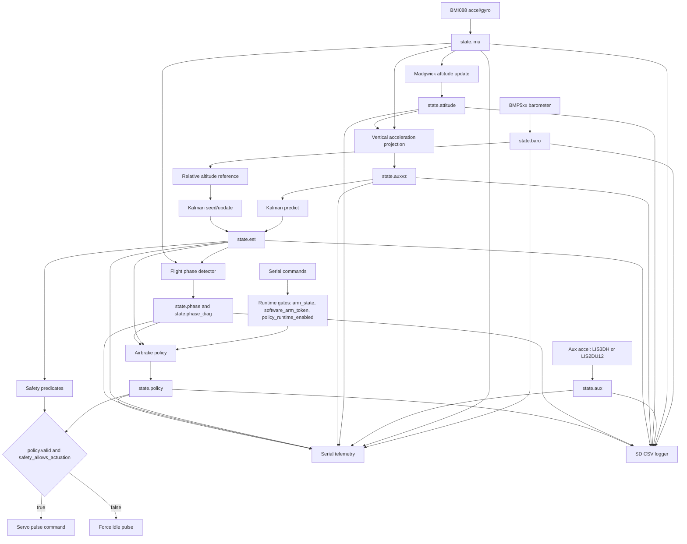

# Caelum Sufflamen

Real-time Teensy 4.1 firmware for deterministic vertical-state estimation, flight-phase classification, and safety-gated apogee-targeting airbrake control.

## Abstract

Caelum Sufflamen is an embedded flight-control firmware project for a rocket airbrake module. The project addresses the problem of converting noisy barometric and inertial measurements into a defensible, observable, and safety-gated actuator command for apogee management. The firmware runs a fixed-order Arduino/Teensy scheduler, publishes validity-qualified sensor and estimator snapshots, estimates altitude and vertical velocity with a Madgwick attitude solution plus a two-state Kalman filter, classifies flight phase with latched dwell logic, and computes normalized airbrake deployment intent from a quadratic-drag apogee model.

The technical contribution of the repository is a reviewable control and evidence pipeline rather than a monolithic sketch: sensing, estimation, phase classification, policy intent, safety gating, actuation, telemetry, and SD logging have explicit ownership boundaries. Host-side tests exercise the policy, phase detector, command parser, previous-year data audit, analytical coast simulation, and aerodynamic fitting utilities. The current aerodynamic constants remain placeholders because the committed previous-year CSV data lacks the command/deployment and coast-through-apogee evidence required to identify vehicle-specific airbrake coefficients.

## Overview

### Purpose

This repository exists to support disciplined development of a model-based rocket airbrake controller on Teensy 4.1 hardware. It is intended to be understandable by reviewers, maintainable by future contributors, and testable before flight hardware is trusted.

### Use Cases

| Use case                                      | Repository support                                                                                                    |
| --------------------------------------------- | --------------------------------------------------------------------------------------------------------------------- |
| Bench bring-up of a Teensy 4.1 avionics stack | Canonical Arduino CLI wrapper, serial diagnostics, sensor health flags, idle-forcing actuator path.                   |
| Airbrake control-law development              | Quadratic-drag apogee predictor, fixed-count command solver, host-side 1D coast simulation, replay validation tools.  |
| Flight data collection                        | SD CSV logger, live Serial CSV telemetry, warning masks, phase and policy observability fields.                       |
| Post-flight or post-test review               | Committed validation workflow, previous-year data audit, empirical coefficient fitting script for compatible SD logs. |
| Technical presentation or review              | Explicit architecture, state contracts, equations, verification gaps, and traceable limitations.                      |

### Scope

The repository currently covers:

| In scope                                                 | Not yet in scope                                                           |
| -------------------------------------------------------- | -------------------------------------------------------------------------- |
| Teensy 4.1 Arduino firmware architecture                 | Certified or flight-qualified controller claims.                           |
| LIS3DH auxiliary accelerometer and Pmod CMPS2 magnetometer bench acquisition; legacy BMP5xx, BMI088, and LIS2DU12 backends remain compile-time options | Full multi-sensor redundancy or voting.                                    |
| Quaternion attitude and vertical acceleration projection | Complete 6-DOF vehicle dynamics simulation.                                |
| Two-state altitude and vertical-speed estimation         | GPS/GNSS or magnetometer fusion in the active runtime.                     |
| Conservative phase detection and apogee-targeting policy | Vehicle-specific aerodynamic identification from current airbrake flights. |
| Serial commands, telemetry, SD logging, and host tests   | Firmware-in-the-loop or hardware-in-the-loop infrastructure.               |

### Key Features

- Deterministic 50 Hz main scheduler with non-blocking command service and bounded runtime work.
- Shared `SystemState` snapshot model with `valid`, `updated`, timestamp, and sequence semantics.
- LIS3DH auxiliary accelerometer and Pmod CMPS2 magnetometer acquisition in the current bench profile, with legacy BMP5xx, BMI088, and LIS2DU12 backends available as compile-time options.
- Madgwick quaternion attitude update and world-vertical acceleration projection.
- Two-state Kalman filter for altitude and vertical velocity using measured IMU `dt`.
- Stateful `IDLE`, `BOOST`, `COAST`, `BRAKE`, and `DESCENT` phase detector with latches and dwell timers.
- Explicit `ARM` and `POLICY` runtime command path before policy intent can become non-idle.
- Model-based apogee prediction and fixed-count bisection command solve.
- Pulse-width servo writes through `writeMicroseconds`.
- Shared warning-mask generation for Serial telemetry and SD logs.
- Host-side Python tests and validation utilities.

### Evidence Model

The README distinguishes evidence levels as follows.

| Category              | Meaning in this repository                                                                               |
| --------------------- | -------------------------------------------------------------------------------------------------------- |
| Confirmed fact        | Directly supported by committed source, scripts, docs, or result artifacts.                              |
| Engineering inference | Strongly implied by code structure or naming, but not independently proven by committed flight evidence. |
| Open gap              | Known missing verification, missing data, or unpinned environment detail.                                |

Confirmed facts include the Teensy 4.1 target in `BUILDING.md`, the `teensy:avr:teensy41` FQBN in the build wrapper, the runtime control gates in `utils/commands.cpp` and `src/airbrake_policy.cpp`, and the previous-year data audit result in `validation/results/previous_year_flight_data_audit.json`.

Engineering inferences include the intended rocket-airbrake vehicle context and the physical interpretation of the normalized airbrake command. These are strongly supported by names, comments, equations, and documentation, but the repository does not contain a final mechanical drawing or vehicle test report.

Open gaps include vehicle-specific aerodynamic coefficients, exact library version pinning, complete simulation, firmware-in-the-loop testing, hardware-in-the-loop testing, and committed target-board oscilloscope or logic-analyzer evidence for servo pulse widths.

## Architecture

### High-Level Data and Control Flow



### Major Subsystems

| Subsystem                   | Primary files                                                                                | Responsibility                                                                                                                             |
| --------------------------- | -------------------------------------------------------------------------------------------- | ------------------------------------------------------------------------------------------------------------------------------------------ |
| Scheduler and orchestration | `CaelumSufflamen.ino`                                                                        | Owns boot order, main-loop timing, subsystem call order, telemetry cadence, SD service timing, and final actuation decision.               |
| Shared data contracts       | `include/data_types.h`, `utils/config.h`, `utils/math_utils.h`                               | Defines runtime state, snapshot semantics, constants, helper math, parsing, and unit conventions.                                          |
| Sensor acquisition          | `include/sensors.h`, `src/sensors.cpp`                                                       | Initializes hardware and publishes bounded barometer, IMU, auxiliary accelerometer, and magnetometer snapshots.                            |
| Attitude estimation         | `include/attitude.h`, `src/attitude.cpp`                                                     | Maintains private quaternion state, publishes attitude, and computes vertical acceleration from body-frame acceleration.                   |
| Altitude estimation         | `include/estimation.h`, `include/kalman_alt2.h`, `src/estimation.cpp`, `src/kalman_alt2.cpp` | Selects relative altitude reference, runs Kalman predict/update, and publishes altitude, velocity, acceleration, and covariance.           |
| Phase classification        | `include/flight_phase.h`, `src/flight_phase.cpp`                                             | Classifies `IDLE`, `BOOST`, `COAST`, `BRAKE`, and `DESCENT` with latches, dwell timers, and diagnostic fields.                             |
| Airbrake policy             | `include/airbrake_policy.h`, `src/airbrake_policy.cpp`                                       | Computes normalized deployment intent from a drag-aware apogee model under explicit arming, phase, freshness, and altitude/speed gates.    |
| Safety and actuator output  | `include/safety.h`, `src/safety.cpp`, `include/actuator.h`, `src/actuator.cpp`               | Applies final actuation permission and maps normalized command to servo pulse width, or forces idle.                                       |
| Commands                    | `utils/commands.h`, `utils/commands.cpp`                                                     | Implements bounded Serial command parsing, arming, policy enable, baseline commands, and `SIM_APOGEE`.                                     |
| Telemetry and logging       | `utils/telemetry.h`, `utils/telemetry.cpp`, `utils/sd_logger.h`, `utils/sd_logger.cpp`       | Emits fixed-schema Serial CSV telemetry, diagnostics, status, warning masks, and SD CSV logs.                                              |
| Host validation             | `tests/host/*.py`                                                                            | Provides source-integrated reference-model tests, policy simulation, replay validation, coefficient fitting, and previous-year data audit. |

### External Interfaces

| Interface         | Direction                             | Current contract                                                                                                    |
| ----------------- | ------------------------------------- | ------------------------------------------------------------------------------------------------------------------- |
| USB Serial        | Host to firmware and firmware to host | `115200` baud command, status, telemetry, and diagnostic channel.                                                   |
| I2C               | Firmware to sensors                   | Current bench profile auto-detects LIS3DH on `Wire`, `Wire1`, or `Wire2`; Pmod CMPS2 remains on `Wire1`; legacy BMP5xx, BMI088, and LIS2DU12 backends remain compile-time options. |
| Built-in SD card  | Firmware to storage                   | Creates `LOG###.CSV`, writes a fixed header, appends runtime rows, flushes by row and time cadence.                 |
| Servo output      | Firmware to actuator                  | `PIN_AIRBRAKE_SERVO = 9`, normalized command mapped to configured pulse width and written with `writeMicroseconds`. |
| Host Python tools | Developer to repository               | Validation scripts read firmware constants from `utils/config.h` and CSV data from committed log locations.         |

### Teensy 4.1 Wiring

| Hardware             | Firmware interface | Teensy 4.1 wiring                                                                    | Firmware role                                      |
| -------------------- | ------------------ | ------------------------------------------------------------------------------------ | -------------------------------------------------- |
| BMP5xx               | `Wire`             | SDA pin 18, SCL pin 19, 3.3 V, GND                                                   | Barometer and pressure-altitude source.            |
| BMI088               | `Wire`             | SDA pin 18, SCL pin 19, 3.3 V, GND                                                   | Primary acceleration and gyro source.              |
| LIS3DH               | auto `Wire`/`Wire1`/`Wire2` | Detected at `0x18` or `0x19`; current bench can share `Wire1` with CMPS2 on SDA1 pin 17 and SCL1 pin 16 | Current auxiliary acceleration evidence.           |
| LIS2DU12             | `Wire`             | SDA pin 18, SCL pin 19, 3.3 V, GND                                                   | Legacy optional auxiliary acceleration evidence.   |
| Pmod CMPS2           | `Wire1`            | SDA1 pin 17, SCL1 pin 16, 3.3 V, GND                                                 | Logged magnetometer observability only.            |
| Pmod ACL2            | Optional SPI       | CS pin 10, MOSI pin 11, MISO pin 12, SCK pin 13, optional INT1/INT2 pins 2 and 3     | Logged ADXL362 acceleration observability only.    |
| Pmod ACL             | Optional SPI       | Alternative to ACL2 on the same SPI pins; use only one Pmod accelerometer backend     | Logged ADXL345 acceleration observability only.    |
| Airbrake servo       | Servo output       | Signal pin 9, external servo power rail, servo ground tied to Teensy ground           | Safety-gated actuator output.                      |
| Heartbeat LED        | GPIO               | External LED on pin 33                                                               | Status heartbeat; pin 13 remains available as SCK. |
| Built-in microSD     | SDIO               | No external wiring                                                                   | Persistent `LOG###.CSV` flight/test evidence.      |
| USB Serial           | USB                | USB cable                                                                            | Commands, telemetry, boot status, and diagnostics. |

All GPIO-connected hardware must use 3.3 V logic. Servo power must not be drawn from the Teensy 3.3 V rail.

### Runtime Control Path

The policy is compiled in by default in the current branch, but a non-idle policy command still requires explicit runtime gates:

```text
arm_state == ARMED
software_arm_token == true
policy_runtime_enabled == true
phase in {COAST, BRAKE}
estimator valid and fresh
altitude >= POLICY_MIN_ALT_M
vertical speed >= POLICY_MIN_VZ_MPS
predicted overshoot beyond deadband
```

The command path is exposed through Serial:

```text
ARM ARMED
POLICY 1
```

`ARM DISARMED`, `ARM SAFE`, or `POLICY 0` resets policy output and forces the actuator idle. `ARM ARMED` is accepted only while the phase is `IDLE`, which prevents arming from being introduced after a flight phase has already been detected.

## Repository Structure

| Path                                                      | Role                                                                                                                 |
| --------------------------------------------------------- | -------------------------------------------------------------------------------------------------------------------- |
| `CaelumSufflamen.ino`                                     | Arduino sketch entry point, boot sequence, deterministic scheduler, and top-level actuation decision.                |
| `include/`                                                | Public subsystem interfaces and shared `SystemState` data contracts.                                                 |
| `src/`                                                    | Core subsystem implementations for sensing, attitude, estimation, phase, policy, safety, and actuation.              |
| `utils/`                                                  | Configuration, command parser, telemetry, SD logger, and math/string helpers staged into the Arduino sketch build.   |
| `tools/teensy41_arduino_cli.ps1`                          | Canonical PowerShell wrapper that stages the split source tree and invokes `arduino-cli`.                            |
| `tests/host/`                                             | Host-side Python test harness, policy simulation, replay validator, empirical fitter, and previous-year data audit.  |
| `validation/`                                             | Documentation and artifacts for replay validation and aerodynamic coefficient identification.                        |
| `validation/CURRENT_FLIGHT_LOGGING_SCHEMA.md`              | Current-flight SD logging and metadata evidence contract for body/brake drag coefficient identification.             |
| `validation/current_flight_log_schema.csv`                 | Machine-readable column manifest for the current-flight coefficient-identification logging schema.                   |
| `validation/results/previous_year_flight_data_audit.json` | Machine-readable audit of the committed previous-year CSV data.                                                      |
| `validation/flight data/`                                 | Previous-year CSV logs: six drop logs, one stationary log, and thirty legacy MC logs.                                |
| `simulation/README.md`                                    | Current simulation and planned firmware-in-the-loop/hardware-in-the-loop roadmap.                                    |
| `BUILDING.md`                                             | Board, FQBN, dependencies, canonical build command, upload command, and limitations.                                 |
| `Airbrake_Policy_Documentation.md`                        | Narrative expected behavior for phase/policy integration.                                                            |
| `Repository_Study_Notes.md`                               | Historical engineering study notes; useful context, but partly superseded by current build and validation artifacts. |
| `.gitignore`                                              | Ignores `.build/`, macOS resource-fork files, Python bytecode, and `__pycache__/`.                                   |

## Theory of Operation

### 1. Boot

At startup, `CaelumSufflamen.ino` initializes conservative software defaults, configures the heartbeat LED, starts Serial, initializes sensors, optionally captures a barometric pressure baseline, resets the estimator, initializes the SD logger, attaches the actuator, forces idle, prints command help, prints the telemetry header, and finally announces `BOOT,READY`.

The boot sequence intentionally captures the barometer baseline before runtime estimation begins. This keeps the estimator, telemetry, and SD logs in the same altitude reference frame.

### 2. Scheduler Timing

The main scheduler runs at:

```text
LOOP_HZ = 50
LOOP_PERIOD_US = 1000000 / LOOP_HZ
```

The loop advances `next_loop_us` by a fixed period after each due pass. This preserves average cadence without blocking. Heartbeat and command parsing run on every Arduino `loop()` entry, even when the main 50 Hz pass is not yet due.

### 3. Sensor Snapshot Publication

Each runtime sensor poll attempts at most one acquisition per call:

| Snapshot     | Source   | Units                                                                     |
| ------------ | -------- | ------------------------------------------------------------------------- |
| `state.baro` | BMP5xx   | temperature in deg C, pressure in hPa, altitude in m.                     |
| `state.imu`  | BMI088   | acceleration in m/s^2, angular rate in rad/s, acceleration norm in m/s^2. |
| `state.aux`  | LIS3DH or LIS2DU12 auxiliary accelerometer | auxiliary acceleration in m/s^2 and acceleration norm. |
| `state.mag`  | CMPS2    | raw unsigned counts, calibrated magnetic vector in uT, norm, and heading. |

Snapshots carry metadata:

| Field             | Semantics                                                                                                                   |
| ----------------- | --------------------------------------------------------------------------------------------------------------------------- |
| `valid`           | Payload is semantically usable by downstream consumers.                                                                     |
| `updated`         | Owning module produced a fresh publication during its most recent service call; this is observability, not a consume latch. |
| `t_ms` and `t_us` | Publication or acquisition timestamps used for freshness and measured `dt`.                                                 |
| `seq`             | Successful-publication counter.                                                                                             |

Consumers are expected to gate on metadata and finiteness before using payload values.

### 4. Attitude and Vertical Acceleration

The attitude module owns a private quaternion. A valid IMU update:

1. Rejects invalid `dt` and non-finite sensor values.
2. Normalizes the accelerometer vector.
3. Applies Madgwick gradient correction to gyro integration.
4. Renormalizes the quaternion.
5. Publishes `state.attitude`.

The estimator then projects body-frame acceleration into the world vertical axis using the quaternion and removes gravity according to the firmware sign convention:

```text
a_vertical = world_z_component(body_acceleration, q) + g
```

This derived acceleration is published in `state.auxvz`.

### 5. Altitude and Velocity Estimation

The Kalman state is:

```text
x = [h, v]^T
```

where `h` is relative altitude in meters and `v` is vertical velocity in meters per second, positive upward.

Prediction uses measured IMU sample interval:

```text
h(k+1) = h(k) + v(k) * dt + 0.5 * a * dt^2
v(k+1) = v(k) + a * dt
```

Barometric altitude supplies the scalar measurement:

```text
z = h + noise
```

The covariance prediction uses acceleration process noise from `kSigmaA2`, and correction uses `kR`. The update uses Joseph-form covariance correction and explicitly symmetrizes the off-diagonal covariance terms.

### 6. Flight-Phase Classification

The phase detector consumes estimator altitude, estimator vertical speed, and IMU acceleration norm. It uses private latches and dwell timers so isolated noisy samples do not immediately change the phase state.

| Phase     | Meaning                                                                 |
| --------- | ----------------------------------------------------------------------- |
| `IDLE`    | No confirmed launch. This is the fail-safe preflight state.             |
| `BOOST`   | Launch has been confirmed and burnout has not yet been confirmed.       |
| `COAST`   | Burnout has been confirmed and the vehicle is still in upward coast.    |
| `BRAKE`   | Previous-cycle policy output indicates active braking intent.           |
| `DESCENT` | Sustained non-positive vertical velocity indicates post-apogee descent. |

`BRAKE` depends on previous-cycle policy intent because `flight_phase_update()` runs before `airbrake_policy_compute()` in the scheduler. That introduces a deterministic one-cycle supervisory latency.

### 7. Apogee Policy

The airbrake policy models upward coast with quadratic drag:

```text
dv/dt = -g - k(u) * v^2
k(u) = rho * (CDA_body + u * CDA_brake) / (2 * m)
```

For locally constant density and drag area, the predicted apogee is:

```text
h_apogee(u) = h + ln(1 + k(u) * v^2 / g) / (2 * k(u))
```

For very small `k`, the policy falls back to the ballistic limit:

```text
h_apogee = h + v^2 / (2 * g)
```

The command solver predicts apogee at zero deployment, predicts apogee at maximum deployment, then uses fixed-count bisection to select a normalized deployment command. It applies a slew-rate limit before publishing policy intent.

### 8. Safety and Actuation

Policy output is intent only. Hardware movement still requires `safety_allows_actuation(state)` and `state.policy.valid`.

The safety predicate checks:

| Gate                              | Purpose                                                  |
| --------------------------------- | -------------------------------------------------------- |
| `ACTUATION_ENABLED`               | Compile-time hard gate.                                  |
| `state.cfg.valid`                 | Prevents acting with invalid runtime configuration.      |
| `state.est.valid`                 | Prevents acting without a fused vertical-state estimate. |
| Estimator age <= `EST_MAX_AGE_MS` | Prevents stale estimates from driving hardware.          |

If any gate fails, the scheduler calls `actuator_force_idle()`. The actuator maps normalized command to pulse width using:

```text
servo_us = servo_us_min + command01 * (servo_us_max - servo_us_min)
```

The current implementation writes pulse-equivalent microseconds directly and stores the last requested pulse for telemetry.

### 9. Observability

Serial telemetry and SD logging are engineering evidence channels. They include validity flags, update flags, sequence counters, timestamps, sensor values, attitude, vertical acceleration, estimator state, covariance, phase diagnostics, arming gates, policy outputs, actuator pulse width, configuration references, and warning masks.

The SD logger runs last in the scheduler so each row records the state already used for policy and actuation in that same cycle.

## Design and Implementation

### Shared-State Contract

`SystemState` is the central integration object. It is intentionally a plain aggregate rather than a hidden framework. Each module owns a small portion of it and publishes snapshots into that portion.

The `updated` field is consistently treated as an external observability flag: it reports whether the owning module published fresh data in its most recent service call. It is not a cross-module consume flag that downstream modules clear.

### Configuration and Constants

`utils/config.h` centralizes:

- feature switches,
- scheduler rates,
- command buffer size,
- barometer calibration settings,
- SD logging cadence,
- warning-mask allocation,
- physical constants,
- Madgwick and Kalman tuning,
- servo pin and pulse bounds,
- policy target and aerodynamic constants,
- phase-detection thresholds,
- uncertainty margin settings.

The current branch defaults both `ACTUATION_ENABLED` and `AIRBRAKE_POLICY_ENABLED` to `1`, which permits the complete control path to be exercised in development builds. Runtime arming, policy enable, phase, estimator freshness, and safety gates still prevent non-idle hardware output unless conditions are explicitly satisfied.

### Command Parser

The Serial command parser is bounded by `CMD_BUF_N = 96`. It consumes only already-buffered Serial bytes and dispatches complete CR/LF-terminated lines. If a line exceeds the buffer, the parser emits `ERR,CMD_TOO_LONG` and discards all bytes until the next newline. This prevents a suffix of an overlong command from being accidentally executed as a later command.

Supported commands:

| Command                    | Effect                                                                                                        |
| -------------------------- | ------------------------------------------------------------------------------------------------------------- |
| `HELP`                     | Print command list.                                                                                           |
| `STATUS`                   | Print compact status, compile feature flags, SD fault reason, plot validity mask, policy/phase state, LIS3DH selected I2C address, and CMPS2 init/runtime diagnostics. |
| `I2C_SCAN`                 | Scan `Wire`, `Wire1`, and `Wire2` for 7-bit I2C addresses as a bench diagnostic.                              |
| `HDR 0` or `HDR 1`         | Disable or enable periodic telemetry rows.                                                                    |
| `PLOT OFF`                 | Disable the optional low-rate visual telemetry stream.                                                        |
| `PLOT OVERVIEW`            | Emit compact altitude, velocity, command, actuator, age, covariance, validity, and warning fields for live dashboards. |
| `PLOT IMU`                 | Emit IMU, auxiliary acceleration, optional Pmod acceleration, magnetometer, attitude, and vertical-accel QA.   |
| `PLOT APOGEE`              | Emit estimator state, apogee predictions, target margin, brake authority, energy, command validity, actuator pulse, and estimator age. |
| `PLOT ESTIMATOR`           | Emit estimator/barometer consistency, covariance, one-sigma altitude/velocity uncertainty, and data ages.      |
| `PLOT PHASE`               | Emit phase, launch/burnout/descent latches, candidates, dwell gates, timers, and phase-driving state values.  |
| `PLOT HEALTH`              | Emit sensor health, validity flags, snapshot ages, warning mask, and SD runtime status for bench/preflight QA. |
| `PLOT ACTUATOR`            | Emit policy gates, command intent, servo pulse evidence, estimator freshness, and apogee-policy context.      |
| `PLOT ORIENT`              | Emit LIS3DH gravity-vector attitude, CMPS2 magnetic vector/heading, freshness, validity, and warning fields.  |
| `PLOT SAFETY`              | Emit configuration, estimator freshness, arming, phase, policy, central safety gates, and actuator evidence.  |
| `PLOT PROVENANCE`          | Emit raw barometer altitude, finite-difference barometer velocity, filtered estimator state, residuals, covariance, freshness, and validity. |
| `PLOT ENERGY`              | Emit altitude/velocity phase-state evidence, height-equivalent specific energy, kinetic height, apogee envelope, brake authority, and command. |
| `PLOT HUD`                 | Emit compact onboard HUD-page fields for flight state, apogee/control, attitude/field, and readiness/safety. |
| `ARM DISARMED` or `ARM 0`  | Clear arm token, disable policy runtime gate, reset policy, force idle.                                       |
| `ARM SAFE` or `ARM 1`      | Enter safe state, clear arm token, disable policy runtime gate, reset policy, force idle.                     |
| `ARM ARMED` or `ARM 2`     | Enter armed state only if phase is `IDLE`, set software arm token, reset policy.                              |
| `POLICY 0` or `POLICY OFF` | Disable runtime policy gate, reset policy, force idle.                                                        |
| `POLICY 1` or `POLICY ON`  | Enable runtime policy gate.                                                                                   |
| `SET_SLP <hpa>`            | Set sea-level pressure reference and reset estimator/log reference state.                                     |
| `CAP_BASELINE`             | Capture current valid barometer pressure as baseline and reset estimator/log reference state.                 |
| `CAL_BASELINE`             | Run bounded averaged baseline calibration and reset estimator/log reference state.                            |
| `SIM_APOGEE <h_m> <v_mps>` | Print no-brake, full-brake, and solved-command apogee predictions when `AIRBRAKE_POLICY_TEST_API` is enabled. |

`CAL_BASELINE` is intentionally blocking but bounded. It is a ground or boot operation, not a flight-loop operation.

### Visual Telemetry Stream

The `PLOT` stream is a low-rate serial-only stream intended for live plotting and bench dashboards. It does not modify the SD log schema and it is independent of `HDR 0` / `HDR 1`, so operators can reduce high-rate `TLM` bandwidth while keeping a compact visual instrument active.

Each `PLOT <mode>` command prints `ACK,PLOT,<mode>` followed by a `PLOT_HDR,<mode>,...` schema line. Runtime rows then emit as `PLOT,<mode>,...` at `PLOT_PERIOD_MS`.

Mode semantics:

| Mode       | Main use                                                                                                                     |
| ---------- | ---------------------------------------------------------------------------------------------------------------------------- |
| `OVERVIEW` | Live flight-state dashboard: estimator altitude/velocity/acceleration, barometer altitude, actuator command, covariance, target margin, freshness, health. |
| `IMU`      | Sensor QA dashboard: body acceleration, acceleration norms, gyro norm, magnetic norm/heading/interference, attitude, vertical acceleration. |
| `APOGEE`   | Control-science dashboard: no-brake/full-brake apogee predictions, target/error, brake authority, specific energy, command validity, applied pulse, and estimator freshness. |
| `ESTIMATOR` | Sensor-fusion trust dashboard: barometer altitude, fused altitude/velocity/acceleration, covariance, one-sigma uncertainty, and snapshot freshness. |
| `PHASE`    | State-machine audit dashboard: phase, candidates, latches, dwell gates, confirmation timers, acceleration, velocity, command, and actuator pulse. |
| `HEALTH`   | Preflight and bench dashboard: hardware presence, snapshot validity, freshness, warning mask, and SD logger status. |
| `ACTUATOR` | Command-authority dashboard: arming gates, policy validity, normalized intent, servo pulse evidence, estimator freshness, and apogee context. |
| `ORIENT`   | Live connected-sensor dashboard: LIS3DH gravity vector, roll/pitch from acceleration, CMPS2 magnetic vector, heading, interference, and freshness. |
| `SAFETY`   | Causality dashboard: configuration validity, estimator validity/freshness, arming token, runtime policy gate, phase allowance, policy validity, safety predicates, and actuator pulse. |
| `PROVENANCE` | Raw-vs-filtered dashboard: barometer altitude, diagnostic barometer velocity proxy, estimator altitude/velocity/acceleration, residuals, covariance, freshness, and validity. |
| `ENERGY`   | Energy-state dashboard: altitude/velocity phase plot inputs, height-equivalent specific energy, kinetic height, vertical dynamic-pressure/Mach proxies, apogee envelope, target margin, brake authority, and command. |
| `HUD`      | Onboard minimal science pages: one compact row with page index, flight state, apogee/control, attitude/magnetic quality, readiness bits, safety, and SD status. |

`qbar_v_proxy_pa` and `mach_v_proxy` in `PLOT APOGEE` are derived from vertical speed only. They are useful for visual trend checks and anomaly detection, but they are not substitutes for true airspeed-derived dynamic pressure or full Mach number.

`P00_m2`, `P11_m2`, `sigma_h_m`, sensor ages, `policy_valid`, and `actuator_us` are included in `PLOT APOGEE` so a display can distinguish estimator uncertainty, stale evidence, command computation, and the actuator pulse requested at the backend without changing the fixed SD log schema.

`PLOT OVERVIEW` appends covariance and policy evidence after the original overview fields. Existing consumers can keep using the older prefix, while dashboards that understand the extended layout can render altitude/velocity uncertainty, uncertainty margin, effective target, policy validity, and estimator seeded state.

`PLOT SAFETY` is intended for "why did the actuator move or stay idle?" debugging. It reports the central `safety_runtime_ok` and `safety_allows_actuation` predicates alongside their supporting evidence instead of forcing a display to infer safety state from unrelated packets.

`PLOT PROVENANCE` finite-differences successive valid barometer altitude samples to produce `baro_v_proxy_mps`. That value is diagnostic evidence for raw-vs-filtered disagreement; it is not a flight-control input and should be plotted with its freshness and residual fields.

`PLOT ENERGY` reports specific energy as height equivalent, `h + v^2/(2g)`, plus kinetic height, `v^2/(2g)`. These fields support altitude/velocity phase plots without assuming vehicle mass or claiming full aerodynamic energy accounting.

`PLOT HUD` is the smallest onboard display contract. Its row includes a cycling `page` index for four pages (`0=flight`, `1=apogee/control`, `2=attitude/field`, `3=readiness`) and a compact `readiness_flags` bitmask so a small screen can show whether each page is supported by fresh estimator, policy, safety, SD, gravity, magnetic, barometer, and IMU evidence.

### Recapture Readiness Checklist

Meaningful `PLOT APOGEE`, `PLOT PROVENANCE`, and `PLOT ENERGY` rows require a build and bench state that can publish barometer, IMU, attitude, vertical-acceleration, and estimator snapshots. In the current LIS3DH/CMPS2 bench profile, `BMP5XX_ENABLED=0` and `BMI088_ENABLED=0`, so copied rows with `valid_mask=20` mean only bit 2 (`aux_valid`) and bit 4 (`mag_valid`) are set. That profile is useful for orientation and magnetic-quality work, but it cannot produce useful apogee-envelope rows.

Before recapturing apogee or energy evidence:

1. Build a flight-state profile with `BMP5XX_ENABLED=1` and `BMI088_ENABLED=1` by passing `-FlightStateProfile` to `tools/teensy41_arduino_cli.ps1`.
2. Insert a known-good FAT32 microSD card before reset.
3. On boot, confirm `BOOT,SD,OK`, `BOOT,SD_REASON,none`, and a `BOOT,SD_FILE,LOG###.CSV` line.
4. Run `STATUS` and require `sd_enabled=1`, `sd_card_ok=1`, `sd_file_open=1`, `sd_runtime_failed=0`, and `sd_fault_reason=none`.
5. Run `I2C_SCAN` and confirm the expected BMP5xx/BMI088 bus addresses before relying on estimator output.
6. Run `HDR 0`, then `PLOT HEALTH`, `PLOT PROVENANCE`, and `PLOT ENERGY`.
7. Require `baro_valid=1`, `imu_valid=1`, `att_valid=1`, `auxvz_valid=1`, and `est_valid=1` in `STATUS` or `PLOT HEALTH`.
8. Require the plotted validity mask to include bits 0, 1, 5, 6, and 7. A useful full flight-state mask with aux and magnetometer also valid is at least `0xF7` decimal `247`; with policy valid it includes bit 8 as well.

If `warn_mask=8192`, warning bit 13 is set: SD logging is not ready or a runtime SD failure has latched. Use `BOOT,SD_REASON`, `STATUS sd_fault_reason=...`, and `DIAG,RUN sd_fault_reason=...` to distinguish `sd_begin_failed`, `filename_exhausted`, `file_open_failed`, and `runtime_file_fault`.

### Warning Mask

`telemetry_warn_mask(state)` is the single warning-mask generator for both Serial and SD outputs. Current allocation:

| Bit | Meaning                                       |
| --- | --------------------------------------------- |
| 0   | BMP5xx hardware not initialized.              |
| 1   | BMI088 accelerometer not initialized.         |
| 2   | BMI088 gyroscope not initialized.             |
| 3   | Selected auxiliary accelerometer not initialized. |
| 4   | Barometer snapshot invalid.                   |
| 5   | IMU snapshot invalid.                         |
| 6   | Auxiliary accelerometer snapshot invalid.     |
| 7   | Derived vertical acceleration invalid.        |
| 8   | Attitude snapshot invalid.                    |
| 9   | Estimator snapshot invalid.                   |
| 10  | Runtime configuration invalid.                |
| 11  | Pmod CMPS2 hardware not initialized.          |
| 12  | Magnetometer snapshot invalid.                |
| 13  | SD logger not ready, unavailable, or runtime SD failure latched. |

Hardware and snapshot warning bits are emitted only for backends compiled into
the current build. In the current LIS3DH/CMPS2 bench profile, absent BMP5xx,
BMI088, and LIS2DU12 hardware does not by itself set warning bits; LIS3DH
auxiliary acceleration and CMPS2 magnetometer validity remain visible.

### Data and Validation Scripts

The host scripts are intentionally source-coupled: they parse constants from `utils/config.h` instead of duplicating all configuration by hand.

| Script                                          | Purpose                                                                                          |
| ----------------------------------------------- | ------------------------------------------------------------------------------------------------ |
| `tests/host/run_host_tests.py`                  | Runs the host-side regression harness.                                                           |
| `tests/host/policy_coast_sim.py`                | Runs a minimal 1D coast simulation using the policy drag model and command shaping.              |
| `tests/host/policy_aero_empirical_fit.py`       | Fits body and brake drag-area coefficients from compatible SD logs.                              |
| `tests/host/policy_aero_identification_report.py` | Generates Markdown/JSON coefficient-identification reports with body/brake residual summaries. |
| `tests/host/replay_policy_validation.py`        | Replays compatible SD logs through the configured apogee predictor and reports prediction error. |
| `tests/host/heldout_replay_validation.py`       | Fits constants on training logs and validates apogee prediction error on held-out logs.          |
| `tests/host/firmware_in_loop_shim.py`           | Replays deterministic rows through command, estimator, phase, and policy host shims.             |
| `tests/host/generate_synthetic_current_schema_logs.py` | Generates theoretical current-schema SD fixtures for tool checkout only.                  |
| `tests/host/audit_previous_year_flight_data.py` | Audits previous-year CSV schemas for coefficient-identification suitability.                     |

## Build and Usage

### Prerequisites

| Requirement      | Current repository contract                                                                    |
| ---------------- | ---------------------------------------------------------------------------------------------- |
| Board            | Teensy 4.1.                                                                                    |
| Build tool       | `arduino-cli`.                                                                                 |
| FQBN             | `teensy:avr:teensy41`.                                                                         |
| Platform package | A Teensy Arduino package that provides the Teensy 4.1 FQBN.                                    |
| Core libraries   | Arduino core, `Wire`, `SD`, and Teensy-compatible servo backend.                               |
| Sensor libraries | Headers matching enabled backends. Current bench defaults require `Adafruit_LIS3DH.h` and `Adafruit_Sensor.h`; legacy BMP5xx, BMI088, and LIS2DU12 builds also require their matching libraries. |
| Host validation  | Python 3 with only standard-library modules for the committed host tests.                      |

### Canonical Build Command

From the repository root:

```powershell
powershell -ExecutionPolicy Bypass -File .\tools\teensy41_arduino_cli.ps1 -ArduinoCli arduino-cli
```

For apogee-envelope recapture, build the flight-state profile without editing
`config.h`:

```powershell
powershell -ExecutionPolicy Bypass -File .\tools\teensy41_arduino_cli.ps1 `
  -ArduinoCli arduino-cli `
  -FlightStateProfile
```

That profile injects `-DBMP5XX_ENABLED=1 -DBMI088_ENABLED=1` through the
Teensy 4.1 `build.flags.defs` Arduino CLI build property while preserving the
board's required base defines. It therefore requires the BMP5xx and BMI088
libraries to be installed in the Arduino CLI environment.

Additional compile-time overrides can be supplied as reviewed preprocessor
defines:

```powershell
powershell -ExecutionPolicy Bypass -File .\tools\teensy41_arduino_cli.ps1 `
  -ArduinoCli arduino-cli `
  -Define BMP5XX_ENABLED=1,BMI088_ENABLED=1
```

The wrapper:

1. Resolves the project root.
2. Creates `.build/teensy41/staged_sketch/`.
3. Copies `CaelumSufflamen.ino` into the staged sketch root as `staged_sketch.ino`.
4. Copies root-level headers into the staged sketch root and `staged_sketch/src/` for the current flattened sketch layout.
5. Copies root-level `.c`, `.cc`, and `.cpp` files into `staged_sketch/src/`.
6. Invokes `arduino-cli compile --fqbn teensy:avr:teensy41 --warnings all --build-path .build/teensy41/build`, with optional validated build-property defines for selected profiles.
7. Copies generated `.hex`, `.ehex`, `.elf`, `.eep`, `.lst`, and `.sym` artifacts into `.build/teensy41/output/`.

To regenerate only the staged sketch from the latest source files:

```powershell
powershell -ExecutionPolicy Bypass -File .\tools\teensy41_arduino_cli.ps1 -StageOnly
```

The wrapper also supports the older split layout if `include/`, `src/`, and `utils/` are all present.

### Canonical Upload Command

Replace `COM7` with the port reported by `arduino-cli board list`:

```powershell
powershell -ExecutionPolicy Bypass -File .\tools\teensy41_arduino_cli.ps1 -ArduinoCli arduino-cli -Upload -Port COM7
```

For flight-state profile upload:

```powershell
powershell -ExecutionPolicy Bypass -File .\tools\teensy41_arduino_cli.ps1 `
  -ArduinoCli arduino-cli `
  -FlightStateProfile `
  -Upload `
  -Port COM7
```

Build artifacts are written under:

```text
.build/teensy41/staged_sketch/
.build/teensy41/build/
.build/teensy41/output/
```

### Execution Workflow

1. Install the Teensy board package and required sensor libraries in the Arduino CLI environment.
2. Connect the Teensy 4.1 over USB.
3. Build with the canonical wrapper.
4. Upload with the canonical wrapper and the correct port.
5. Open a Serial monitor at `115200` baud.
6. Confirm boot messages including `BOOT,BEGIN` and `BOOT,READY`.
7. Confirm sensor health from boot lines and `STATUS`.
8. Capture or calibrate the barometer baseline while the vehicle is stationary.
9. Keep the system disarmed during bench setup.
10. Use `ARM ARMED` and `POLICY 1` only in a controlled, restrained, and reviewed test state.

### Simulation and Deployment Workflow

Current committed simulation and replay support is host-side. It includes a compact analytical coast model plus a deterministic 1D plant model with sensor noise, actuator lag, and scheduled fault injection. These tools are still not a substitute for 6DOF simulation, target-board firmware-in-the-loop, or hardware-in-the-loop evidence.

Example policy coast simulation:

```powershell
python .\tests\host\policy_coast_sim.py --mode policy --h0-m 120 --v0-mps 90 --target-apogee-m 300
```

Example repeatable plant simulation with current-schema SD-log output:

```powershell
python .\tests\host\plant_simulation.py `
  --seed 42 `
  --target-apogee-m 900 `
  --fault baro_dropout:3.0:3.4 `
  --fault actuator_stuck:4.0:5.0 `
  --fault noise_burst:6.0:6.5:8 `
  --csv-out .\validation\results\plant_faulted_LOG000.CSV `
  --shim-csv-out .\validation\results\plant_faulted_shim.csv `
  --json-out .\validation\results\plant_faulted_summary.json
```

The plant CSV follows the firmware SD logger schema. The JSON summary records the seed, plant configuration, active faults, true apogee, estimator-apogee error, peak policy command, peak actuator position, and fault row counts. The shim CSV can be replayed through `tests/host/firmware_in_loop_shim.py`.

Example apogee-control evidence display from any current-schema SD CSV:

```powershell
python .\tests\host\apogee_evidence_view.py `
  .\validation\results\plant_faulted_LOG000.CSV `
  --svg-out .\validation\results\plant_faulted_apogee_evidence.svg `
  --json-out .\validation\results\plant_faulted_apogee_evidence.json `
  --layout-json-out .\validation\results\plant_faulted_apogee_layout.json
```

The generated SVG is an engineering display, not a decorative gauge: it overlays estimated altitude, raw barometer altitude, no-brake and full-brake apogee predictions, target altitude, estimator uncertainty, policy command, actuator estimate, phase intervals, and warning ticks. The layout JSON normalizes those same quantities into panel bounds, physical values, pixel coordinates, stale-estimator flags, and warning-tick flags for other displays.

Example apogee prediction residual timeline from the same evidence stream:

```powershell
python .\tests\host\apogee_prediction_residual_timeline.py `
  .\validation\results\plant_faulted_LOG000.CSV `
  --svg-out .\validation\results\plant_faulted_apogee_prediction_residual_timeline.svg `
  --json-out .\validation\results\plant_faulted_apogee_prediction_residual_timeline.json
```

The residual timeline is a post-flight or replay evidence view. It back-labels each apogee prediction against an observed apogee, either provided with `--observed-apogee-m` or inferred from the maximum logged estimator altitude. It plots no-brake, full-brake, and selected-command residuals so controller predictions can be compared against the eventual flight outcome. If firmware-published apogee fields are absent, it uses the same host policy model and configured CDA constants as the coefficient tooling, and records those rows as model-assisted rather than pure firmware-prediction evidence.

Example raw-vs-filtered provenance display from any current-schema SD CSV:

```powershell
python .\tests\host\provenance_evidence_view.py `
  .\validation\results\plant_faulted_LOG000.CSV `
  --svg-out .\validation\results\plant_faulted_provenance_evidence.svg `
  --json-out .\validation\results\plant_faulted_provenance_evidence.json `
  --layout-json-out .\validation\results\plant_faulted_provenance_layout.json
```

The provenance view plots barometer altitude, diagnostic barometer finite-difference velocity, estimator altitude/velocity/acceleration, residuals, covariance, snapshot freshness, validity, and warning ticks. It accepts current-schema SD logs, captured `PLOT PROVENANCE` rows, and headerless copied `PLOT,PROVENANCE` rows that use the current firmware field order.

Example EKF innovation/covariance consistency dashboard from any current-schema SD CSV:

```powershell
python .\tests\host\ekf_innovation_covariance_dashboard.py `
  .\validation\results\plant_faulted_LOG000.CSV `
  --svg-out .\validation\results\plant_faulted_ekf_innovation_covariance.svg `
  --json-out .\validation\results\plant_faulted_ekf_innovation_covariance.json
```

The EKF dashboard plots post-update altitude and velocity residual proxies, normalized residuals, covariance symmetry and positive-semidefinite evidence, published sigma contract checks, freshness, and warning ticks. It accepts current-schema SD logs, captured `PLOT ESTIMATOR` rows, and headerless copied `PLOT,ESTIMATOR` rows that use the current firmware field order. The residual is explicitly a post-update proxy because the firmware does not publish the exact pre-update Kalman innovation `y` and innovation covariance `S`.

Example temporal freshness / latency oscilloscope from any current-schema SD CSV:

```powershell
python .\tests\host\temporal_freshness_latency_oscilloscope.py `
  .\validation\results\plant_faulted_LOG000.CSV `
  --svg-out .\validation\results\plant_faulted_temporal_freshness_latency.svg `
  --json-out .\validation\results\plant_faulted_temporal_freshness_latency.json
```

The temporal oscilloscope plots sample-period jitter, warning ticks, channel age traces, derived update freshness, row-sequence gaps, per-channel sequence gaps, and SD runtime-failure evidence. It accepts current-schema SD logs and captured `PLOT HEALTH` rows. For SD logs, channel age is derived from update flags and sequence timing when explicit age fields are not present.

Example aerodynamic coefficient observability map from any current-schema SD CSV:

```powershell
python .\tests\host\aero_observability_map.py `
  .\validation\results\plant_faulted_LOG000.CSV `
  --svg-out .\validation\results\plant_faulted_aero_observability_map.svg `
  --json-out .\validation\results\plant_faulted_aero_observability_map.json
```

The aerodynamic observability map is a pre-fit evidence display. It does not replace the coefficient report; it shows whether the log has coast/brake phase coverage, valid state evidence, enough velocity and apogee leverage, closed-command body baseline samples, open-command brake excitation, usable command span, acceptable `[1, command]` design conditioning, warning-free fit windows, and measured or proxy deployment evidence. If `brake_pos01_meas` is absent, the display reports command-proxy observability rather than full measured-position support.

Example wind-relative landing footprint / uncertainty cone from a CSV with horizontal state:

```powershell
python .\tests\host\wind_relative_landing_footprint.py `
  .\validation\data\flight_001\LOG000.CSV `
  --metadata-json .\validation\data\flight_001\metadata.json `
  --svg-out .\validation\results\flight_001_wind_relative_landing_footprint.svg `
  --json-out .\validation\results\flight_001_wind_relative_landing_footprint.json
```

The landing-footprint view is intentionally strict. It only reports a wind-relative footprint when the log contains finite horizontal position, ground-relative horizontal velocity, altitude/descent-time evidence, and wind metadata or CLI wind overrides. Current vertical-only SD logs render a `horizontal_state_unavailable` evidence view rather than a guessed landing point, and stale horizontal state is blocked by `--max-state-age-s`. Wind direction is interpreted in the local x/y frame; use `--wind-direction-convention toward` for a vector pointing where the wind blows, or `from` for meteorological-style direction.

Example onboard minimal science HUD pages from any current-schema SD CSV or captured `PLOT HUD` text:

```powershell
python .\tests\host\onboard_science_hud_pages.py `
  .\validation\results\plant_faulted_LOG000.CSV `
  --svg-out .\validation\results\plant_faulted_onboard_science_hud_pages.svg `
  --json-out .\validation\results\plant_faulted_onboard_science_hud_pages.json
```

The HUD-pages view mirrors the onboard `PLOT HUD` contract as four compact pages: flight state, apogee/control, attitude/field, and readiness/safety. It is intentionally sparse enough for a small display, but still carries validity, warning, freshness, safety, and SD evidence so a page can be marked as ready, caution, or unsupported.

Example energy-state phase display from any current-schema SD CSV:

```powershell
python .\tests\host\energy_phase_view.py `
  .\validation\results\plant_faulted_LOG000.CSV `
  --svg-out .\validation\results\plant_faulted_energy_phase.svg `
  --json-out .\validation\results\plant_faulted_energy_phase.json `
  --layout-json-out .\validation\results\plant_faulted_energy_phase_layout.json
```

The energy-state view plots estimated altitude versus vertical velocity as a phase portrait, then links it to height-equivalent specific energy, kinetic height, apogee envelope, target margin, brake authority, command, estimator freshness, and warning evidence. It accepts current-schema SD logs, captured `PLOT ENERGY` rows, and headerless copied `PLOT,ENERGY` rows that use the current firmware field order.

Example phase-timeline display from any current-schema SD CSV:

```powershell
python .\tests\host\phase_timeline_view.py `
  .\validation\results\plant_faulted_LOG000.CSV `
  --svg-out .\validation\results\plant_faulted_phase_timeline.svg `
  --json-out .\validation\results\plant_faulted_phase_timeline.json
```

The generated SVG shows the classified phase intervals, candidate and dwell evidence, launch/burnout/descent latch events, estimator altitude and velocity, acceleration norm, policy command, actuator pulse, and warning ticks. It is intended to make phase-state transitions reviewable against their driving evidence.

Example health-dashboard display from any current-schema SD CSV:

```powershell
python .\tests\host\health_dashboard_view.py `
  .\validation\results\plant_faulted_LOG000.CSV `
  --svg-out .\validation\results\plant_faulted_health_dashboard.svg `
  --json-out .\validation\results\plant_faulted_health_dashboard.json
```

The generated SVG summarizes channel validity, warning-mask activity, stale-data age evidence when available, SD runtime status, and fault intervals. It is intended for bench, preflight, replay, and fault-injection review where health state matters more than trajectory shape.

Render the complete host view set from a deterministic synthetic non-flight plant log:

```powershell
powershell -ExecutionPolicy Bypass -File .\validation\results\render_all_views.ps1
```

Render the complete host view set from a real or bench SD CSV:

```powershell
powershell -ExecutionPolicy Bypass -File .\validation\results\render_all_views.ps1 `
  -InputCsv .\validation\data\flight_001\LOG000.CSV `
  -Prefix flight_001
```

Direct bench capture through a renderer can send the PLOT command after opening the serial port:

```powershell
python .\tests\host\provenance_evidence_view.py `
  --serial-port COM9 `
  --serial-command "HDR 0" `
  --serial-command "PLOT PROVENANCE" `
  --duration-s 30 `
  --svg-out .\validation\results\bench_provenance_evidence.svg `
  --json-out .\validation\results\bench_provenance_evidence.json `
  --layout-json-out .\validation\results\bench_provenance_layout.json

python .\tests\host\estimator_policy_phase_space_view.py `
  --serial-port COM9 `
  --serial-command "HDR 0" `
  --serial-command "PLOT APOGEE" `
  --duration-s 30 `
  --svg-out .\validation\results\bench_estimator_policy_phase_space.svg `
  --json-out .\validation\results\bench_estimator_policy_phase_space.json

python .\tests\host\ekf_innovation_covariance_dashboard.py `
  --serial-port COM9 `
  --serial-command "HDR 0" `
  --serial-command "PLOT ESTIMATOR" `
  --duration-s 30 `
  --svg-out .\validation\results\bench_ekf_innovation_covariance.svg `
  --json-out .\validation\results\bench_ekf_innovation_covariance.json

python .\tests\host\temporal_freshness_latency_oscilloscope.py `
  --serial-port COM9 `
  --serial-command "HDR 0" `
  --serial-command "PLOT HEALTH" `
  --duration-s 30 `
  --raw-out .\validation\results\bench_temporal_health_capture.txt `
  --svg-out .\validation\results\bench_temporal_freshness_latency.svg `
  --json-out .\validation\results\bench_temporal_freshness_latency.json

python .\tests\host\energy_phase_view.py `
  --serial-port COM9 `
  --serial-command "HDR 0" `
  --serial-command "PLOT ENERGY" `
  --duration-s 30 `
  --svg-out .\validation\results\bench_energy_phase.svg `
  --json-out .\validation\results\bench_energy_phase.json `
  --layout-json-out .\validation\results\bench_energy_phase_layout.json

python .\tests\host\phase_timeline_view.py `
  --serial-port COM9 `
  --serial-command "HDR 0" `
  --serial-command "PLOT PHASE" `
  --duration-s 30 `
  --svg-out .\validation\results\bench_phase_timeline.svg `
  --json-out .\validation\results\bench_phase_timeline.json

python .\tests\host\health_dashboard_view.py `
  --serial-port COM9 `
  --serial-command "HDR 0" `
  --serial-command "PLOT HEALTH" `
  --duration-s 30 `
  --svg-out .\validation\results\bench_health_dashboard.svg `
  --json-out .\validation\results\bench_health_dashboard.json

python .\tests\host\orientation_vector_view.py `
  --serial-port COM9 `
  --serial-command "HDR 0" `
  --serial-command "PLOT ORIENT" `
  --duration-s 30 `
  --svg-out .\validation\results\bench_orientation_vector.svg `
  --json-out .\validation\results\bench_orientation_vector.json

python .\tests\host\magnetic_field_quality_view.py `
  --serial-port COM9 `
  --serial-command "HDR 0" `
  --serial-command "PLOT ORIENT" `
  --duration-s 30 `
  --svg-out .\validation\results\bench_magnetic_field_quality.svg `
  --json-out .\validation\results\bench_magnetic_field_quality.json

python .\tests\host\gravity_norm_stability_view.py `
  --serial-port COM9 `
  --serial-command "HDR 0" `
  --serial-command "PLOT ORIENT" `
  --duration-s 30 `
  --svg-out .\validation\results\bench_gravity_norm_stability.svg `
  --json-out .\validation\results\bench_gravity_norm_stability.json

python .\tests\host\tilt_compensated_heading_view.py `
  --serial-port COM9 `
  --serial-command "HDR 0" `
  --serial-command "PLOT ORIENT" `
  --duration-s 30 `
  --raw-out .\validation\results\bench_heading_orient_capture.txt `
  --svg-out .\validation\results\bench_tilt_compensated_heading.svg `
  --json-out .\validation\results\bench_tilt_compensated_heading.json

python .\tests\host\sensor_frame_alignment_verifier.py `
  .\validation\results\bench_heading_orient_capture.txt `
  --input-format plot `
  --expected-sequence "+X,-X,+Y,-Y,+Z,-Z" `
  --svg-out .\validation\results\bench_sensor_frame_alignment.svg `
  --json-out .\validation\results\bench_sensor_frame_alignment.json

python .\tests\host\heading_sign_calibration_validator.py `
  .\validation\results\bench_tilt_compensated_heading.json `
  --svg-out .\validation\results\bench_heading_sign_calibration_validator.svg `
  --json-out .\validation\results\bench_heading_sign_calibration_validator.json

python .\tests\host\readiness_gate_view.py `
  --serial-port COM9 `
  --serial-command "HDR 0" `
  --serial-command "PLOT HEALTH" `
  --duration-s 30 `
  --svg-out .\validation\results\bench_readiness_gate.svg `
  --json-out .\validation\results\bench_readiness_gate.json
```

Example previous-year data audit:

```powershell
python .\tests\host\audit_previous_year_flight_data.py --data-dir "validation/flight data" --json-out .\validation\results\previous_year_flight_data_audit.json
```

Example empirical fit for future compatible SD logs:

```powershell
python .\tests\host\policy_aero_empirical_fit.py .\validation\data\flight_001\LOG000.CSV --json-out .\validation\results\flight_001_policy_fit.json
```

Example documented coefficient-identification report:

```powershell
python .\tests\host\policy_aero_identification_report.py `
  .\validation\data\flight_001\LOG000.CSV `
  --report-out .\validation\results\flight_001_coefficient_report.md `
  --json-out .\validation\results\flight_001_coefficient_report.json
```

Example replay validation for future compatible SD logs:

```powershell
python .\tests\host\replay_policy_validation.py .\validation\data\flight_001\LOG000.CSV --json-out .\validation\results\flight_001_policy_replay.json
```

Example held-out replay validation:

```powershell
python .\tests\host\heldout_replay_validation.py `
  --fit-log .\validation\data\flight_001\LOG000.CSV `
  --heldout-log .\validation\data\flight_002\LOG000.CSV `
  --json-out .\validation\results\heldout_policy_replay.json
```

Example deterministic firmware-loop shim:

```powershell
python .\tests\host\firmware_in_loop_shim.py `
  .\validation\data\bench_replay\input_rows.csv `
  --csv-out .\validation\results\bench_firmware_loop_rows.csv `
  --json-out .\validation\results\bench_firmware_loop_summary.json
```

If no real SD logs are available, synthetic current-schema fixtures can be
generated for tool checkout:

```powershell
python .\tests\host\generate_synthetic_current_schema_logs.py
```

Synthetic fixtures are marked in their metadata and must not be used as evidence
for changing aerodynamic constants.

The planned progression is:

| Level                           | Status    | Description                                                                                           |
| ------------------------------- | --------- | ----------------------------------------------------------------------------------------------------- |
| Serial model probe              | Committed | `SIM_APOGEE` exposes policy math on target.                                                           |
| Analytical host simulation      | Committed | `policy_coast_sim.py` evaluates the drag model and command shaping.                                   |
| Deterministic 1D plant simulation | Committed | `plant_simulation.py` adds sensor noise, actuator dynamics, current-schema logs, shim input, and fault injection. |
| Replay validation               | Committed | `replay_policy_validation.py` evaluates compatible SD logs against configured constants.              |
| Firmware-loop host shim         | Committed | `firmware_in_loop_shim.py` replays deterministic rows through command, estimator, phase, and policy shims. |
| Firmware-in-the-loop C++ build  | Planned   | Host build with deterministic Arduino, sensor, SD, Serial, and time shims.                            |
| Teensy 4.1 hardware-in-the-loop | Planned   | Real board timing, scripted sensor replay, Serial capture, SD capture, and servo pulse-width capture. |

## Configuration

### Compile-Time Feature Switches

| Symbol                     | Current default | Meaning                                                                     |
| -------------------------- | --------------- | --------------------------------------------------------------------------- |
| `BMP5XX_ENABLED`           | `0`             | Enable BMP5xx barometer acquisition. Disabled in the current LIS3DH/CMPS2 bench profile. |
| `BMI088_ENABLED`           | `0`             | Enable BMI088 accelerometer and gyroscope acquisition. Disabled in the current LIS3DH/CMPS2 bench profile. |
| `BMI088_USE_SPI`           | `0`             | Present but not used by current I2C implementation.                         |
| `LIS2DU12_ENABLED`         | `0`             | Enable LIS2DU12 auxiliary accelerometer acquisition. Mutually exclusive with LIS3DH. |
| `LIS3DH_ENABLED`           | `1`             | Enable LIS3DH auxiliary accelerometer acquisition into `state.aux` and the existing `lis_ax,lis_ay,lis_az` schema fields. |
| `LIS2MDL_ENABLED`          | `0`             | Placeholder for magnetometer support; not active in current runtime.        |
| `PMOD_CMPS2_ENABLED`       | `1`             | Enable Pmod CMPS2 magnetometer observability on `Wire1` when wired.         |
| `PMOD_ACL2_ENABLED`        | `0`             | Enable Pmod ACL2/ADXL362 SPI acceleration observability when wired.         |
| `PMOD_ACL_ENABLED`         | `0`             | Enable Pmod ACL/ADXL345 SPI acceleration observability when wired.          |
| `I2C_SCANNER_ENABLED`      | `1`             | Compile the `I2C_SCAN` bench diagnostic command.                            |
| `I2C_SCAN_ON_BOOT`         | `0`             | Optionally run all-bus I2C scan during boot diagnostics.                    |
| `ACTUATION_ENABLED`        | `1`             | Compile actuator command path. Runtime gates still control non-idle output. |
| `AIRBRAKE_POLICY_ENABLED`  | `1`             | Compile policy command generation. Runtime gates still control validity.    |
| `AIRBRAKE_POLICY_TEST_API` | `1`             | Expose test/prediction API and `SIM_APOGEE` command.                        |

The LIS3DH backend tries `0x18` first and then `0x19` on `Wire`, `Wire1`, and
`Wire2`, publishing the selected address and bus as `lis_i2c_addr` and
`lis_i2c_bus` in `STATUS`. The CMPS2 backend uses `Wire1` at `0x30` and reports
`cmps2_init` plus `cmps2_runtime` so a bench operator can distinguish electrical
ACK, initialization, status-register reads, conversion timeouts, and data-read
failures.

### Timing and Telemetry Constants

| Constant                 | Value    | Meaning                                    |
| ------------------------ | -------- | ------------------------------------------ |
| `SERIAL_BAUD`            | `115200` | USB Serial command and telemetry rate.     |
| `BOOT_SERIAL_TIMEOUT_MS` | `2000`   | Bounded boot wait for USB Serial.          |
| `LOOP_HZ`                | `50`     | Main scheduler rate.                       |
| `HEARTBEAT_MS`           | `250`    | Status LED toggle period.                  |
| `DIAG_PERIOD_MS`         | `1000`   | Diagnostic line cadence.                   |
| `TLM_PERIOD_MS`          | `100`    | Serial telemetry row cadence when enabled. |
| `PLOT_PERIOD_MS`         | `200`    | Optional visual telemetry row cadence.     |
| `CMD_BUF_N`              | `96`     | Serial command buffer capacity.            |
| `SD_LOG_HZ`              | `50`     | SD row cadence.                            |
| `SD_FLUSH_EVERY_LINES`   | `50`     | Flush cadence by row count.                |
| `SD_FLUSH_EVERY_MS`      | `500`    | Flush cadence by elapsed time.             |

### Estimator and Physics Constants

| Constant           | Value      | Role                                            |
| ------------------ | ---------- | ----------------------------------------------- |
| `kG`               | `9.80665`  | Gravity constant in m/s^2.                      |
| `MADGWICK_BETA`    | `0.1`      | Attitude correction gain.                       |
| `EST_MIN_IMU_DT_S` | `0.0005`   | Lower measured-IMU-dt guard.                    |
| `EST_MAX_IMU_DT_S` | `0.1000`   | Upper measured-IMU-dt guard.                    |
| `kSigmaH2`         | `5.71e-03` | Barometric altitude measurement variance basis. |
| `kR`               | `kSigmaH2` | Kalman measurement variance.                    |
| `kSigmaA2`         | `2.73e-03` | Acceleration process-noise intensity.           |
| `EST_MAX_AGE_MS`   | `200`      | Safety freshness limit for estimator output.    |

### Airbrake Policy Constants

| Constant                          | Value    | Role                                                |
| --------------------------------- | -------- | --------------------------------------------------- |
| `POLICY_TARGET_APOGEE_M`          | `300.0`  | Nominal target apogee in estimator reference frame. |
| `POLICY_MIN_ALT_M`                | `30.0`   | Minimum altitude for policy activation.             |
| `POLICY_MIN_VZ_MPS`               | `15.0`   | Minimum upward velocity for policy activation.      |
| `POLICY_APOGEE_DEADBAND_M`        | `5.0`    | No-command overshoot deadband.                      |
| `POLICY_VEHICLE_MASS_KG`          | `2.50`   | Vehicle mass used by apogee model.                  |
| `POLICY_RHO_KGPM3`                | `1.225`  | Local density assumption used by apogee model.      |
| `POLICY_CDA_BODY_M2`              | `0.0040` | Placeholder body drag area.                         |
| `POLICY_CDA_BRAKE_M2`             | `0.0200` | Placeholder incremental brake drag area.            |
| `POLICY_MAX_COMMAND01`            | `1.0`    | Maximum normalized deployment command.              |
| `POLICY_SLEW_PER_SEC`             | `1.5`    | Normalized command slew limit.                      |
| `POLICY_MAX_EST_AGE_MS`           | `200`    | Policy-local estimator freshness gate.              |
| `POLICY_BISECTION_STEPS`          | `18`     | Fixed iteration count for command solve.            |
| `POLICY_SIGMA_MARGIN_N`           | `1.0`    | Altitude sigma count subtracted from target.        |
| `POLICY_MAX_UNCERTAINTY_MARGIN_M` | `20.0`   | Maximum covariance-derived target reduction.        |

### Placeholder Parameters and Provenance

The aerodynamic constants in `utils/config.h` are explicitly documented as placeholders:

```text
POLICY_VEHICLE_MASS_KG
POLICY_RHO_KGPM3
POLICY_CDA_BODY_M2
POLICY_CDA_BRAKE_M2
```

The committed previous-year data under `validation/flight data/` was audited and was not sufficient to replace these constants. The audit result is committed at `validation/results/previous_year_flight_data_audit.json`.

Future replacement requires logs with:

- observed apogee or complete coast-through-descent altitude history,
- estimator altitude and vertical velocity during coast/brake intervals,
- airbrake command or actuator deployment state,
- vehicle mass and atmospheric-density assumptions for the fitted interval.

### Runtime-Modifiable Settings

| Setting                      | Command                                 | Notes                                                                          |
| ---------------------------- | --------------------------------------- | ------------------------------------------------------------------------------ |
| Serial telemetry rows        | `HDR 0` or `HDR 1`                      | Diagnostics and command responses remain available.                            |
| Visual telemetry stream      | `PLOT OFF`, `PLOT OVERVIEW`, `PLOT IMU`, `PLOT APOGEE`, `PLOT ESTIMATOR`, `PLOT PHASE`, `PLOT HEALTH`, `PLOT ACTUATOR`, `PLOT ORIENT`, `PLOT SAFETY`, `PLOT PROVENANCE`, or `PLOT ENERGY` | Serial-only low-rate dashboard stream; SD schema remains unchanged. |
| Sea-level pressure reference | `SET_SLP <hpa>`                         | Resets estimator and SD logger reference timing.                               |
| Barometer baseline           | `CAP_BASELINE` or `CAL_BASELINE`        | Establishes local altitude reference and resets estimator/log reference state. |
| Arming state                 | `ARM DISARMED`, `ARM SAFE`, `ARM ARMED` | `ARM ARMED` requires phase `IDLE`.                                             |
| Policy runtime gate          | `POLICY 0` or `POLICY 1`                | Non-idle policy intent requires this gate plus arming.                         |

## Verification and Testing

### Existing Verification Artifacts

| Artifact                                                  | Verification value                                                                                                                                            |
| --------------------------------------------------------- | ------------------------------------------------------------------------------------------------------------------------------------------------------------- |
| `tests/host/run_host_tests.py`                            | Regression harness for policy, phase, parser overflow handling, source integration, simulation, reporting, held-out replay, shim replay, data audit, and analytic fit fixtures. |
| `tests/host/policy_coast_sim.py`                          | Confirms increasing brake authority reduces apogee in the analytical model and that policy commands remain normalized.                                        |
| `tests/host/plant_simulation.py`                          | Deterministic 1D plant simulation with noisy barometer/IMU/magnetometer channels, first-order actuator dynamics, current-schema CSV export, shim CSV export, and scheduled faults. |
| `tests/host/apogee_evidence_view.py`                      | Parses, normalizes, and renders current-schema SD logs or captured `PLOT APOGEE` rows into SVG/JSON apogee-control evidence artifacts for debugging and demonstration. |
| `tests/host/apogee_prediction_residual_timeline.py`        | Renders current-schema SD logs or captured `PLOT APOGEE` rows into a back-labeled apogee prediction residual timeline using observed or inferred apogee. |
| `tests/host/estimator_policy_phase_space_view.py`         | Renders current-schema SD logs or captured `PLOT APOGEE` rows into a causal phase-space SVG/JSON view linking estimator state, prediction corridor, gates, command, and actuator. |
| `tests/host/provenance_evidence_view.py`                  | Parses, normalizes, and renders current-schema SD logs or captured `PLOT PROVENANCE` rows into raw-vs-filtered residual and freshness SVG/JSON evidence. |
| `tests/host/ekf_innovation_covariance_dashboard.py`       | Renders current-schema SD logs or captured `PLOT ESTIMATOR` rows into an EKF residual-proxy, covariance PSD/symmetry, sigma-contract, freshness, and warning dashboard. |
| `tests/host/temporal_freshness_latency_oscilloscope.py`   | Renders current-schema SD logs or captured `PLOT HEALTH` rows into a timebase jitter, channel freshness, sequence-gap, warning, and SD runtime oscilloscope. |
| `tests/host/aero_observability_map.py`                    | Renders current-schema SD logs into a pre-fit body/brake CDA observability map with command excitation, dynamic-pressure leverage, gate raster, and conditioning evidence. |
| `tests/host/energy_phase_view.py`                         | Parses, normalizes, and renders current-schema SD logs or captured `PLOT ENERGY` rows into altitude/velocity phase-state and energy-envelope SVG/JSON evidence. |
| `tests/host/phase_timeline_view.py`                       | Renders current-schema SD logs or captured `PLOT PHASE` rows into an SVG/JSON phase-transition evidence view for debugging and demonstration.                 |
| `tests/host/health_dashboard_view.py`                     | Renders current-schema SD logs or captured `PLOT HEALTH` rows into an SVG/JSON sensor-health and warning-mask dashboard for bench, replay, and fault review.   |
| `tests/host/orientation_vector_view.py`                   | Renders current-schema SD logs or captured `PLOT ORIENT` rows into an SVG/JSON LIS3DH+CMPS2 vector attitude view for bench, replay, and demonstration.        |
| `tests/host/magnetic_field_quality_view.py`               | Renders current-schema SD logs or captured `PLOT ORIENT` rows into an SVG/JSON CMPS2 magnetic field quality and interference map.                              |
| `tests/host/gravity_norm_stability_view.py`               | Renders current-schema SD logs, captured `PLOT ORIENT` rows, or orientation JSON into an SVG/JSON LIS3DH gravity-norm stability and vibration panel.           |
| `tests/host/sensor_frame_alignment_verifier.py`           | Renders current-schema SD logs, captured `PLOT ORIENT` rows, or orientation JSON into a six-face LIS3DH axis-convention and roll/pitch formula verifier.       |
| `tests/host/tilt_compensated_heading_view.py`             | Renders current-schema SD logs, HDR/TLM captures, or captured `PLOT ORIENT` rows into an SVG/JSON tilt-compensated heading demonstrator with readiness gates.  |
| `tests/host/heading_sign_calibration_validator.py`        | Segments heading JSON into bench pose intervals and validates tilt-heading sign evidence, pose coverage, and CMPS2 heading-bin calibration coverage.            |
| `tests/host/readiness_gate_view.py`                       | Renders current-schema SD logs, captured `PLOT HEALTH` rows, or health JSON into a profile-aware readiness gate that marks uninstalled sensors separately.     |
| `tests/host/audit_previous_year_flight_data.py`           | Proves the committed previous-year data cannot justify aerodynamic coefficient replacement.                                                                   |
| `tests/host/policy_aero_empirical_fit.py`                 | Defines the future data contract for coefficient identification from compatible SD logs.                                                                      |
| `tests/host/policy_aero_identification_report.py`         | Produces body/brake coefficient reports with signed residual records and Markdown review output.                                                             |
| `tests/host/replay_policy_validation.py`                  | Defines the future replay contract for model prediction error on compatible SD logs.                                                                          |
| `tests/host/heldout_replay_validation.py`                 | Fits on training logs and compares predicted apogee against observed apogee on held-out logs.                                                                |
| `tests/host/firmware_in_loop_shim.py`                     | Replays deterministic command and sensor rows through command, estimator, phase, and policy shims.                                                           |
| `validation/results/previous_year_flight_data_audit.json` | Records the schema and suitability results for 37 committed CSV logs.                                                                                         |
| `Airbrake_Policy_Documentation.md`                        | States expected phase/policy behavior for rest, boost, coast below target, coast above target, and descent.                                                   |
| `BUILDING.md`                                             | Defines canonical board, FQBN, required libraries, build command, upload command, and build limitations.                                                      |

### Host Test Command

```powershell
python .\tests\host\run_host_tests.py
```

The current harness includes checks for:

- valid policy command generation in `COAST` when armed and policy-enabled,
- policy invalidation when disarmed,
- phase progression to `COAST` and `DESCENT`,
- command overflow discard-until-newline behavior,
- source integration invariants,
- analytical coast simulation response to brake authority,
- previous-year data audit blocking coefficient replacement,
- empirical aerodynamic fitting on an analytic fixture,
- coefficient report generation with body and brake residual records,
- held-out replay validation on analytic train/held-out fixtures,
- deterministic firmware-loop shim replay through command, estimator, phase, and policy.

### What Is Verified

| Verified behavior                                                                                 | Method                                                                                    |
| ------------------------------------------------------------------------------------------------- | ----------------------------------------------------------------------------------------- |
| Policy can produce a nonzero valid command in `COAST` under the explicit arming and policy gates. | Host reference model in `run_host_tests.py`.                                              |
| Disarmed or un-tokened state prevents policy validity.                                            | Host reference model in `run_host_tests.py`.                                              |
| Phase detector reaches `COAST` and `DESCENT` under representative motion samples.                 | Host reference model in `run_host_tests.py`.                                              |
| Overlong command lines are fully discarded until newline.                                         | Host parser model in `run_host_tests.py` and source check in `utils/commands.cpp`.        |
| SD warning mask uses the same generator as Serial telemetry.                                      | Source integration check and `telemetry_warn_mask(state)` usage in `utils/sd_logger.cpp`. |
| Actuator writes pulse-equivalent microseconds.                                                    | Source integration check for `writeMicroseconds` in `src/actuator.cpp`.                   |
| Previous-year data cannot identify current body or brake coefficients.                            | Audit script and committed JSON result.                                                   |
| Coefficient reports preserve body and brake residual records.                                     | Analytic fixture through `policy_aero_identification_report.py`.                          |
| Held-out replay compares predicted and observed apogee outside the fit set.                       | Analytic train/held-out fixture through `heldout_replay_validation.py`.                   |
| Deterministic command, estimator, phase, and policy replay is available without target hardware.  | Synthetic replay through `firmware_in_loop_shim.py`.                                      |

### What Is Not Yet Verified

| Gap                                                                             | Consequence                                                                                                              |
| ------------------------------------------------------------------------------- | ------------------------------------------------------------------------------------------------------------------------ |
| No committed Teensy 4.1 build transcript from a pinned environment.             | Build workflow is canonical but not bit-for-bit reproducible.                                                            |
| No exact library versions are pinned.                                           | Different developer machines may resolve different sensor or Teensy library versions.                                    |
| No current-flight SD log with policy command and coast-through-apogee evidence. | Aerodynamic constants remain placeholders.                                                                               |
| No C++ firmware-in-the-loop test binary.                                        | Host shim tests model selected behavior in Python rather than compiling firmware C++ against Arduino mocks.              |
| No hardware-in-the-loop rig.                                                    | Real scheduler timing, SD behavior, sensor injection, Serial scripts, and servo pulses are not yet repeatably exercised. |
| No committed oscilloscope or logic-analyzer evidence for servo pulses.          | Pulse-width mapping is implemented in code but still needs target-board measurement.                                     |
| No formal sensor-axis calibration artifact.                                     | The accelerometer sign convention and mounting orientation must be validated on the actual vehicle.                      |

### Validation Acceptance for Aerodynamic Updates

Before replacing the placeholder coefficients, a future change should include:

1. Compatible SD logs under `validation/data/<flight_id>/`.
2. `flight_metadata.json` and event notes following `validation/CURRENT_FLIGHT_LOGGING_SCHEMA.md`.
3. Raw or minimally processed evidence sufficient to identify coast and brake intervals.
4. `policy_aero_empirical_fit.py` JSON output under `validation/results/`.
5. `policy_aero_identification_report.py` Markdown/JSON output with residual summaries.
6. Held-out replay validation output showing prediction bias and RMSE with both old and new constants.
7. A justified `utils/config.h` update.
8. A short note describing mass, air density assumption, airbrake configuration, launch conditions, and anomalies.

## Results

### Committed Data Audit

The repository contains 37 previous-year CSV logs under `validation/flight data/`:

| Category                        | Count | Audit result                                                                                                                                  |
| ------------------------------- | ----- | --------------------------------------------------------------------------------------------------------------------------------------------- |
| Legacy MC logs                  | 30    | Include `t_us`, `kf_h`, and `kf_v`, but lack current SD policy columns and actuator command state.                                            |
| Raw sensor/drop/stationary logs | 7     | Include raw sensor-style fields, but lack phase, estimator velocity, policy command, and observed apogee fields required for current fitting. |

The committed audit reports:

```text
file_count = 37
legacy_mc_log_count = 30
raw_sensor_log_count = 7
body_identifiable_log_count = 0
brake_identifiable_log_count = 0
can_update_policy_cda_body_m2 = false
can_update_policy_cda_brake_m2 = false
```

Interpretation: these logs are useful for schema review and historical context, but they do not justify replacing `POLICY_CDA_BODY_M2` or `POLICY_CDA_BRAKE_M2`.

### Reproducible Repository Outputs

Current reproducible outputs are:

| Output                              | Command                                                                                                                                                |
| ----------------------------------- | ------------------------------------------------------------------------------------------------------------------------------------------------------ |
| Host regression result              | `python .\tests\host\run_host_tests.py`                                                                                                                |
| Previous-year data audit JSON       | `python .\tests\host\audit_previous_year_flight_data.py --data-dir "validation/flight data" --json-out .\validation\results\previous_year_flight_data_audit.json` |
| Analytical coast simulation summary | `python .\tests\host\policy_coast_sim.py --mode policy --h0-m 120 --v0-mps 90 --target-apogee-m 300`                                                   |
| Coefficient-identification report   | `python .\tests\host\policy_aero_identification_report.py .\validation\data\flight_001\LOG000.CSV --report-out .\validation\results\flight_001_coefficient_report.md` |
| Held-out replay validation          | `python .\tests\host\heldout_replay_validation.py --fit-log .\validation\data\flight_001\LOG000.CSV --heldout-log .\validation\data\flight_002\LOG000.CSV` |
| Firmware-loop shim replay           | `python .\tests\host\firmware_in_loop_shim.py .\validation\data\bench_replay\input_rows.csv --json-out .\validation\results\bench_firmware_loop_summary.json` |
| Teensy build artifacts              | `powershell -ExecutionPolicy Bypass -File .\tools\teensy41_arduino_cli.ps1 -ArduinoCli arduino-cli`                                                    |

### Demonstration Workflow

A review-safe demonstration can show:

1. Host tests passing.
2. The previous-year audit proving the coefficient limitation.
3. `SIM_APOGEE` on a connected board to expose the policy math without requiring flight state.
4. `STATUS` output showing sensor health, LIS3DH/CMPS2 diagnostics, arming state, policy gate, phase, policy output, actuator pulse, and warning mask.
5. SD log creation on Teensy 4.1 with a stable CSV schema.
6. A restrained bench actuator check showing idle behavior when gates are not satisfied.

## Design Decisions and Tradeoffs

| Decision                                | Rationale                                                                                   | Tradeoff                                                                  |
| --------------------------------------- | ------------------------------------------------------------------------------------------- | ------------------------------------------------------------------------- |
| Single-threaded deterministic scheduler | Easier timing analysis and review than asynchronous callbacks.                              | Sensor and logging work must remain bounded.                              |
| Shared `SystemState` snapshots          | Makes data contracts explicit and observable.                                               | Requires discipline to preserve field ownership and update semantics.     |
| `updated` as observability flag         | Telemetry can distinguish fresh publications from stale state without hidden consume logic. | Consumers must not treat `updated` as an ownership-transfer latch.        |
| Policy computes intent only             | Keeps control law separated from hardware authority.                                        | Requires separate safety and actuator checks to remain synchronized.      |
| Runtime arming plus policy enable       | Prevents compile-time-enabled policy from acting without explicit operator path.            | Adds required operator workflow and more telemetry fields.                |
| Fixed-count bisection solver            | Deterministic runtime cost and easy review.                                                 | Uses a simple monotonic model; fidelity depends on aerodynamic constants. |
| Pulse-width servo writes                | Aligns telemetry and physical actuator unit with microseconds.                              | Requires target-board pulse-width validation.                             |
| SD logger records live estimator state  | Ensures logs match the state used for policy and safety.                                    | No independent logger-local estimator for cross-checking.                 |
| Host tests in Python                    | Fast to run without hardware or Arduino toolchain.                                          | Does not replace compiled C++ unit tests or target timing tests.          |
| Library versions unpinned               | Keeps setup simple while hardware dependencies evolve.                                      | Reduces reproducibility across machines.                                  |

## Limitations

- The aerodynamic constants in `utils/config.h` remain placeholders and should not be presented as identified vehicle coefficients.
- The committed previous-year data cannot identify the current airbrake policy coefficients because it lacks deployment command state and observed coast-through-apogee evidence.
- The analytical coast simulation is intentionally minimal. Use `plant_simulation.py` for deterministic sensor-noise, actuator-dynamics, and fault-injection studies, but do not treat it as a full 6DOF vehicle simulation or hardware substitute.
- The host tests are reference-model and source-integration checks; they are not a compiled firmware-in-the-loop suite.
- Sensor mounting, IMU axis sign convention, and barometric reference behavior still require vehicle-level validation.
- LIS3DH and CMPS2 bench availability is an electrical and transaction-level
  contract, not merely a compile-time setting. If `I2C_SCAN` does not show
  LIS3DH at `0x18` or `0x19` on any scanned I2C bus, firmware-native auxiliary
  acceleration remains invalid. If CMPS2 reports
  `cmps2_runtime=status_read_fail`, the device ACKs at `0x30` but register reads
  are still failing.
- The firmware is not certified and should not be treated as flight-ready without independent review, ground tests, flight-readiness review, and range-safety approval.
