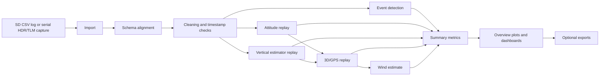

# Architecture

The Offline Flight Analysis Dashboard is a MATLAB package for turning Caelum firmware telemetry into repeatable engineering evidence. The architecture separates import, schema normalization, data cleaning, event detection, estimator replay, dashboard rendering, live playback, and validation so that each layer has a reviewable contract.

## High-Level Dataflow



The canonical end-to-end function is:

```matlab
results = caelum.analyzeLog(filename, ...
    MakePlots=true, ...
    ReplayEstimator=true, ...
    MakeDashboard=true, ...
    MakeAuxiliaryDashboard=false, ...
    ExportFigures=false);
```

## Layer Responsibilities

| Layer | Representative files | Responsibility |
| --- | --- | --- |
| Import | `+caelum/importLog.m`, `+caelum/importLogRobust.m`, `+caelum/importSerialTelemetry.m` | Read SD CSV or serial text captures while preserving firmware field order and import diagnostics. |
| Schema alignment | `+caelum/alignImportedSchema.m`, `firmware_sdlog_schema.csv`, `firmware_serial_telemetry_schema.csv` | Map firmware names into the dashboard analysis contract without silently shifting field meanings. |
| Cleaning | `+caelum/cleanLog.m` | Remove or report nonmonotonic timestamps, duplicate timestamps, missing time rows, and invalid numeric rows. |
| Event detection | `+caelum/detectEvents.m` | Identify launch, burnout, apogee, descent/landing, or other review events from cleaned telemetry. |
| Attitude replay | `+caelum/runAttitudeReplay.m`, `+caelum/propagateQuaternion.m`, `+caelum/normalizeQuaternion.m` | Reconstruct attitude/provenance fields and provide gravity-vector evidence for vertical replay and dashboards. |
| Vertical replay | `+caelum/replayEstimator.m`, `+caelum/runVerticalEKF.m`, `+caelum/runVerticalKalmanEstimator.m` | Replay vertical altitude/velocity estimation, innovation, covariance, bias, beta, and gating behavior. |
| 3D/GPS replay | `+caelum/run3DEKF.m`, `+caelum/predict3DEKF.m`, `+caelum/estimateWind.m` | Fuse position/velocity evidence when GPS channels are available and estimate wind from reconstructed trajectory state. |
| Dashboards | `+caelum/plotDashboard.m`, `+caelum/plotAuxiliaryDashboard.m`, `+caelum/plotOverview.m`, `+caelum/playLiveFlight.m` | Render engineering review boards for flight timeline, estimator health, phase/policy behavior, 3D trajectory, wind, and mission context. |
| Export | `+caelum/exportFigures.m`, `+caelum/exportSummary.m` | Write reproducible figures and summary artifacts into ignored output folders unless intentionally promoted. |
| Validation | `validate_*.m` | Prove firmware/dashboard alignment, replay correctness, live import behavior, mission profile semantics, and dashboard evidence contracts. |

## `caelum.analyzeLog` Pipeline

`caelum.analyzeLog` performs the following sequence:

1. Resolve configuration through `caelum.defaultConfig()` and local 3D settings.
2. Try strict import through `caelum.importLog`.
3. Fall back to robust import if the strict path fails.
4. Normalize firmware schema with `caelum.alignImportedSchema`.
5. Clean the imported table with `caelum.cleanLog`.
6. Detect events with `caelum.detectEvents`.
7. Run attitude replay when enabled by config.
8. Run vertical estimator replay when requested.
9. Compute truth and consistency metrics when truth data is available.
10. Run 3D/GPS replay and wind estimation when GPS channels and config allow it.
11. Render overview plots and dashboards according to options.
12. Export figures when requested.
13. Return a single `results` struct containing data, diagnostics, replay products, metrics, figures, and export metadata.

## Results Struct Contract

| Field | Description |
| --- | --- |
| `filename` | Source log or capture path. |
| `config` | Effective Caelum analysis configuration. |
| `raw` | Imported and schema-aligned table. |
| `data` | Cleaned dashboard contract table. |
| `events` | Detected flight events and timeline markers. |
| `replay` | Vertical estimator replay table. |
| `attitude` | Attitude replay table. |
| `summary` | Summary struct for the run. |
| `summaryTable` | Tabular version of the summary. |
| `figures`, `figures3D` | Overview plot handles. |
| `dashboardFigure` | Main dashboard figure handle. |
| `auxiliaryDashboardFigure` | Auxiliary dashboard figure handle. |
| `importReport`, `cleanReport` | Import and cleaning diagnostics. |
| `truth`, `truthError`, `truthMetrics` | Optional truth comparison data. |
| `consistencyMetrics` | Replay consistency and gating metrics. |
| `attitudeMetrics` | Attitude replay health metrics. |
| `est3d` | Optional 3D/GPS replay table. |
| `wind` | Wind summary struct. |
| `exportInfo` | Paths and metadata for exported figures when enabled. |

## Configuration Model

`+caelum/defaultConfig.m` defines default analysis constants and feature gates, including:

- 50 Hz nominal sample rate and vertical replay timing.
- Launch, burnout, landing, and event-detection thresholds.
- Vertical Kalman/replay covariance and gating parameters.
- Attitude replay parameters.
- 3D/GPS replay and wind-estimation parameters.
- IREC 10,000 ft AGL mission profile through `caelum.irecMissionProfile(TargetApogee_ft=10000)`.

Keep firmware policy targets, mission scoring targets, and dashboard display targets separate. Firmware fields are evidence from the flight computer; mission profile values are analysis/scoring context.

## Offline and Live Modes

The same dashboard surface supports both post-flight and live-style workflows:

| Mode | Input | Typical path |
| --- | --- | --- |
| Offline SD log | Firmware SD CSV | `caelum.analyzeLog("LOG000.CSV")` |
| Captured serial replay | Text file with `HDR`/`TLM` lines | `caelum.importSerialTelemetry(...)` then `caelum.playLiveFlight(...)` |
| Buffered playback | Ring buffer built from serial lines | `createLiveTelemetryBuffer` -> `appendLiveTelemetryBuffer` -> `snapshotLiveTelemetryBuffer` |
| Bounded live read | MATLAB `serialport` for a duration or row count | `caelum.readLiveSerialTelemetry(...)` |
| Callback live dashboard | MATLAB `serialport` with timer/callback dashboard | `caelum.startLiveSerialDashboard(...)` |

## Data Contract Principles

The project follows these contract rules:

1. Field order in firmware schema files is a parsing contract.
2. Firmware/dashboard name alignment must be explicit.
3. Validity, update, sequence, timestamp, freshness, phase, policy, and warning fields are first-class telemetry, not decorative metadata.
4. Missing fields should be reconstructed only when the reconstruction is documented and safe for the analysis being performed.
5. Validators must be updated alongside schema, fixture, dashboard, or firmware-contract changes.

## Source-Control Boundaries

Tracked source-of-truth inputs include MATLAB source, validators, schema CSVs, representative fixtures, documentation, and firmware-reference context required for contract validation.

Generated or local-only outputs should normally remain untracked:

- `exports/`
- `Screen Captures/`
- generated Monte Carlo logs
- MATLAB autosaves and workspaces
- Arduino/Teensy build products
- local IDE files, OS metadata, credentials, keys, and environment files
